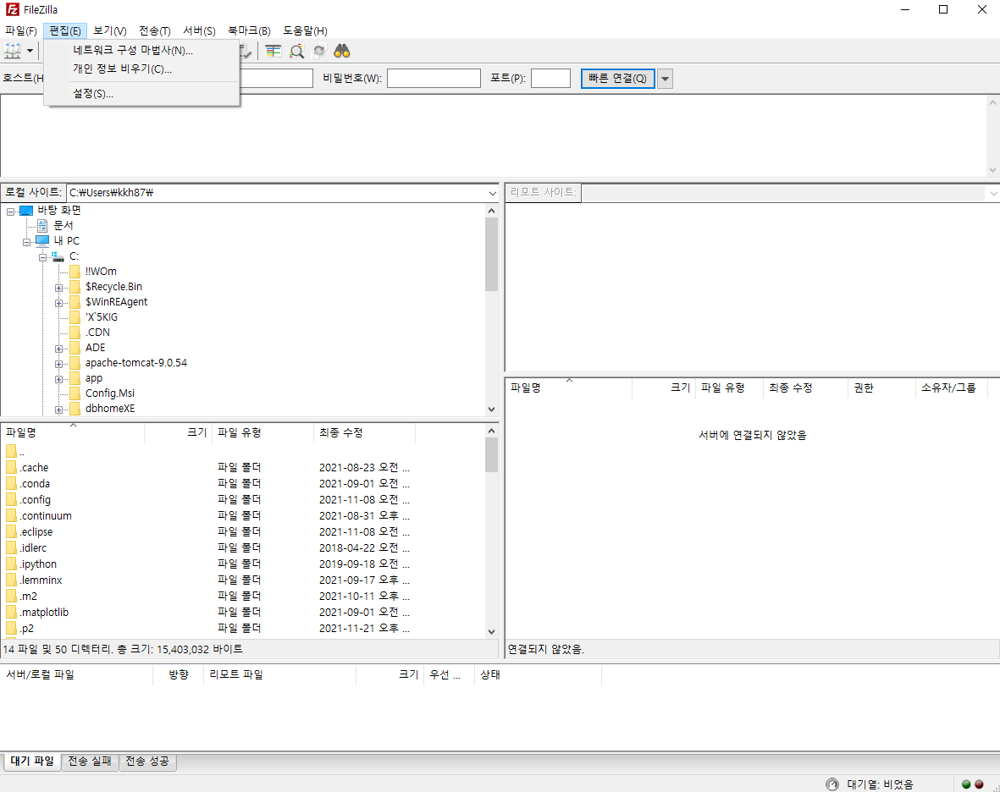

# AWS 백엔드 배포 

## STS 백엔드 내장서버 배포하기 

##### 1. 배포하려는 프로젝트에서 Maven Build 


##### 2. 해당 프로젝트의 target폴더로 가서 jar파일을 확인한다. 

jar파일의 이름은 바꿔도 무방하다. 

##### 3. 명령프롬프트에서 

```
cd P:\springBoot\sprBootTest\target
p:		(cd를 해도 안되면 이 명령어 입력)
java -jar sprBootTest.jar		
```

4. 크롬에서 localhost:3000/test 로 잘 되는지 확인 


## AWS로 백엔드 배포하기 

##### 1. AWS 가입하기

##### 2. 인스턴스 시작


##### 3. putty다운로드 및 실행

https://putty.softonic.kr/

다운로드 후 puttygen 실행 

​	


import key로 mykeypair.pem 불러오기(인스턴스)


Save private key에서 이름을 mykeypair로 하고 저장했더니 다운로드 폴더에 mykeypair.ppk라는 파일이 생성되었다. 

이후 PuTTY를 실행한다. 


여기에 인스턴스에서 봤던 퍼블릭 IPv4 주소를 입력한다 


Browse로 mykeypair.ppk를 불러온다. 

그리고 다시 session부분으로 와서 Save Sessions에 이름을 설정해주고 Save를 해준 뒤 그 이름을 클릭한 뒤 Open해주면 콘솔창이 뜬다. 


ubuntu를 입력해서 이렇게 뜨면 성공! 


##### 4. PuTTY가 아닌 다른 연결방법


##### 5. 파일 올리기 

파일질라 다운로드 https://filezilla-project.org/download.php?type=client




호스트는 인스턴스에서 퍼블릭 IPv4 DNS의 주소를 복붙하면 된다. 


##### 6. OS에 Java 다운로드(현재는 ubuntu만 깔려있는 상태)

PuTTY콘솔창에 입력

```
sudo apt-get update

sudo apt install openjdk-8-jdk 
차례로 다운로드 후

java -jar sprBootTest.jar를 입력하면 Spring 백엔드 서버 가동 아래처럼 확인 가능 
  .   ____          _            __ _ _
 /\\ / ___'_ __ _ _(_)_ __  __ _ \ \ \ \
( ( )\___ | '_ | '_| | '_ \/ _` | \ \ \ \
 \\/  ___)| |_)| | | | | || (_| |  ) ) ) )
  '  |____| .__|_| |_|_| |_\__, | / / / /
 =========|_|==============|___/=/_/_/_/
 :: Spring Boot ::                (v2.5.6)			
~~~~~~
~~~~~~
~~~~~~


```


##### 7. AWS 인스턴스에서 포트넘버를 인바운드 규칙에서 설정 


## MySQL로 연결하기 

```
sudo apt install mysql-server	-> MySQL설치
sudo mysql -u root -p  (mysql접속하는 명령어)  -> password는 그냥 엔터치고 넘어감 
use mysql; 	-> mysql 접속

CREATE USER '{생성할 GRANT ALL PRIVILEGES ON *.* TO '{사용자 이름}'@'%';
	CREATE USER 'test'@'%' IDENTIFIED BY 'testtest';


GRANT ALL PRIVILEGES ON *.* TO '{사용자 이름}'@'%';
	GRANT ALL PRIVILEGES ON *.* TO 'test'@'%';

FLUSH PRIVILEGES;
exit 


cd /etc/mysql
cd  mysql.conf.d
sudo vi mysqld.cnf;
그러면 파란색 글자들이 쭉 나오는데, bind address부분에서 insert키를 눌러서 입력가능하게 만들고 0.0.0.0으로 수정 후 :q 인가, :w로 탈출
탈출 후 sudo service mysql restart

```


AWS 인스턴스에서 MySQL포트넘버 설정


호스트 이름에는 퍼블릭 IPv4 주소 넣기 이후 테스트에서 성공 확인 후 접속! 


## 이클립스로 연결하기 

```
select *from MEMBER;
INSERT INTO MEMBER(ID, PWDM NAME, EMAIL, AUTH)
VALUES('abs','123','abc','abc@naver.com',3);
```


jar파일을 추가해주고, 기존 디폴트로 있는 file은 remove해준다 


여기서 password는 설정했던 값으로 변경해주고, URL 부분에서 localhost는 퍼블릭 IPv4 주소를 넣어준다 

이 후 Test Connection을 누르고 성공확인한 후 Finish! 


# 총정리

## STS에서 설정

설명을 위해 DB에서 실습용으로 만든 데이터를 STS의 새 프로젝트에서 가져와서 데이터를 잘 받아오는지 확인하는 작업


application.properties에서 mysql로 바꿔준다. 참고로 url부분의 데이터베이스(여기선 /test)도 빠짐없이 수정해준다

이후 DatabaseConfig, pom.xml 도 mysql에 맞게 수정해준다. 그리고 서버를 돌린다. 

정상적으로 서버가 작동하면, 크롬에서 http://localhost:3000/dbtest를 입력해서 잘 되는지 확인한다.(컨트롤러에 있는 주소)

잘 되면, Run as로 maven build를 하고, Build Success가 뜨면, 해당 프로젝트의 target폴더의 jar파일의 이름을 수정해서 일단 둔다. 

그 파일을 fileziller에 넣고, PuTTY에서 home/ubuntu위치로 cd를 해주고, ls로 jar파일을 확인한다. 

그 다음 같은 위치에서 java -jar 파일명을 쳐주면 서버가 실행된다.(서버를 끄려면 ctrl + c를 입력하면 된다.) 

이렇게 하면 이제 크롬에서 퍼블릭 IPv4 DNS의 주소:3000/dbtest를 입력하면 정상적으로 작동하는 것을 볼 수 있다. 


