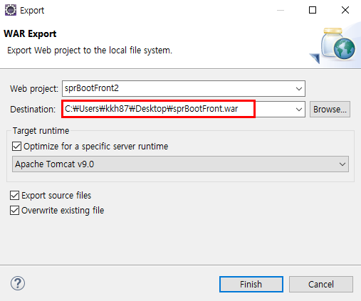

## Backend내장서버 활용 배포 실습

sprBootBackMySql에 어제 만든 데이터베이스를 연결해주고(application.properties), 기존 백엔드에서 만들어놨던 테이블을 이 DB에도 생성해준다. (Member, BBS 테이블)


#### sts 백엔드 배포

run as - maven build

해당 프로젝트의 target폴더로 가서 .jar파일 생성 확인 후 이름 설정 sprBootBack.jar

Fileziller에서 사이트관리자를 열어서 포트넘버 입력하고 접속 -> .jar파일 옮기기

PuTTY열고 ubuntu입력 후 ls로 파일 확인 후 서버가동(java -jar sprBootBack.jar)


프론트로 넘어와서 각 페이지마다 ajax에 있는 url 주소의 localhost부분을 퍼블릭 IPv4 주소로 모두 바꿔준다 -> 이클립스 실행 시 정상 작동 (크롬 자체 방화벽 때문에 안될 수 있는데 쿠키, 방문 기록 삭제)

---------


## Frontend 배포

##### 1. 아파치 톰캣 링크복사


##### 2. PuTTY에서 

```
wget 링크주소복사 한거 넣기 (톰캣 tar.gz) -> 다운로드가 진행 
tar -zvxf	-> 다운받은 파일을 압축해제 하는 명령어 


< server.xml에서 포트넘버 변경하는 방법 >
cd conf 
ls   -> server.xml 있는지 확인
vi server.xml
인서트키 
port 8080을 8090으로 변경 
esc
:wq!
```


##### 3. war파일 생성




Destination에서 Browse...를 누르고 바탕화면에 다운로드 받을 때 war파일명을 지정해준다(sprBootFront)

Fileziller로 가서 새로고침을 한번 눌러주면 apache-tomcat-9.0.55 폴더가 생성된 것을 확인할 수 있다. 

webapp에서 기존의 폴더들은 다 삭제하고, war파일을 옮긴다.


##### 4. AWS에서 8090포트넘버를 인바운드 규칙에 추가 


##### 5. (백엔드용 PuTTY) PuTTY를 하나 더 열어서 백엔드 서버 가동 

```
ubuntu
ls로 확인 
java -jar sprBootBack.jar
```


##### 6. (프론트용 PuTTY) PuTTY에서 서버를 실행한다

```
cd .. 
cd bin 
./startup.sh		- 서버 시작
./shutdown.sh		- 서버 종료
```


