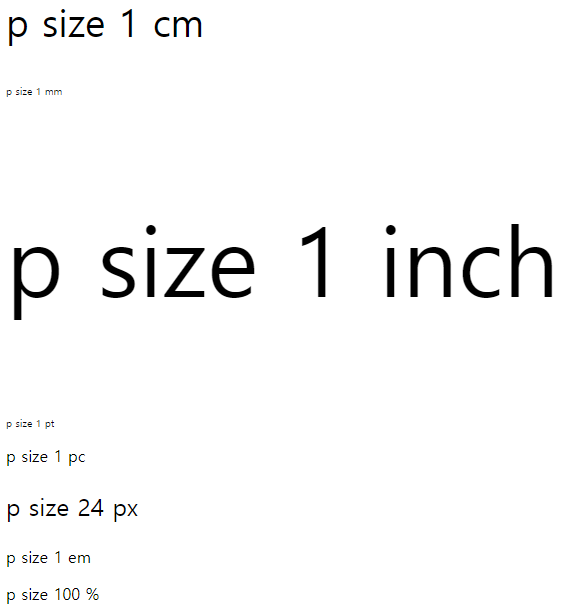

## CSS 1 

#### 적용방법, 선택자, CSS3 단위

### 0. 적용방법

CSS, JS 둘 다 세가지 방식으로 적용 
inline(태그 안), internal(head), external(외부 파일)

```html
 <!-- inline 방식 -->
 <p style="background-color: black; color:white">"이더리움 2,800달러 유지가 최대 관건" 억만장자 투자자의 전망</p>
  
 <div id = "header">
 	<h1 class="title">제목입니다.</h1>
 	<div id = "nav">
 		<h1>Navigation</h1>
 	</div>
 </div>


 <!-- internal 방식 -->
 <p id ="idcss">'작지만 분명한 차이'..."모더나, 시간 지나도 효과 높다"</p>
 <h3 id ="idcss">'작지만 분명한 차이'..."모더나, 시간 지나도 효과 높다"</h3>
 
 <p class="classcss">"이더리움 2,800달러 유지가 최대 관건" 억만장자 투자자의 전망</p>
 <h3 class ="classcss">"이더리움 2,800달러 유지가 최대 관건" 억만장자 투자자의 전망</h3>
 
<!-- head 태그에 style 태그 작성 -->
<style type="text/css">
h1{
	color: red;
}
p{
	color: blue;
}

#idcss{
	font-size: 150%;
	background-color: yellow;
	color: green; 
}

.classcss{
	background-color: red;
	border: 3px solid;
}
</style> 


<!-- external 방식 -->
<!-- .css파일을 만들고 link를 연결하는 방식 -->

<link href="style.css" rel="stylesheet">
 

<!-- .css파일 -->
@charset "UTF-8";
h1{
	color: red;
}
p{
	color: blue;
}

#idcss{
	font-size: 150%;
	background-color: yellow;
	color: green; 
}

.classcss{
	background-color: red;
	border: 3px solid;
}

/* header 안의 h1태그에만 적용 */
#header > h1 {
	color: green;
}
```


### 1. 선택자 

선택자는 워낙 이것저것 많다. 기본 선택자를 위주로 공부하되, 혹시 모르는 선택자가 나오면 구글링 하도록 하자 

- **기본 선택자**

| 종류          | 형태    | 설명                                                    |
| ------------- | ------- | ------------------------------------------------------- |
| 전체 선택자   | *       | HTML 페이지 내의 모든 태그를 선택                       |
| 태그 선택자   | 태그    | HTML 페이지 내의 특정 태그를 모두 선택                  |
| 아이디 선택자 | #아이디 | 특정 id 속성이 있는 태그 선택, id속성은 중복되면 안된다 |
| 클래스 선택자 | .클래스 | 특정 클래스가 있는 태그를 선택                          |


- **속성 선택자** 

  ```css
  <style>
  input[type="text"]{background:green;}
  input[type="password"]{background:yellow;}
  </style>
  ```

  

- **자손 선택자와 후손 선택자**

  ```html
  <!-- 자손 선택자 -->
  #header > h1 
  header id선택자 내의 바로 아래에 있는 h1태그에만 스타일을 적용한다.
  
  <!-- 후손 선택자 -->
  #header h1
  header id선택자 내의 모든 h1태그에 스타일을 적용한다. 
  ```

  후손 선택자의 주의사항으로는 header h1, h2로 작성할 경우, h2는 후손 선택자가 아닌 일반 h2태그를 선택한다. 그러므로 두 후손 선택자를 선택하려고 할 때는 header h1, header h2 이렇게 작성해야 한다. 


### 2. CSS3 단위

```css
<style type="text/css">
.p1{
	font-size: 1cm;
}
.p2{
	font-size: 1mm;
}
.p3{
	font-size: 1in;
}
.p4{
	font-size: 1pt;
}
.p5{
	font-size: 1pc;
}
.p6{
	font-size: 24px;
}
.p7{
	font-size: 1em;
}
.p8{
	font-size: 100%;
}
/* 사용빈도는 px과 %를 제일 많이 쓴다. */


</style>
</head>
<body>
<p class="p1">p size 1 cm</p>
<p class="p2">p size 1 mm</p>
<p class="p3">p size 1 inch</p>  <!-- 1 inch = 2.54cm -->
<p class="p4">p size 1 pt</p>
<p class="p5">p size 1 pc</p>
<p class="p6">p size 24 px</p>
<p class="p7">p size 1 em</p>
<p class="p8">p size 100 %</p>

</body>
```



