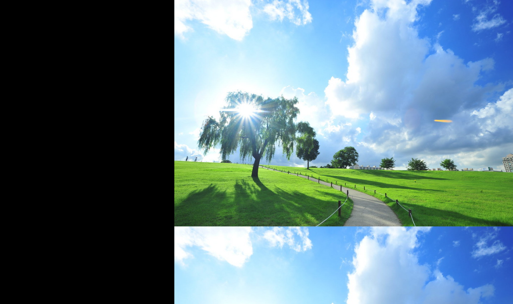
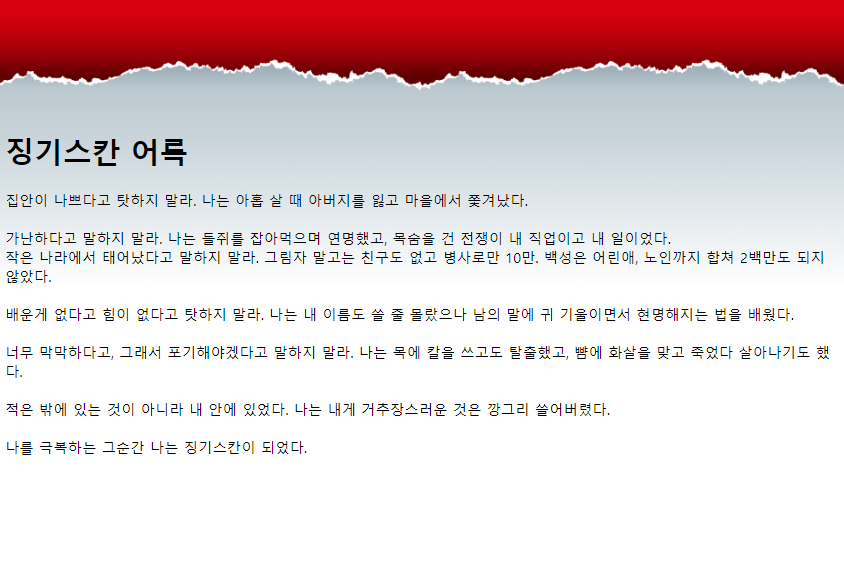
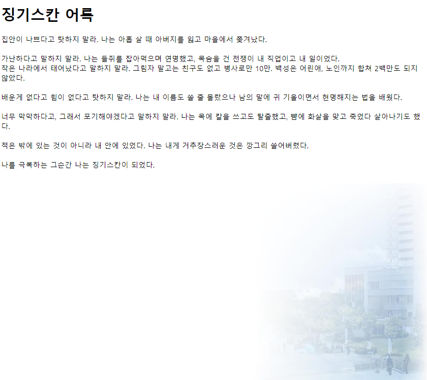
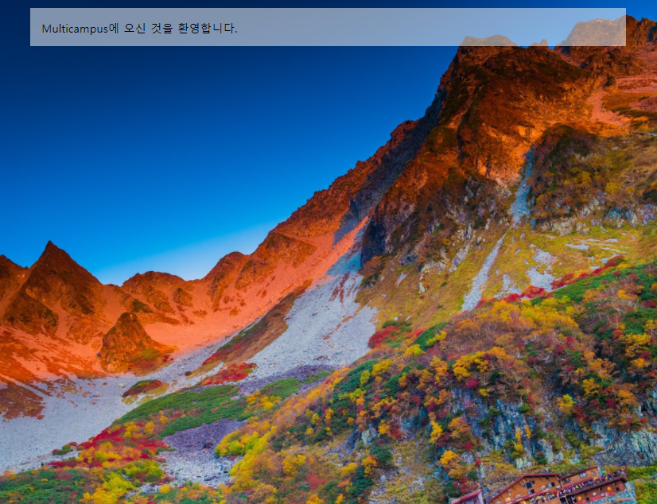
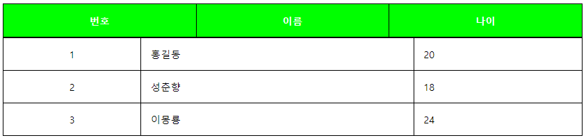
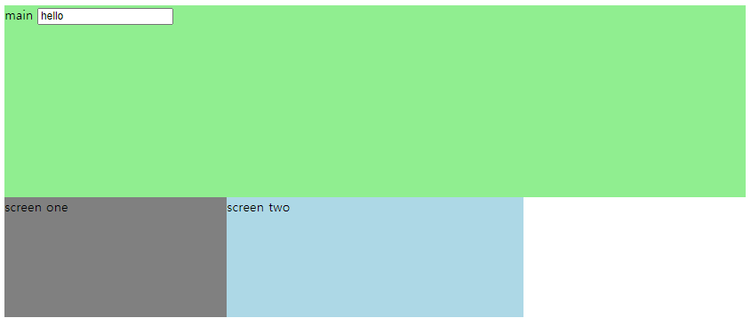
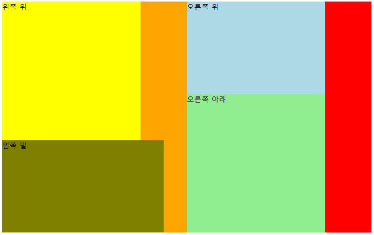
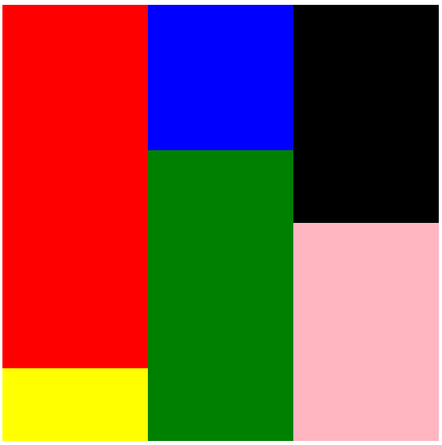

## CSS 2

#### 배경, 테이블, float을 활용한 배치 

### 1. 배경



```css
<style>
body{
/* 	background-color: black;
	background-image: url("back.jpg");
	background-repeat: no-repeat;
	background-position: right top; 
*/
	
	background:black url(back.jpg) repeat-y right top;
}
</style>
```




```css
<style type="text/css">
body{
        background-image: url('red01.png');
        background-repeat : repeat-x;
        padding-top: 120px;
        
}
</style>
```




```css
<style type="text/css">
body{
        background-image: url('city.jpg');
        background-repeat : no-repeat;
        background-attachment: fixed;
        background-position: right bottom;
}
</style>
```




```css
<style type="text/css">
body{
	width: 100%;
	background: url('back2.jpg') no-repeat center center fixed;
	-webkit-background-size: cover;
	-moz-background-size: cover;
	-o-background-size: cover;
	background-size: cover;
}
.main{
	width: 800px;
	background-color: rgba(255, 255, 255, 0.5);
	margin: 1em auto;
	padding: 1em;
}
</style>

</head>
<body>

<div class="main">
Multicampus에 오신 것을 환영합니다. 
</div>
</body>
```


 


### 2. 테이블



```css
<style type="text/css">
table {
	width: 100%;
	border-collapse: collapse; 
}

table,th,td{
	border: 1px solid black;
}

th {
	height: 50px;
	background-color: rgb(0, 255, 0);
	color: rgb(255,255,255);
}

td {
	padding: 15px;
}

td.center{
	text-align: center;
}

</style>

</head>
<body>
<table>
<tr>
	<th>번호</th><th>이름</th><th>나이</th>
</tr>
</table>
<table>
<tr>
	<td class= "center">1</td><td>홍길동</td><td>20</td>
</tr>
<tr>
	<td class= "center">2</td><td>성춘향</td><td>18</td>
</tr>
<tr>
	<td class= "center">3</td><td>이몽룡</td><td>24</td>
</tr>
</table>

</body>
```


### 3. float을 활용한 배치



```css
<style type="text/css">
#mainscreen{
	width:100%;
	height:240px;
	background-color: lightgreen;
	float: left;
}
#one{
	width:30%;
	height: 150px;
	background-color: gray;
	float: left;
}

#two{
	width:40%;
	height: 150px;
	background-color: lightblue;
	float: left;
}
</style>


</head>
<body>
<div id="mainscreen">
main
<input id="inp" type="text" value="hello">
</div>

<div id="one">
screen one
</div>

<div id="two">
screen two
</div>
</body>
```




```css
<!DOCTYPE html>
<html>
<head>
<meta charset="UTF-8">
<title>Insert title here</title>
<style type="text/css">
#fullscreen{
	width: 800px;
	height: 500px;
	background-color: grey;
}
#left{
	width: 400px;
	height: 500px;
	background-color: orange;
	float:left;
}

.right{
	width: 400px;
	height: 500px;
	background-color: red;
	float:right;
}

#leftup{
	width:300px;
	height:300px;
	background-color: yellow;
}

#leftdown{
	width:350px;
	height:200px;
	background-color: olive;
}

.rightup{
	width:300px;
	height:200px;
	background-color: lightblue;
}

.rightdown{
	width:300px;
	height:300px;
	background-color: lightgreen;
}
</style>


</head>
<body>
<div id = "fullscreen">
	<div id="left">
		<!-- 왼쪽 -->
		<div id = "leftup">
			왼쪽 위
		</div>
			
		<div id = "leftdown">
			왼쪽 밑
		</div>
	</div>	
	<div class="right">
		<!-- 오른쪽 -->
		<div class="rightup">
			오른쪽 위
		</div>
		
		<div class="rightdown">
			오른쪽 아래
		</div>		
	</div>
</div>

</body>
</html>
```




```css
<style type="text/css">
#fullscreen{
	width: 600px;
	height: 600px;
	background: lightgrey;
}
#left{
	width:200px;
	height:600px;
	float: left;
}
.center{
	width:200px;
	height:600px;
	float: left;
}
.right{
	width:200px;
	height:600px;
	float: right;
} 


#lefttop{
	width:200px;
	height:500px;
	float: left;
	background-color: red;
}
#leftbottom{
	width:200px;
	height:100px;
	background-color: yellow;
	float: left;
}

#centertop{
	width:200px;
	height:200px;
	background-color: blue;
	float: left;
}
#centerbottom{
	width:200px;
	height:400px;
	background-color: green;
	float: left;
}

#righttop{
	width:200px;
	height:300px;
	background-color: black;
	float: left;
}

#rightbottom{
	width:200px;
	height:300px;
	background-color: lightpink;
	float: left;
}

</style>


</head>
<body>
<div id = "fullscreen">
	<div id="left">
		<div id = "lefttop">
		</div>
		
		<div id = "leftbottom">
		</div>
	</div>
	
	<div class ="center">	
		
		<div id = "centertop">
		</div>
		
		<div id = "centerbottom">
		</div>
	</div>
	
	<div class ="right">
		<div id = "righttop">
		</div>
		
		<div id = "rightbottom">
		</div>
	</div>
</div>
</body>
```

