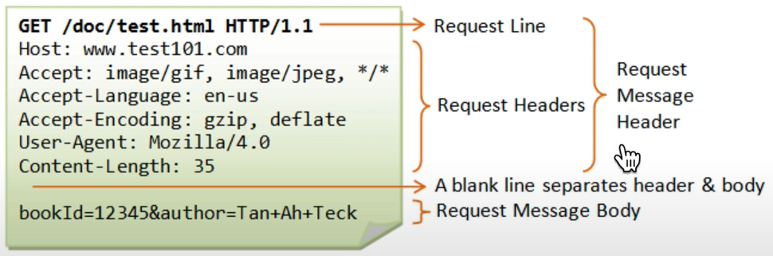
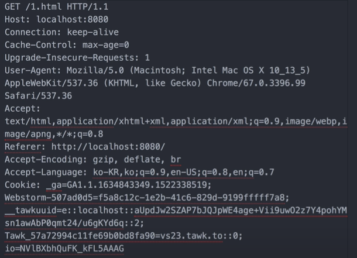
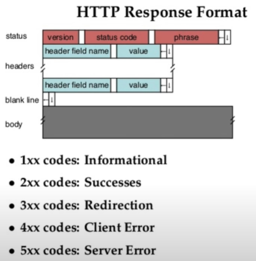
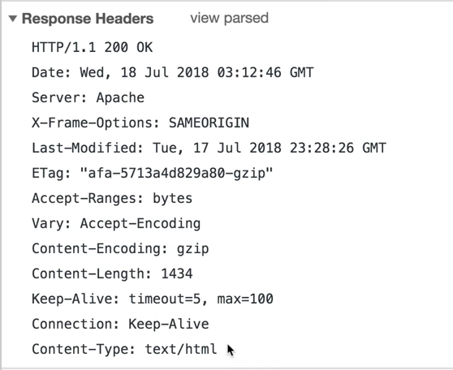
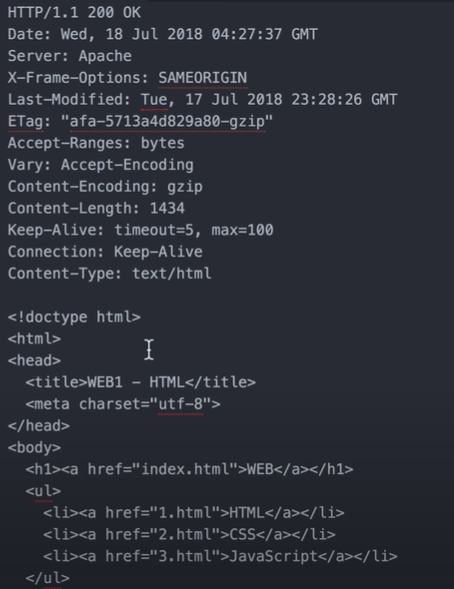

## WEB의 구성 요소 

HTML : 웹 페이지를 만드는 컴퓨터 언어  

URL : 원하는 웹 페이지에 방문할 수 있도록 도와주는 주소체계

Web Browser와 Web Server : 웹 페이지를 주고받는 소프트웨어 

**HTTP(HyperText Transfer Protocol)** : Web Browser와 Web Server가 통신할 때 사용하는 통신규칙 

## HTTP

\- HTML같은 텍스트 파일 외에도, 이미지, 오디오, 동영상 등 다양한 멀티미디어 파일을 전송하는 프로토콜 

\- HTTP는 크게 클라이언트가 Request를 보내면, 서버가 Response하는데 이를 위해 필요한 메시지로 구분되어 있다.

웹브라우저의 역할은 사용자가 요청한 정보를 웹서버에게 request headers를 만들어서 대신 물어봐주는 역할이라고 할 수 있다. 

웹서버는 자기가 가진 정보를 보내주면서 response headers를 만들어주는 기계라고도 할 수 있다. 

그러면 그렇게 응답받은 정보를 화면에 띄어주는 역할을 하는 프로그램이라고 추가설명이 가능하다. 

#### Request Headers

GET방식 : 데이터를 웹서버로부터 가져올 때, 주소를 쳐서 엔터를 칠 때 GET방식이라고 함 

Host(Request Headers 중 필수로 적어야 되는 부분) : 인터넷에 연결되어 있는 컴퓨터 한대 한대를 식별하는 이름, 우리가 요청하는 주소를 적는 것으로 보면 된다. 

포트넘버는 하나의 컴퓨터가 여러 서버를 가질 수 있는데, 해당 서버의 포트넘버

User-Agent는 웹브라우저의 다른 이름 

Accept-Encoding는 웹서버와 웹브라우저가 서로 통신할 때, 응답하는 데이터의 양이 많으면, 그걸 압축해서 전송하면, 웹브라우저가 압축을 풀어서 처리할 수 있는데, 이렇게 하면 웹브라우저의 자원을 아낄 수 있다. 그럴 때, 어떤 압축 방식을 지원하는지 적어놓은 것이다. 

If-Modified-Since는 내가 응답받은 페이지(파일)이 언제 마지막으로 받았는지 보여주는 것인데, 이를 통해 웹서버는 응답할 때, 서버가 가진 파일과 어느 파일이 최신인지 확인을 하고난 후에 파일을 전송할지 말지 결정을 함으로써 속도도 줄일 수 있고, 윈윈할 수 있다. 

웹 브라우저는 위와같이 Request Headers를 작성해서 웹 서버에 요청을 보낸다. 만약 POST방식일 경우에는, 웹 브라우저가 요청을 할 때 같이 보내야하는 정보도 있는데, 이럴 때는 Request Message Headers 밑에 한 줄을 띄고, Request Message Body를 작성해서 요청을 보낸다. 

그러면 웹서버에서는 이 요청을 받아서 이 요청정보를 해석해서 응답메시지를 만들어준다. 

#### Response Headers

status = 서버가 응답했을 때의 상태를 알려준다

status code는 응답 결과에 대한 코드 

phrase는 응답결과를 사람이 알아보기 쉽게 설명  

Content-Type은 웹서버가 응답할 때 이 응답은 text고, html이라는 언어를 사용한다. 라고 알려주는 것 

Content-Length는 응답하는 이 컨텐츠의 전체 크기는 1434 byte이다. 

Content-Encoding은 이 컨텐츠는 g-zip이라는 방식으로 압축했으므로, 읽기 위해선 해당 방식에 맞게 압축을 풀어야 한다고 알려주는 것 

Last-Modified는 마지막으로 이 정보가 마지막으로 언제 수정되었는지 알려주는 것 

웹 브라우저가 요청을 보냈다면, 웹 서버는 응답을 해주어야 한다. 이 때, Response Headers를 작성 후 한 줄 띄고, Html 코드를 함께 보낸다. 이 때,  웹서버는 인터넷 통신망을 통해 요청을 보낸 브라우저로 정보를 보내준다. 

cf)

### Https?  

Https의 s는 secure의 약자

전송하고 있는 내용을 가로채더라도 암호화가 되어있기 때문에 그 안에 무슨 내용이 있는지는 당사자들만 알 수 있다. 