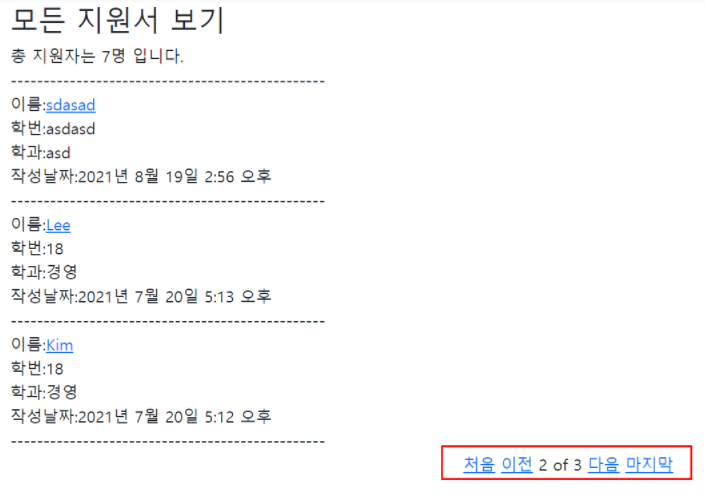

## Paginator(페이징, 페이지 매김) 

이번에는 Paginator 기능에 대해 살펴보려고 한다. 영어로 뭔가 거창해보이지만, 카페글이나, 각종 게시글들이 있거나 컨텐츠가 있는 페이지에서는 흔하게 볼 수 있는 기능이다. 게시글이 많아지면, 그 게시글들을 페이지를 나눠서, 쪼개서 보여주는 것이다. 예를 들어 총 9개의 게시글이 있는데 글을 3개씩 끊어서 보이게 설정하면 총 세 페이지로 나뉘면 한 페이지 당 세개의 게시물을 볼 수 있도록 하는 것이다. 

본격적으로 기능구현을 살펴보자.


**1. views.py에서 함수 작성하기** 

내가 페이징 기능을 구현할 페이지 즉, 보려고 하는 객체들을 보여주는 함수에 해당 기능을 작성해야 한다. 나의 경우 지원한 사람들의 글을 모아볼 수 있는 readall.html이 해당 템플릿이다. 

```python
from django.core.paginator import Paginator

def readall(request):
    apply_all = Apply.objects.order_by("-date")
    count_apply = apply_all.count()
    paginator = Paginator(apply_all,5)            
    # 하나의 페이지에서 5개의 게시물을 볼 수 있도록 설정
    page = request.GET.get('page')            
     # GET방식으로 정보를 받되, GET으로 정보를 받지 않고, 로컬호스트로 정보를 받아도 뜰 수 있도록 뒤에 한번더 .get을 해준다  
     # 'page'를 키값으로 받아서 몇번째 페이지인지를 가져오는 것이다.
    apply_all = paginator.get_page(page)          
    # get_page라는 메소드를 써서 해당 페이지에 있는 내용을 보여주는 것   
    return render(request,"readall.html",{'views_apply_all':apply_all, 'views_count_all':count_apply})

```


**2. readall.html로 가서 템플릿 언어로 작성하기** 

```python
<div style="text-align: center;">
    
        <a href="?page=1">처음</a> 
        <a href="?page={{views_apply_all.previous_page_number}}">이전</a>
    
        <span>{{views_apply_all.number}}</span>
        <span>of</span>
        <span>{{views_apply_all.paginator.num_pages}}</span>
    
        <a href="?page={{views_apply_all.next_page_number}}">다음</a>
        <a href="?page={{views_apply_all.paginator.num_pages}}">마지막</a>
    
    </div> <br>
```


여기서 코딩할 때는 주의할 점이 있는데, 페이징을 할 때는 띄어쓰기에 주의해야한다는 것이다. 자칫 띄어쓰기를 잘못했다가는 공백이 문자로 인식되기 때문에 정상적으로 기능하지 않을 수 있다. 

이렇게 하면 아래처럼 결과물을 볼 수 있다. 

