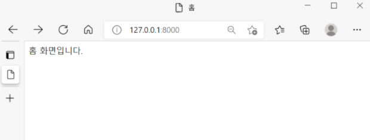

## 웹사이트의 시작, Home 화면 만들기

나는 코린이of코린이..최소한의 html만을 구성하여 백엔드를 구성해

최종적으로 회원가입을 하고, 로그인을 해서, 지원서를 작성하고, 제출하는 간단한 지원사이트를 만들어보고자 한다. (그 외에도 부가적인 기능이 추가된..^^) 


그 시작은 홈 화면 만들기이다. apply라는 앱을 만들어, 그 안에 templates 폴더를 만들고, 그 안에 home.html 파일을 만들었다. 그리고 아래는 home.html에 작성한 코드이다.(내가 작성한 것이라곤 홈 화면입니다. 뿐!)

```python
<!DOCTYPE html>                   #간단하게 ! + enter키를 통해 html 양식을 불러올 수 있다.
<html lang="kor">
<head>
    <meta charset="UTF-8">
    <meta http-equiv="X-UA-Compatible" content="IE=edge">
    <meta name="viewport" content="width=device-width, initial-scale=1.0">
    <title>홈</title>
</head>
<body>
    홈 화면입니다. 
</body>
</html>
```


화면으로 보여지는 html을 만들었으면, 다음 함수를 작성할 차례이다. 

views.py로 이동해서 아래와 같이 함수를 작성하였다. 


```python
def home(request):
    return render(request,'home.html') 
```

위 함수를 설명해보면, home함수 요청이 들어오면, home.html 페이지를 내보내라 정도로 볼 수 있다.

render함수를 한번 짚고 넘어가면, 

render(인수1, 인수2, 선택적 인수3) 이렇게 구성된다.

인수1은 request객체를 받고, 인수2는 보여줄 template을 받고, 인수3은 필수인수는 아니며, 인수2(template)에 전달할 데이터를 딕셔너리 형태로 받는다. 

딕셔너리 형태란 {'키':값(value)} 형태이다. 

여기서 키는 인수2에서 사용할 템플릿변수명이 되고, value는 전달할 내용을 넣어주면 된다. 


다음으로 views.py를 작성했으면, 이제 작성한 함수를 urls.py에서 url과 연결해주어야 한다. 

```python
from django.contrib import admin
from django.urls import path, include
from apply.views import home                      #apply앱의 함수에서 home함수를 import한다.

urlpatterns = [
    path('admin/', admin.site.urls),
    path('', home, name="urlnamehome"),           #첫 화면이므로 주소가 '',로 되어있다. 
    path('apply/',include('apply.urls')),         # url간략화 
]
```

url간략화 작업이 이루어진 프로젝트 폴더의 urls.py의 코드이다. 

urls.py에서 path를 살펴보면 path('url부분', views부분, name="이름부분")으로 구성된다. 



이렇게 홈화면 작성이 끝이 났다. 이미 동일한 프로젝트를 두번 마치고 혼자서 해보면서 블로그 게시물을 작성중이지만, 그래도 쉽지 않은 것 같다. 단순히 따라서 타이핑 하는 것과 혼자 공부하면서, 이해하면서 코딩하는 것은 천지차이이다 ㅠㅠ 그래도 한번 해본 것들을 혼자서 마스터 해보고 블로그 글로 하나하나 작성하다보면, 굉장한 성장을 이룰 수 있을 것 같아 딱히 막막한 느낌보다는 기대가 되고 이번 미션(?)을 후딱 클리어 하고 싶다! 

