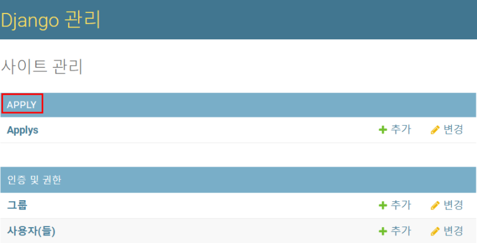
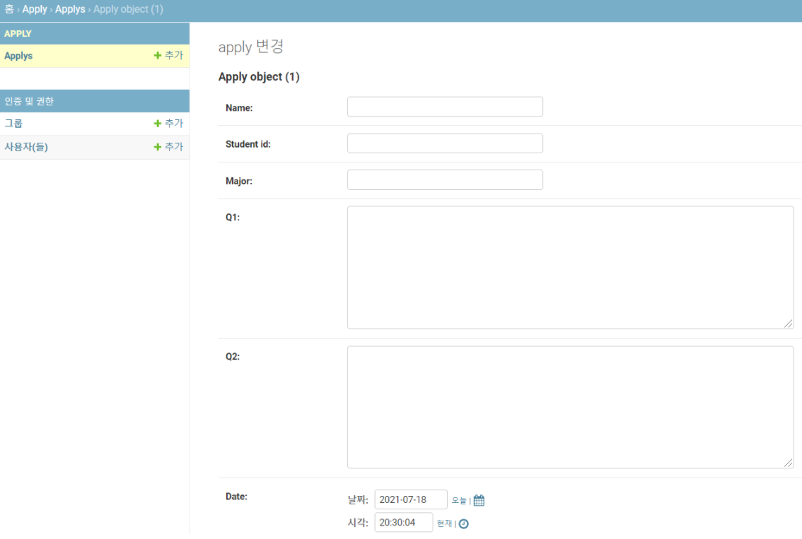
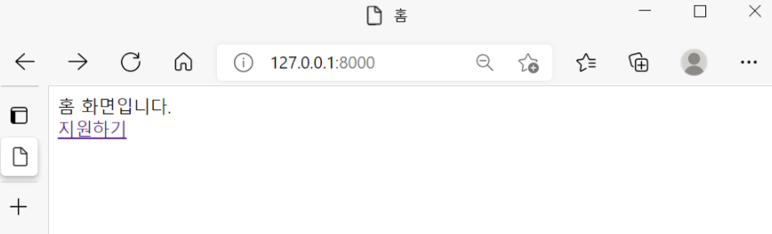
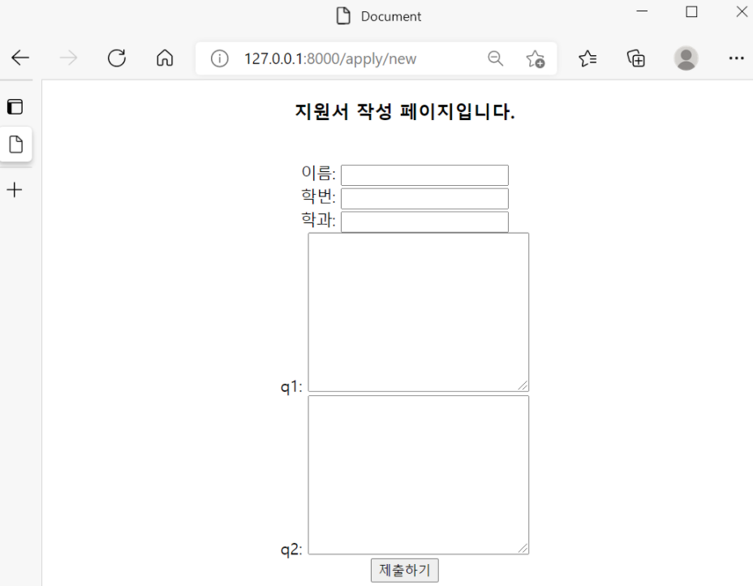

## 지원서 작성하는 페이지 만들기(CRUD 중 Create)


지원서를 작성하고 나서, 이 페이지가 데이터베이스에 저장이 되어 있어야 사이트에서 나가도 사라지지 않고, 저장된 지원서를 볼 수 있다. 그러기 위해서 먼저 지원서에 들어갈 내용들을 구상하고, 이를 models.py에 class형태로 만들어주어야 한다. 그래야 누군가 지원서를 작성하고 제출하면, 제출된 지원서가 미리 데이터베이스에 만들어진 class형태로  저장이 된다. 


**1. models.py에 class 작성하기**

```python
from django.db import models
from django.db.models.fields import CharField

class Apply(models.Model):    
    name = models.CharField(max_length=10)
    student_id = models.CharField(max_length=10)
    major = models.CharField(max_length=10)
    q1 = models.TextField(max_length=100)
    q2 = models.TextField(max_length=100)
    date = models.DateTimeField()
```


**2. models.py에 등록한 Apply 클래스를 admin.py에서 알려주어야 한다.**

```python
from django.contrib import admin
from .models import Apply                    #models에서 Apply클래스를 import해준다. 

admin.site.register(Apply)
```

여기까지 하고 admin 주소로 들어가면 Apply가 생긴 것을 볼 수 있다. 








**3. 서버의 추가사항이나 수정사항이 생기고 나서는 반드시 migration과 migrate 해주어야 한다.**

```python
python manage.py makemigrations
```

makemigrations는 앱 내에 migration 폴더를 만들어서 models.py의 변경사항을 저장하는 명령어이다.

```python
python manage.py migrate
```

migrate는 migration폴더를 실행시켜 데이터베이스에 적용하는 명령어이다. 


이제 본격적으로 create를 하기 위해 template작성, view(함수) 작성, url연결을 해주도록 하겠다. 

**4. templates폴더에 new.html 파일을 만들고 아래의 코드를 작성한다.** 

```python
<div style="text-align: center;">
  		<form action="" method="POST">      
  			#form action의 url은 미리 넣어주었다. 
                          
        	# POST방식을 채택할 경우, 보안을 위해 좌측의 코드를 작성해준다. 
        <h3>지원서 작성 페이지입니다.</h3><br>
        이름: <input type="text" name="htmlname"> <br>
        학번: <input type="text" name="htmlstudent_id"> <br>
        학과: <input type="text" name="htmlmajor"> <br>
        q1: <textarea name="htmlq1" id="" cols="30" rows="10"></textarea> <br>
        q2: <textarea name="htmlq2" id="" cols="30" rows="10"></textarea> <br>
        <button type="submit">제출하기</button>
        </form>    
    </div>
```


**5. views.py로 이동해 new함수를 작성한다.**

```python
from apply.models import Apply                      #models.py의 class를 import한다. 
from django.shortcuts import render, redirect       #redirect를 import한다. 
from django.utils import timezone            new함수에서 사용될 timezone을 import한다. 

def new(request):
    if request.method == 'POST':
        new_apply = Apply()            #여기서 Apply는 models.py에서 작성한 class이다.
        new_apply.name = request.POST['htmlname']
        new_apply.student_id = request.POST['htmlstudent_id']
        new_apply.major = request.POST['htmlmajor']
        new_apply.q1 = request.POST['htmlq1']
        new_apply.q2 = request.POST['htmlq2']
        new_apply.date = timezone.now()         
        new_apply.save()
        return redirect('urlnamehome')
    else:
        return render(request,'new.html')
```

좀 더 부연설명을 하자면, Apply 클래스를 new_apply라는 객체로 받는다. (new_apply.name에 커서를 놓고 F12를 눌러보면, models.py의 Apply클래스의 name으로 이동하는 것을 볼 수 있다.)new.html에서 POST방식으로 받은 요청을  밑에 new_apply.save()를 통해 일괄로 새 column에 저장해주는 것이다. 

저장된 후에는 if문을 통해 POST방식인 경우에는 저장 후 urlnamehome을 반환하고, POST방식이 아닐 경우에는 new.html을 반환하도록 하였다. 


여기서 추가로 timezone설정과 관련된 코드를 살펴보면, settings.py에 별 다른 수정없이 timezone을 쓰게 되면, 저장된 시간은 우리나라 시간과 다르게 나타난다. 그러므로 settings.py에 아래의 코드로 수정해주어야 우리나라를 기준으로 설정된 시간을 볼 수 있다. 

```python
TIME_ZONE = 'Asia/Seoul'                     #기존에 있던 국가설정은 지워줘야 한다!
```


**6. apply앱 내의 urls.py에서 url을 연결해준다.** 

```python
from django.urls import path
from apply.views import *

urlpatterns = [
    path('new',new,name='urlnamenew'),      
    # 4번에서 봤던 new.html에 폼 액션 연결해주어야 한다
]
```


**7. 마지막으로 홈화면에서 지원하기 페이지로 이동할 수 있도록 a태그를 걸어준다.**

```python
<a href="">지원하기</a>
```








후후,,미숙하지만 이렇게 지원하기(CRUD 중 Create)가 끝이 났다

남은 RUD 와 로그인, 회원가입도 파이팅!