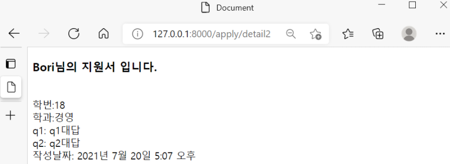
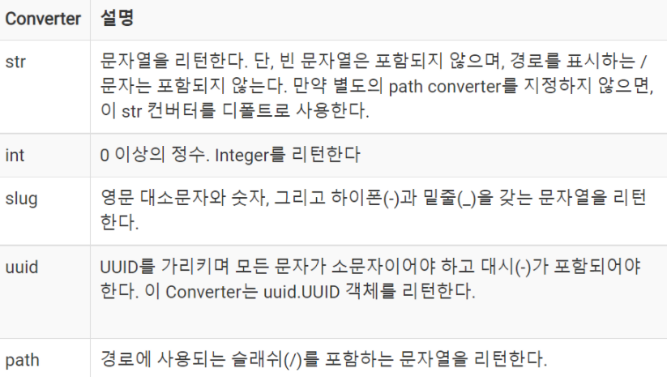
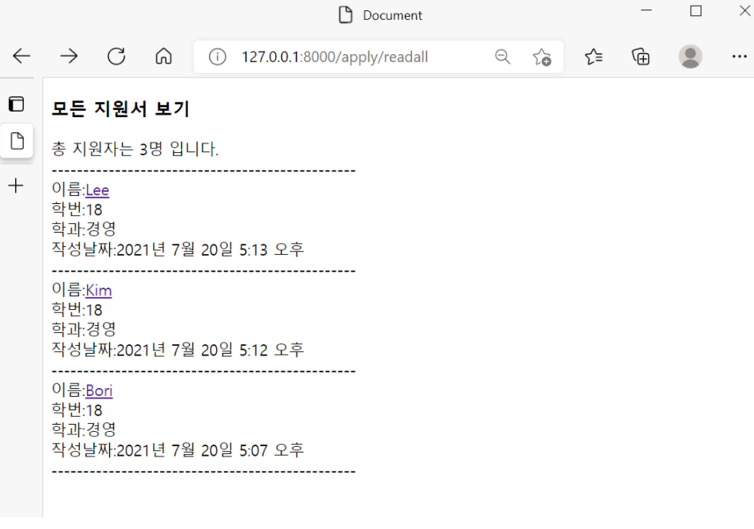

## 작성한 지원서 보기, 전체글 보기, 상세페이지(CRUD 중 Read)


applyproject에서는 작성한 지원서를 볼 수 있는 페이지이고, 좀 더 포괄적으로 보면 상세페이지를 구성하는 단계이다. 

이번에는 크게 작성한 지원서 보기와 전체글 보기 두 파트로 나뉜다. 

첫 파트는 views.py에서 함수작성 - 템플릿 작성 - urls.py에서 url연결 순서로 진행된다. 


### 지원서보기(detail)




**1. views.py에 함수작성하기**

```python
from apply.models import Apply
from django.shortcuts import get_object_or_404, render, redirect 
								#404함수 import해주기 
from django.utils import timezone

def detail(request, each_id):
    apply = get_object_or_404(Apply,pk=each_id)
    return render(request,'detail.html',{'views_apply':apply})
```

detail이라는 함수를 만들었다. request를 첫 인자로 받고, detail 함수는 추가로 each_id라는 매개변수를 인자로 받는다. (each_id는 명칭을 바꿔도 괜찮다.)


그리고 두번째줄에서는 get_object_or_404라는 함수가 나오는데, 해당 함수는 객체를 가져오던지 아니면 404에러를 띄우는 함수인데, 404에러는 참고로 요청한 페이지를 찾을 수 없을 때 발생하는 에러이다. 

그 옆에 pk는 primary key(기본키)의 줄임말로 쉽게 말하면, 데이터베이스에서 한 테이블에서 한줄한줄을 식별하기 위한 ID값을 의미한다. 


세번째줄을 보면, return render(request객체, 보여줄페이지, {키:값})을 의미한다. 그리고 여기서 키(views_apply)는 바로 다음 템플릿 작성 때 사용된다. 


**2. templates 폴더에 detail.html 파일을 만들고 코드 작성하기** 

```python
<body>
    <div>
        <h3>{{views_apply.name}}님의 지원서 입니다.</h3><br>
        학번:{{views_apply.student_id}} <br>
        학과:{{views_apply.major}} <br>
        q1: {{views_apply.q1}} <br>
        q2: {{views_apply.q2}} <br>
        작성날짜: {{views_apply.date}} <br>
    </div>
</body>
```

views.py에서 지정한 키(views_apply)를 사용해 가져올 객체들을 적어준다. 


**3. urls.py에서 url을 연결해준다.** 

```python
from django.urls import path
from apply.views import *

urlpatterns = [
    path('new',new,name='urlnamenew'),
    path('detail<str:each_id>',detail,name='urlnamedetail'),
]  
```

여기서 detail에 해당하는 path를 보면 new와는 다른 점을 알 수 있는데, <str:each_id> 표현은 URL에서 파라미터를 캡쳐(Capture)하는 표현으로 콜론(:) 뒤에 있는 each_id는 views.py에 전달되는 파라미터명이고 콜론 앞에 있는 것(str)은 Path Converter라고 불리우는 것으로 views.py에 값을 전달하기 전에  str타입으로 적절하게 변환한 후 파라미터로 전달하게 된다. Django에는 str외에도 다양한 path converter들이 있다. 



위의 몇가지 path converter로 부족할 경우에는, 커스텀해서 사용도 가능하다고 하니, 이 점도 참고로 알아두면 언젠가 도움이 되지 않을까 싶다.


**4. 여기까지 하고 home.html에서 해당 페이지로 이동하는 a태그를 걸어주면 된다. 그러나 나의 경우에는 전체 글을 볼 수 있는 readall 페이지를 뒤에서 추가로 만들고, 거기서 이름에 태그를 넣을 예정이다. 이 부분은 아래와 같이 코드를 작성하면 된다.** 

```python
이름:<a href="">{{a.name}}</a> <br>
```

기타 추가적인 코딩은 아래 두번째 파트인 readall부분의 템플릿 작성에서 보면 된다.


### 모든 지원서 보기(readall)

이제 두번째 파트인 readall에서는 모든 지원서들을 한번에 볼 수 있는 페이지를 만들어보려고 한다. 

두번째 파트는 views.py에서 함수 작성 - 템플릿 작성 - urls.py에서 url연결 순서로 진행된다. 




**1. views.py에서 함수를 작성한다.** 

```python
def readall(request):
    apply_all = Apply.objects.order_by("-date")
    count_apply = apply_all.count()
    return render(request,"readall.html",{'views_apply_all':apply_all, 'views_count_all':count_apply})
```

readall함수에서는 apply_all이라는 변수에 Apply모델의 객체들을 최신순서("-date")로 정렬해서 넣어준다. 

count_apply라는 변수에는 바로 위에서 정한 변수의 개수를 세어준다. 세어주는 이유는 readall페이지에서 총 지원한 사람의 명수를 표시해주기 위함이다. 


**2. templates폴더에 readall.html 파일을 만들고 아래의 코드를 작성해준다.** 

```python
<body>
    <h3>모든 지원서 보기</h3>
    지원한 총 지원자는 {{views_count_all}}명 입니다. <br>

    이름:<a href="">{{a.name}}</a> <br>
    학번:{{a.student_id}} <br>
    학과:{{a.major}} <br>
    작성날짜:{{a.date}} <br>
    ----------------------------

</body>
```

이제 여기서 템플릿 언어가 등장하는데, 템플릿 언어는 템플릿 작성 시에 파이썬 문법을 쓸 수 있도록 하는 것이고,



파이썬 문법 적용 내용 

   	의 형태로 구성된다. 


여기서는 for문이 적용되었는데, views_apply_all이라는 키에서 하나의 변수를 꺼내어 for문 안의 내용들을 반복하는 것이다. 

이름에는 위에 첫번째 파트의 4번에서 얘기했던 detail페이지를 볼 수 있도록 a태그를 걸어주는 것이다. (이름을 누르면 하나의 지원서만 볼 수 있도록!)


**3. urls.py에서 url을 연결해준다.** 

```python
from django.urls import path
from apply.views import *

urlpatterns = [
    path('new',new,name='urlnamenew'),
    path('detail<str:each_id>',detail,name='urlnamedetail'),
    path('readall',readall,name='urlnamereadall'),      # 해당 내용만 추가
]   
```


**4. 마지막으로 readall페이지로 이동할 수 있는 태그를 home.html에 만들어주면 끝이다.**

```python
<body>
    홈 화면입니다. <br>
    <a href="">지원하기</a>
    <a href="">지원현황보기</a>
</body>
```


와우우우우우우 이렇게 CRUD 중 Read부분이 끝이났다. 블로그를 작성하면서 느끼는 점은 점점 내가 이해하는 깊이가 깊어지고 있다는 것이다. 10%, 11%, 12% 이렇게 점점 깊이가 깊어지고 있다. 뭐 그렇다고 100% 이해하는 것은 결코 아니지만 배움의 깊이가 깊어진다는 것은 그 자체로 유의미하고, 보람된 일이라고 생각한다. 다음 편에서는 CRUD 중 Update인 수정하기이다. 다음 편도 파이팅!