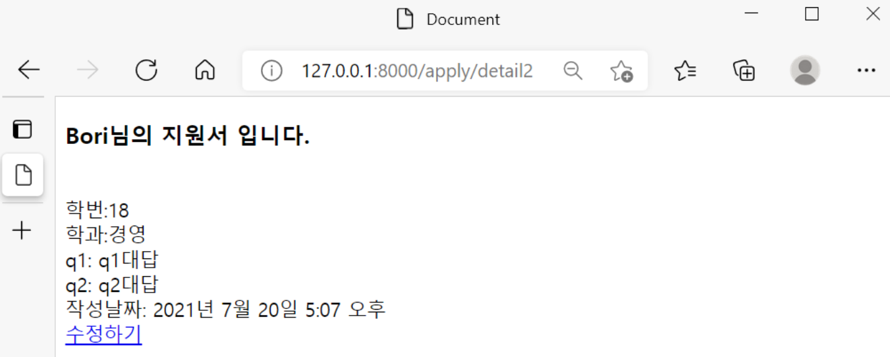
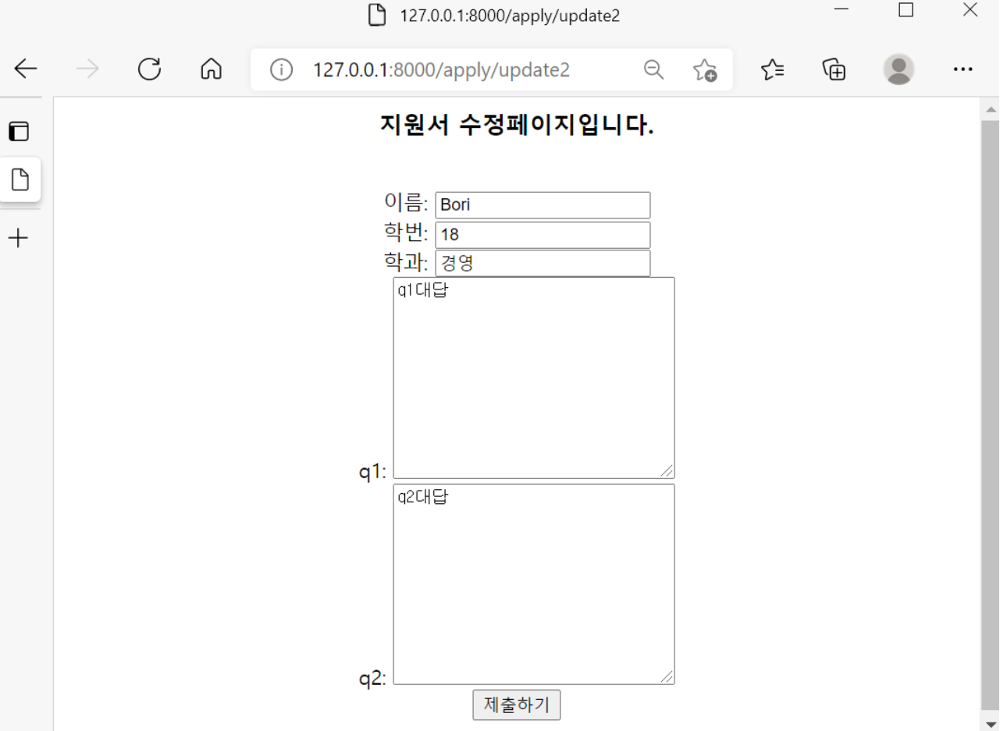

## 지원서 수정하기 두번째 방법(CRUD 중 Update)


두번째 방법은 update함수와 update.html만 있으면 되고, if문을 이용한 방법이다. 


**1. views.py에 update함수를 작성한다.**

```python
def update(request, each_id):
    if request.method == "POST":
        update_apply = get_object_or_404(Apply, pk = each_id)
        update_apply.name = request.POST['htmlname']
        update_apply.student_id = request.POST['htmlstudent_id']
        update_apply.major = request.POST['htmlmajor']
        update_apply.q1 = request.POST['htmlq1']
        update_apply.q2 = request.POST['htmlq2']
        update_apply.date = timezone.now() 
        update_apply.save()
        return redirect('urlnamedetail',update_apply.id)
    else:
        update_apply = get_object_or_404(Apply, pk = each_id)
        return render(request,"update.html",{'update_apply':update_apply})
```
 


**2. update.html 파일을 만들고 템플릿을 작성한다.**

```python
<div style="text-align: center;">
    <form action="" method="POST">
         
    <h3>지원서 수정페이지입니다.</h3><br>
    이름: <input type="text" name="htmlname" value="{{update_apply.name}}"> <br>
    학번: <input type="text" name="htmlstudent_id" value="{{update_apply.student_id}}"> <br>
    학과: <input type="text" name="htmlmajor" value="{{update_apply.major}}"> <br>
    q1: <textarea name="htmlq1" id="" cols="30" rows="10">{{update_apply.q1}}</textarea><br>
    q2: <textarea name="htmlq2" id="" cols="30" rows="10">{{update_apply.q2}}</textarea><br>
    <button type="submit">제출하기</button>
    </form>    
</div>
```

첫번째 방법과 달리, form action 부분에서 id부분이 다르다. (views.py에서 update.html로 넘겨준 키가 다르기 때문!)


**3. urls.py에서 url을 연결해준다.** 

```python
from django.urls import path
from apply.views import *

urlpatterns = [
    path('new',new,name='urlnamenew'),
    path('detail<str:each_id>',detail,name='urlnamedetail'),
    path('readall',readall,name='urlnamereadall'),
    path('update<str:each_id>',update,name='urlnameupdate'),
]  
```


**4. detail.html에 수정할 수 있도록 a태그를 넣어준다.**

```python
<a href="">수정하기</a>
```

첫번째 방법과 url이름이 바뀌었다. (첫번째 방법에서는 urlnameedit였다)

이렇게 두번째 방법도 끝!








첫번째 방법과 두번째 방법의 차이를 보면, 첫번째 방법이 Update라는 과정을 이해하기에는 좀 더 직관적일 수 있으나, 개인적으로는 좀 더 복잡한 느낌이 들었다. 두번째 방법 if로 POST방식인 경우와 그렇지 않은 경우를 나눠서 하는 것은 사실 Update라는 과정을 이해하기엔 더 복잡하고, 이해하는게 더 어려웠다. 그래도 코딩을 하기에는 손도 덜가고 작성하는게 더 쉽다고 느꼈다. 이렇게 개인적이고 주관적인 느낌을 적어봤지만, 사실 코린이인 나는 뭐가 더 좋은지, 현업에서는 어떤 방식을 더 선호하는지는 모르겠다. 어쩌면 두 방식 모두 잘 안쓰일지도 모르겠다. 아무튼... 이렇게 CRUD 중 Update도 완료! 다음 편에서는 비교적 간단하고, 쉬운 Delete에 관해 작성해보도록 하겠다.
