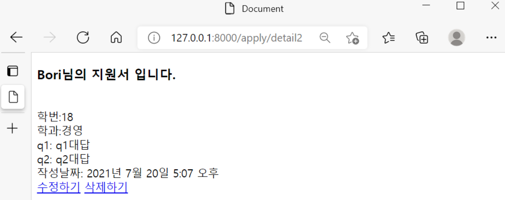

## 지원서 삭제하기(CRUD 중 Delete)

삭제하기는 간단하다

views.py에서 함수 작성 - urls.py에서 url연결 - detail.html에서 a태그 작성 


**1. views.py에서 delete함수를 작성한다.** 

```python
def delete(request, each_id):
    apply = get_object_or_404(Apply, pk = each_id)
    apply.delete()
    return redirect('urlnamereadall')
```


```python
def delete(request, each_id):
    delete_apply = Apply.objects.get(id=each_id)
    delete_apply.delete()
    return render(request,'readall.html')
```

위 방법도 있고 아래 방법도 있는데, 변수로 무얼 받느냐의 차이가 있다.  


**2.urls.py에서 url 연결** 

```python
from django.urls import path
from apply.views import *

urlpatterns = [
    path('new',new,name='urlnamenew'),
    path('detail<str:each_id>',detail,name='urlnamedetail'),
    path('readall',readall,name='urlnamereadall'),
    path('update<str:each_id>',update,name='urlnameupdate'),
    path('delete<str:each_id>',delete,name='urlnamedelete'),
]   
```


**3. detail.html에서 a태그 작성** 

```python
<a href="">삭제하기</a>
```





이렇게 Delete까지 끝! CRUD를 다 해서 매우 뿌듯하다. 다음 편에서부터는 로그인 및 회원가입에 대해 작성할 예정이다.