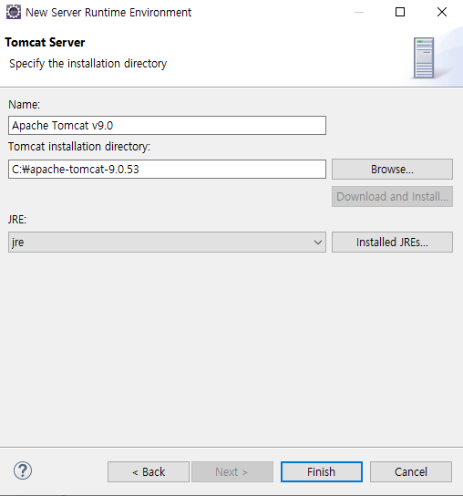

## HTML 0

### 1. 환경설정 

- Html 작업을 할 폴더(나의 경우 D드라이브)를 만들고, 이클립스에서 해당 폴더를 Workspace로 연결해서 열어준다! 

  

- 한글은 깨질 수가 있기 때문에 각종 설정들을 UTF-8로 잡아줘야 한다. 

  

  

  

참고로, HTML Files 외에 CSS Files, JavaScript에서도 Encoding을 UTF-8로 미리 바꿔주었다. 

- Html 파일 만들기

여기에서 우클릭을 하고 new > HTML FILE 을 잡아주면 만들 수 있다. 

### 2. 웹서버와 연결하기 (Tomcat)

- Tomcat 다운로드 

- 압축 해제 후 서버 정상작동하는지 확인  

압축을 풀고 C:\apache-tomcat-9.0.53\bin 의 위치로 들어오면, startup.bat와 shutdown.bat이 있는데, 각각 웹서버를 열고 닫는 기능을 해준다. 

startup.bat을 더블 클릭하면, 명령프롬프트 창에서한글이 깨지고 스크롤이 좀 올라간다. 이러면 정상! 닫은 후에 shutdown.bat을 더블 클릭하면, 웹서버가 닫힌다. 

- 포트 바꿔주기 

C:\apache-tomcat-9.0.53\conf 위치에서 web.xml 파일이 있는데, 해당 파일을 끌어다가 이클립스 작업의 탭 위치에 올려주면 해당 파일을 열 수 있다. 그 파일에서 8080이라는 포트를 8090으로 바꿔준다. 바꾸는 이유는 8080이 많은 프로그램들에서 디폴트로 지정되어 있는 경우가 많아 흔하기 때문이다. 8090, 9000, 3000, 5000 등으로 바꿔주면 된다. 

- 레지스트리에서 코드 페이지 설정하기 

위의 startup.bat을 누르면 한글이 깨지는 것을 봤는데, 이를 해결하기 위한 단계이다. 

시작 -> 실행 -> regedit (레지스트리 편집기) > Tomcat > CodePage > 우클릭 > 수정 > 값데이터, 단위 변경

이렇게 하고 다시 startup.bat을 열어보면 아래처럼 정상적으로 나오는 것을 볼 수 있다. 

- 이클립스로 돌아와 서버 연결하기 

상단의 Window > Preference > Server > Runtime Environments로 들어가서 Add..를 누르고 Apache Tomcat v9.0을 더해준다. 그리고 Next를 눌러 아래처럼 디렉토리를 정하고, 설정을 해준다. 

Finish를 눌러주고 메인으로 나오게 되면, Window > Web Browser > Chrome 으로 설정해주면, 앞으로 html파일을 Run해주면 결과를 크롬창에서 볼 수 있게 된다! 

이렇게 하면 HTML, CSS, JavaScript 작업을 할 준비는 끝이다. 