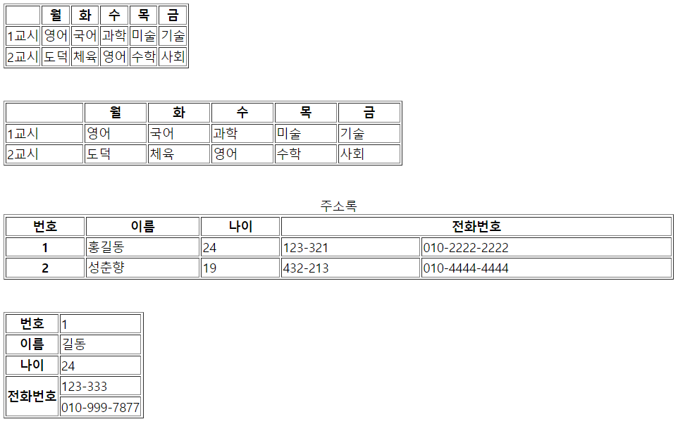

## HTML 1 

#### HTML기본  

## 1. HTML 기본

HTML은 HTML 페이지를 구성하기 위한 부품으로 **요소**를 갖는다. 제목, 본문, 이미지 등은 모두 요소이다. **태그**는 요소를 만들 때 사용하는 작성 방법을 의미하지만, 요소와 태그는 구분하지 않고 사용된다. 그러므로 요소를 생성하는 것과 태그를 생성하는 것은 같은 의미로 이해해도 되며, 태그라는 말을 더 많이 접하게 될 것이다. 그리고 **속성**이 있는데, 속성은 태그에 추가적인 정보를 부여할 때 사용하는 것이다. 예를 들면 다음과 같다. 

```html
<h1 title = "header">Hello World</h1>
  속성 이름   속성 값
		

  속성 이름     속성 값 
```


- **HTML 페이지의 구조**

  ```html
  <!DOCTYPE html>	
  	<!--웹 브라우저에 HTML5 문서라는 것을 알리기 위한 코드-->
                      
  <html> 
  	<!-- 모든 HTML 페이지의 기본 요소로서, 모든 태그 작성은 해당 태그 내에서 이루어져야 한다. root tag -->
      
  <head>
  	<!--body 태그에 필요한 스타일시트와 자바스크립트를 제공한다.-->
  <meta charset="UTF-8"> 
      <!--meta태그로 웹 페이지에 추가 정보를 전달한다. -->
      
  <title>HTML5 Basic</title>
  	<!--웹브라우저에 표시하는 제목 지정-->
  </head>
      
  <body>
  	<!--사용자에게 실제로 보이는 부분을 작성하는 곳-->
  </body>
      
  </html>
  ```

  


### 2. HTML 기본 태그 

- **글자 태그** 

  ```html 
  <h1>Hello World</h1>
  <h2>Hello World</h2>
  <h3>Hello World</h3>
  <h4>Hello World</h4>
  <h5>Hello World</h5>
  <h6>Hello World</h6>
  
  <br> <!-- 개행(줄바꿈) -->
  시가총액 상위종목 중에서는 반도체주인 삼성전자와 SK하이닉스가 동반 상승세를 보이고 있고요.<br>
  네이버와 카카오, 현대자동차와 LG화학 등은 하락세입니다.<br>
  코스닥지수는 어제보다 0.06% 오른 1040.10에 거래되고 있습니다.<br>
  
  <h1>Hello World</h1>
  
  
  <!-- p태그 : 단락  -->
  <p>태풍이 진행하는 경로의 수온을 보면 내내 26~27도를 웃돌아 태풍에 열대수증기를 공급하고 있습니다.</p>
  
  <p>이 때문에 앞으로 태풍이 남해동부 먼바다를 통과하는 동안에도 계속 중간 강도의 위력을 유지할 거로 예상됩니다.</p>
  
  <p>태풍은 앞으로 남해동부해상을 지나 오후 4시쯤에는 부산에서 약 170km 떨어진 대한해협을 통과하면서 한반도와는 점차 멀어질 것으로 보입니다.</p>
  ```


- **앵커태그**

  ```html
  <a href= "http://www.naver.com" >네이버</a>
  
  <a href= "http://www.daum.net" >Daum</a>
  
  <a href= "htmlPage.html" >htmlPage.html로 이동</a>
  
  <a href= "http://www.daum.net" target="_self" >Daum 현재 창</a>
  <a href= "http://www.daum.net" target="_blank" >Daum 새 창 </a>
  ```


- **글자 모양 태그** 

  ```html
  <!-- tag 안의 tag -->
  <p> 보통의 단락태그 </p>
  <p><b> 두꺼운</b>텍스트</p>
  <p><strong>Strong</strong></p>
  <p><i>이탤릭</i>테스트</p>
  <p><ins>밑줄 글자</ins></p>
  <p>나는 <em>성공</em>할 것입니다</p>
  <p>보시는 글은 <del>삭제</del>된 글입니다.</p>
  <p>이것은 <sub>아래 첨자</sub> 입니다.</p>
  <p>이것은 <sup>윗 첨자</sup> 입니다.</p>
  
  <!-- 여백 -->
  이름: &nbsp;&nbsp;&nbsp;&nbsp;&nbsp;홍길동 <br>
  전화번호: &nbsp;&nbsp;&nbsp;&nbsp;&nbsp;02-123-3211
  
  <!-- 폰트 태그 -->
  <font size="3" color="blue">font size:1 font color:blue</font> 
  
  <br>
  
  <font size="3" style="color:blue">font size:1 font color:blue</font>
  ```

  

  

- **목록 태그**

  ```html
  <!--순서없는 리스트-->
  <ul>
    <li> 사과 </li>
    <li> 포도 </li>
    <li> 망고 </li>
  </ul>
  
  <!--순서있는 리스트-->
  <ol type = "I">
    <li> 사과 </li>
    <li> 포도 </li>
    <li> 망고 </li>
  </ol>
  
  <!--리스트 안의 리스트-->
  <ul>
  <!--첫번째 목록-->
  	<li>
  		<b>과일</b>
  		<ol type ="A">
   		 	<li> 사과 </li>
    			<li> 배  </li>
  		</ol>
  	</li>
  <!--두번째 목록-->
  	<li>
  		<b>채소</b>
  		<ol>
    			<li> 상추 </li>
    			<li> 깻잎 </li>
  		</ol>
  	</li>
  </ul>
  ```


- **테이블 태그** 

  ```html
  <table border="1">
  	<!-- <thead> --> <!-- thead, tbody는 생략이 가능한 태그이다. -->
  		<tr>
  			<th></th>
  			<th>월</th>
  			<th>화</th>
  			<th>수</th>
  			<th>목</th>
  			<th>금</th>
  		</tr>
  	<!-- </thead>-->
  	<!-- <tbody> --> 
  		<tr>
  			<td>1교시</td>
  			<td>영어</td>
  			<td>국어</td>
  			<td>과학</td>
  			<td>미술</td>
  			<td>기술</td>
  		</tr>
  		<tr>
  			<td>2교시</td>
  			<td>도덕</td>
  			<td>체육</td>
  			<td>영어</td>
  			<td>수학</td>
  			<td>사회</td>
  		</tr>
  	<!-- </tbody> -->
  </table>
  
  <br>
  <br>
  
  <table border="1">
  		<col width="100"><col width="80"><col width="80"><col width="80"><col width="80"><col width="80">
  		<tr>
  			<th></th>
  			<th>월</th>
  			<th>화</th>
  			<th>수</th>
  			<th>목</th>
  			<th>금</th>
  		</tr>
  		<tr>
  			<td>1교시</td>
  			<td>영어</td>
  			<td>국어</td>
  			<td>과학</td>
  			<td>미술</td>
  			<td>기술</td>
  		</tr>
  		<tr>
  			<td>2교시</td>
  			<td>도덕</td>
  			<td>체육</td>
  			<td>영어</td>
  			<td>수학</td>
  			<td>사회</td>
  		</tr>
  </table>
  
  <br>
  <br>
  
  <!-- colspan으로 좌우합치기, caption, width -->
  <table border = "1" style="width:50%" >
  	<caption>주소록</caption>
  <tr>
  	<th>번호</th>
  	<th>이름</th>
  	<th>나이</th>
  	<th colspan="2">전화번호</th>
  	<!-- <th>전화번호</th> -->
  </tr>
  <tr>
  	<th>1</th>
  	<td>홍길동</td>
  	<td>24</td>
  	<td>123-321</td>
  	<td>010-2222-2222</td>
  </tr>
  	<tr>
  	<th>2</th>
  	<td>성춘향</td>
  	<td>19</td>
  	<td>432-213</td>
  	<td>010-4444-4444</td>
  </tr>
  </table>
  
  <br>
  <br>
  
  <!-- rowspan으로 위아래 합치기 -->
  <table border="1">
  <tr>
  	<th>번호</th>
  	<td>1</td>
  </tr>
  <tr>
  	<th>이름</th>
  	<td>길동</td>
  </tr>
  <tr>
  	<th>나이</th>
  	<td>24</td>
  </tr>
  <tr>
  	<th rowspan="2">전화번호</th>
  	<td>123-333</td>
  </tr>
  <tr>
  	<!-- <th>전화번호</th> -->
  	<td>010-999-7877</td>
  </tr>
  </table>
  ```

  




- **미디어 태그** 

  ```html
  image의 종류
  
  		png		jpg		bmp		gif		tga		tiff
  용량크기   3	   1	   6	   2 	   5	   4
  압축률	 		    1	    X
  	
  참고로 png파일은 배경색이 투명 
  
  <!--이미지 태그-->
  
  
  <br>
  <br>
  
  <br>
  <br>
  		 <!-- 이미지는 웹서버에서 불러오는 것이다. 그래서 그냥 이미지를 d드라이브(서버의 공간이 아니라 하드웨어의 공간이므로)에서 가져오면 안되는 것이다.  -->
  <br>
  <br>
  
  <!-- 만약 사진의 주소가 변경되거나 삭제되면 불러올 수 없다. -->
  
  ```

  


```html
<!--오디오 태그 & 비디오 태그-->

<audio src="Kalimba.mp3" controls="controls"></audio>

<br><br>
<video src="Wildlife.mp4" width="640" controls="controls">
	<source src="Wildlife.mp4" type="video/mp4">
</video>
```


- **공간 분할 태그** 

  div - 블록 형식으로 공간 분할 

  ​			블록 형식 : 각 태그가 한 행을 모두 차지 

  span - 인라인 형식으로 공간 분할 

  ​			인라인 형식 : 각 태그가 글자 크기만큼 영역을 차지

  ```html
  <div style="border-style: solid; border-color: blue">
  <h1>여기가 제목입니다.</h1>
  <p>여기는 내용입니다.</p>
  </div>
  
  <br> <br>
  
  <br><br>
  <span style="border-style: solid; border-color: blue">
  여기가 제목입니다.
  여기는 내용입니다.
  </span>
  ```

  