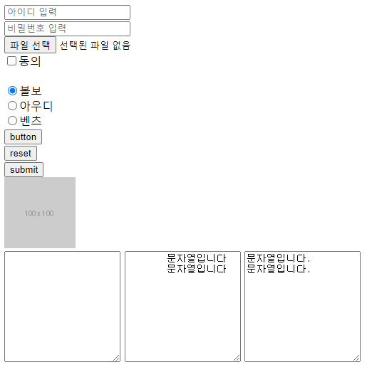
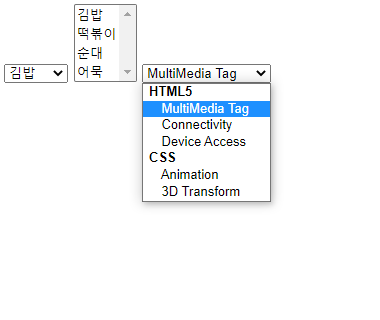
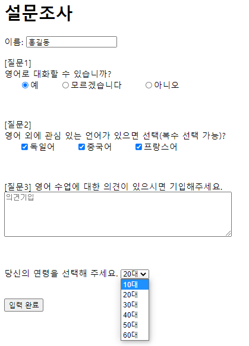
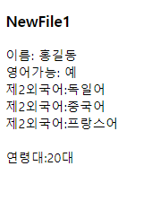

## HTML 2

#### 입력 양식 태그, 웹 데이터 jsp로 받기

### 1. 입력 양식 태그

- **form, input, textarea**

```html
<body>

<!-- form태그 -->

	<!-- input태그 -->
	
	<!-- 사용자 입력양식 -->
	<form action="NewFile.jsp">
	<input type="text" name="text" value="" placeholder="아이디 입력"> <br>
	<input type="password" name="pwd" value="" placeholder="비밀번호 입력"> <br>
	<input type="file" name="file"> <br>
	<input type="checkbox" name ="checkbox" value="checkboc">동의 <br><br>
	<input type="radio" name ="radio" value="" checked="checked">볼보 <br>
	<input type="radio" name ="radio" value="">아우디 <br>
	<input type="radio" name ="radio" value="">벤츠 <br>
		
	<!-- 유저에게 보이지 않는 입력 양식 -->
	<input type="hidden" name="hidden" value="숨겨진 값">
		
	<!-- 버튼 -->
	<input type="button" value="button"><br>
	<input type="reset" value="reset"><br>
	<input type="submit" value="submit"><br>
	<input type="image" src="http://placehold.it/100x100">
</form>

    <!-- textarea -->	
<textarea rows="10" cols="20"></textarea>

<textarea rows="10" cols="20">
	문자열입니다
	문자열입니다
</textarea>

<textarea rows="10" cols="20"> 문자열입니다.
문자열입니다.
</textarea>
</body>
```




- **Select**

  ```html
  <body>
  <!-- 항목 하나 선택하기-->
  <select>
  	<option>김밥</option>
  	<option>떡볶이</option>
  	<option>순대</option>
  	<option>어묵</option>
  </select>
  
  <!-- 여러개 항목 선택하기-->
  <select multiple="multiple">
  	<option>김밥</option>
  	<option>떡볶이</option>
  	<option>순대</option>
  	<option>어묵</option>
  </select>
  
  <!-- 선택 옵션 묶기 -->
  <select>
  	<optgroup label="HTML5">
  		<option>MultiMedia Tag</option>
  		<option>Connectivity</option>
  		<option>Device Access</option>
  	</optgroup>
  		<optgroup label="CSS">
  		<option>Animation</option>
  		<option>3D Transform</option>
  	</optgroup>
  </select>
  </body>
  ```

  

### 2. 웹에서 받은 데이터를 Java로 받기

- HTML페이지

```html
<!DOCTYPE html>
<html>
<head>
<meta charset="UTF-8">
<title>Insert title here</title>
</head>
<body>
<h1>설문조사</h1>

<form action="NewFile1.jsp">
이름: <input type = "text" name="name" size="20">
<p>[질문1]<br>
영어로 대화할 수  있습니까? <br>
&nbsp;&nbsp;&nbsp;&nbsp;&nbsp;<input type="radio" name="eng" value="예">예 &nbsp;&nbsp;&nbsp;&nbsp;&nbsp;
<input type="radio" name="eng" value="모르겠습니다">모르겠습니다 &nbsp;&nbsp;&nbsp;&nbsp;&nbsp;
<input type="radio" name="eng" value="아니오">아니오 
</p>

<br>
<p>[질문2]<br>
영어 외에 관심 있는 언어가 있으면 선택(복수 선택 가능)? <br>
&nbsp;&nbsp;&nbsp;&nbsp;&nbsp;<input type="checkbox" name="other" value="독일어">독일어 &nbsp;&nbsp;&nbsp;&nbsp;&nbsp;
<input type="checkbox" name="other" value="중국어">중국어 &nbsp;&nbsp;&nbsp;&nbsp;&nbsp;
<input type="checkbox" name="other" value="프랑스어">프랑스어 
</p>

<br>

<p>[질문3]
영어 수업에 대한 의견이 있으시면 기입해주세요. <br>
<textarea rows="5" cols="60" placeholder="의견기입"></textarea>
</p>

<br>
<p>
당신의 연령을 선택해 주세요.
<select name="age">
	<option value="10">10대</option>
	<option value="20" selected="selected">20대</option>
	<option value="30">30대</option>
	<option value="40">40대</option>
	<option value="50">50대</option>
	<option value="60">60대</option>
</select>
</p>
<br>

<input type="submit" value="입력 완료">
</form>
</body>
</html>
```




- **jsp페이지**

  💥.jsp를 열었는데, 서버 연결이 안되어있을 수가 있다.💥

  다음의 방법으로 서버를 다시 연결해주자

  

  WebContent	>	우클릭	> 	Build Path	>	Configure Build Path	>	Libraries	>	Classpath클릭	>	Add Library	>	Server Runtime	>	Next	>	Apache Tomcat v9.0	>	Finish

  

  이 순서대로 진행해주면  서버 연결이 가능하다. 

  

  ```html
  <%@ page language="java" contentType="text/html; charset=UTF-8"
      pageEncoding="UTF-8"%>
  <!DOCTYPE html>
  <html>
  <head>
  <meta charset="UTF-8">
  <title>Insert title here</title>
  </head>
  <body>
  
  <h3>NewFile1</h3>
  
  <%
  // Java영역
  String name = request.getParameter("name");
  %>
  이름: <%=name %>
  <br>
  
  <%
  String eng = request.getParameter("eng");
  %>
  영어가능: <%=eng %>
  
  <br>
  <%--
  String other = request.getParameter("other");
  --%>
  
  <%
     
  // 여러개(복수선택)를 받을 때는 아래처럼 받는 형태가 달라진다. 
  String other[] = request.getParameterValues("other");
  
  if(other != null){
  	for(int i = 0; i<other.length; i++){
  	%>
  	제2외국어:<%=other[i] %> <br>
  	<%
  	}
  }
  %>
  
  <br>
  
  <%
  String age = request.getParameter("age");
  int ageNum = Integer.parseInt(age);
  %>
  연령대:<%=ageNum %>대
  
  </body>
  </html>
  ```

   

  

  