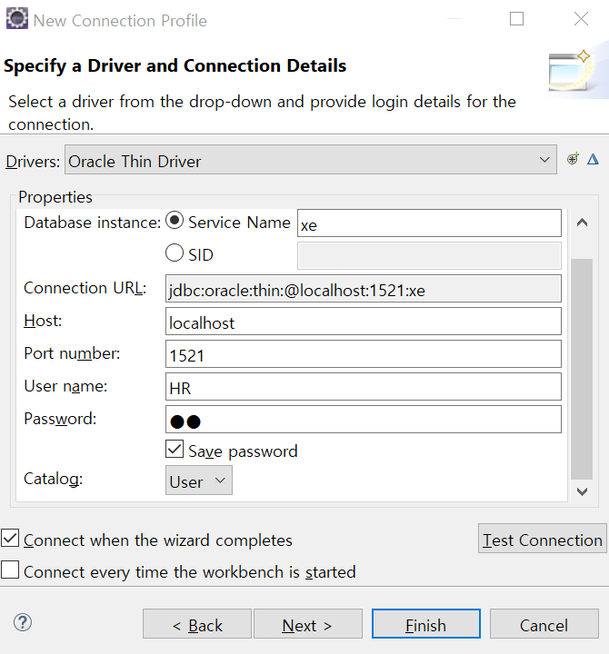
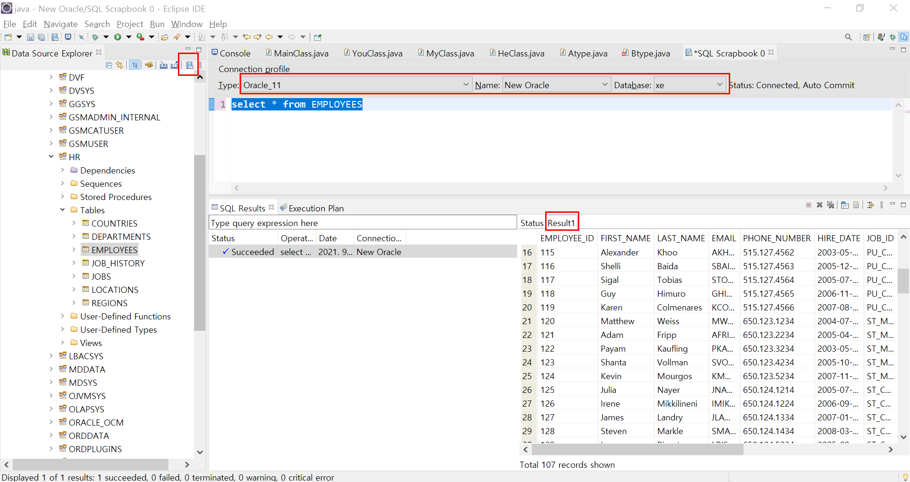

## JDBC 0

#### 이클립스와 데이터베이스 연동 

### 1. 이클립스와 데이터베이스 연동

이클립스 메인에서 

우측 상단의 아이콘(open perspective) > database development > ojdbc6 jar 다운로드(나의 경우엔 1.6이상으로 다운) (jar 파일은 압축 푸는게 아니다!!)

이클립스에서 Database Connection 우클릭 > new > +버튼 > Add JAR > ojdbc6 jar 불러오고 > 기존에 있던 ojdbc14는 remove > ok > 아래 사진처럼 로컬 호스트 HR입력 > Test Connection 눌러서 ping succeeded가 뜨면 Finish > 이클립스 메인으로 와서 > xe > Schemas > HR > Tables > Employees > 여기까지 하면 sql developer에서 봤던 데이터베이스를 이클립스에서도 볼 수 있게 연결되었다.  

그리고 다시 메인에서 scrapbook to edit SQL statement를 눌러준다. 

이렇게 되면 연동이 끝이다! 캡쳐를 적게 뜨고, 텍스트로만 작성하다보니 볼륨이 확 줄긴 했네.. 후후

