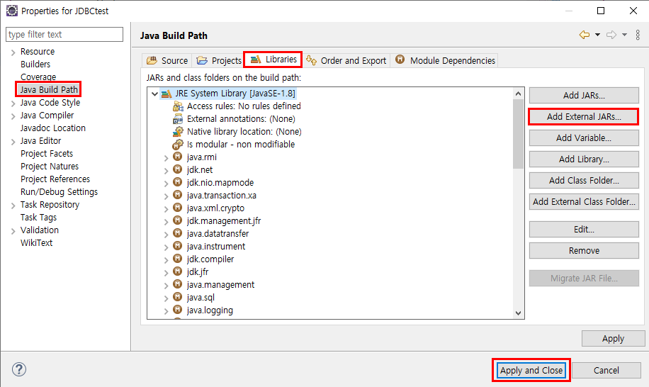

## JDBC 1 

#### JDBC 기본 

#### 1. Java에서 새로운 프로젝트를 만들고 jar파일을 참조로 넣어준다. 

프로젝트 만드는 것은 이미 앞에서 계속 봐왔으니, 대략적인 개요를 말하자면, MainClass, DAO, DTO, DBConnection, DBClose 정도를 최소한의 클래스로 생각하고 프로젝트를 만든다.   

그리고 이렇게 만들었으면 jar파일을 참조하도록 파일을 넣어줘야 하는데, 방법은 프로젝트 폴더에서 우클릭 > Properties > Java Build Path > Libraries > Add External JARs... > .jar파일 추가 > Apply and Close 




#### 2. 테이블 만들고 저장하기 

Open perspective에서 Database Development로 들어가서 좌측 상단에 Open scrapbook to edit~를 눌러서 쿼리 작성창을 열어준다. 


설정은 위와 각자 버전에 맞춰서 해주면 되는데, 나는 이렇게 하였다. 

테이블을 다 작성했다면, Java 프로젝트 폴더에 같이 저장을 해줘야 한다. 

상단의 File > Save As > 해당 프로젝트의 src에 저장을 해준다. 


### 3. DB를 쓰기 위한 기본적인 클래스 만들기 + 커넥션 초기화 

드라이버로딩, 데이터베이스 연결을 위한 클래스와 데이터베이스와의 연결(Connection,Statement, ResultSet)을 닫아주는 클래스를 2개를 만든다. 굳이 안만들어도 프로그램이 돌아가긴 하지만, 효율성과 편리성이 매우 높기 때문에 만드는 것을 강추강추..아니 내가 봤을 땐..쓰면 너무 편해 반드시... 꼭 만들기 

**3.1. DBConnection 클래스를 만들어보자** 

드라이버 로딩과 데이터베이스 연결을 위한 클래스이다. 

DBConnection이라는 클래스명은 사용자에 따라 수정 가능하다.

```java
package db;

import java.sql.Connection;
import java.sql.DriverManager;
import java.sql.SQLException;

public class DBConnection {

	public static void initConnection() {	// static method로 만들어놔서 불러올 때는 DBConnection.initConnection만 함수로 쓰면된다. 
		try {
			Class.forName("oracle.jdbc.driver.OracleDriver");	// 오라클 드라이버가 있는지 조사하고 로딩하는 것이다. 
			
			System.out.println("Driver Loading Success!");
		} catch (ClassNotFoundException e) {			
			e.printStackTrace();
		}
	}
	
	public static Connection getConnection() {		// static method로 만들어놔서 불러올 때는 DBConnection.getConnection()만 쓰면된다. 
		Connection conn = null;		
		try {
			conn = DriverManager.getConnection("jdbc:oracle:thin:@localhost:숫자:xe", "HR", "HR");
			
			System.out.println("DB Connection Success!");			
		} catch (SQLException e) {			
			e.printStackTrace();
		}
		
		return conn;
	}
}

```


여기서 초보자인 나같은 사람은 **"jdbc:oracle:thin:@localhost:숫자:xe"** 이 부분을 뭘 넣어야 될 지 구글링을 할 것이므로 아래를 참조하자 


Driver Properties에 있는 Connection URL을 복사해서 위 코드에 넣어주면 된다. 참고로 다른 외부 컴퓨터에서도 로컬호스트 부분만 바꿔주면 외부에서도 사용이 가능하다고 한다. 


**3.2. DBClose 클래스도 만들어보자 **

데이터베이스와의 연결(Connection,Statement, ResultSet)을 닫아주는 클래스이다.

역시 클래스명은 수정이 가능하다.

```java
package db;

import java.sql.Connection;
import java.sql.ResultSet;
import java.sql.SQLException;
import java.sql.Statement;

// DBClose는 사실 DBConnection에 같이 만들어서 해도된다. 다만 가독성이 이렇게 하면 더 올라가니깐 이렇게 했다. 

public class DBClose {		// static method로 만들어놔서 불러올 때는 DBClose.close만 쓰면된다. 

	public static void close(Connection conn, Statement stmt, ResultSet rs) {
		try {
			
			if(conn != null) {
				conn.close();
			}
			if(stmt != null) {
				stmt.close();
			}
			if(rs != null) {
				rs.close();
			}
			
		} catch (SQLException e) {
			// TODO Auto-generated catch block
			e.printStackTrace();
		}
	}
}
```


**3.3. 커넥션 초기화 하기** 

DBConnection.initConnection(); 라는 코드를 통해 위에서 만든 클래스로 함수를 불러와 커넥션을 초기화해준다. 

해당 코드의 위치는 상황에 따라 다르겠지만, Main의 기본 함수 바로 첫 문장 또는 DAO의 기본 생성자에 해주면 된다. 


 