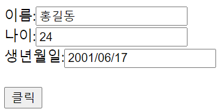

## AJAX 2

### 예시2(Json으로 파싱해서 데이터 가져오기)

String name = "홍길동";
int age = 24;
String birth = "2001/06/17";

위 데이터를 DB로부터 취득한 데이터라고 가정하고 index.jsp에 아래 이미지처럼 클릭버튼을 누르면, 데이터가 들어오게 하기 



- **data.jsp**

  ```jsp
  <%@ page language="java" contentType="text/html; charset=UTF-8"
      pageEncoding="UTF-8"%>
  
  <%
  // DB로부터 취득한 데이터라고 가정 
  String name = "홍길동";
  int age = 24;
  String birth = "2001/06/17";
  
  
  String json = "{ \"name\":\"" + name + "\", \"age\":" + age + ", \"birth\":\"" + birth + "\" }";
  // json이라는 문자열로 받는다. > index.jsp에서 json으로 파싱
  
  System.out.println(json);	// 작성 후 맞게 작성되었는지 확인
  
  out.println(json); 
   // out은 내장객체 json 데이터를 외부, 즉 자바영역 밖(<% % >)으로( 아래 영역 ) 내보내는 것 
  %>
  
  ```


- **index.jsp**

  ```jsp
  <%@ page language="java" contentType="text/html; charset=UTF-8"
      pageEncoding="UTF-8"%>
  <!DOCTYPE html>
  <html>
  <head>
  <meta charset="UTF-8">
  <title>Insert title here</title>
  <script src="https://ajax.googleapis.com/ajax/libs/jquery/3.5.1/jquery.min.js"></script>
  </head>
  <body>
  
  이름:<input type="text" id="name"><br>
  나이:<input type="text" id="age"><br>
  생년월일:<input type="text" id="birth"><br>
  <br>
  <button type="button">클릭</button>
  
  <script type="text/javascript">
  $(document).ready(function() {
  	
  	$("button").click(function () {
  	
  		$.ajax({
  			url:"data.jsp",
  			type:"get",			// 가져갈 데이터는 없으므로, data를 빼고 작성
  			success:function(data){
  			//	alert('success');
  			//	alert(data.trim());
  			
  				let json = JSON.parse(data);		// JSON으로 파싱 
  			//	alert(json);
  			
  				$("#name").val( json.name );
  				$("#age").val( json.age );
  				$("#birth").val( json.birth );
  				
  			},
  			error:function(){
  				alert('error');
  			}
  		});		
  	});	
  });
  </script>
  </body>
  </html>
  ```

  

-----

### 예시3 (AJAX, Servlet,Dto 같이 쓰기, 한개/다수 데이터 보내기)

- 라이브러리에 파일 추가하기 

WebContent > Web-INF > lib에 jar파일들 추가 


- **HumanDto.java**

  ```java
  package dto;
  
  public class HumanDto {
  	private int number;
  	private String name;
  	
  	public HumanDto() {
  	}
  	public HumanDto(int number, String name) {
  		super();
  		this.number = number;
  		this.name = name;
  	}
  	public int getNumber() {
  		return number;
  	}
  	public void setNumber(int number) {
  		this.number = number;
  	}
  	public String getName() {
  		return name;
  	}
  	public void setName(String name) {
  		this.name = name;
  	}
  }
  ```

  

- **Hello.Servlet**

  ```js
  package hello;
  
  import java.io.IOException;
  import java.util.ArrayList;
  import java.util.List;
  
  import javax.servlet.ServletException;
  import javax.servlet.annotation.WebServlet;
  import javax.servlet.http.HttpServlet;
  import javax.servlet.http.HttpServletRequest;
  import javax.servlet.http.HttpServletResponse;
  
  import dto.HumanDto;
  import net.sf.json.JSONObject;
  
  @WebServlet("/hello")
  public class HelloServlet extends HttpServlet {
  
  	@Override
  	protected void doGet(HttpServletRequest req, HttpServletResponse resp) throws ServletException, IOException {
  		System.out.println("HelloServlet doGet()");
  		
  		// 받는 데이터
  		// id, pwd
  		String id = req.getParameter("id");				// 파라미터로 받아서
  		String pwd = req.getParameter("pwd");
  		
  		System.out.println("id:" + id + " pw:" + pwd);	
          // 출력까지만 하였다. 
  		
          
  		// 보내는 데이터		
  		// 1개 데이터를 보내는 것 
  /*		String str = "World";						// 문자열로 World 받고
  		JSONObject jobj = new JSONObject();      	//  JSON으로 보낸다.
  		jobj.put("str", str);		
  */		
          
  		// object(다수)를 보내는 것 (다수)
  		// number, name
  		List<HumanDto> list = new ArrayList<HumanDto>();
  		list.add(new HumanDto(101, "성춘향"));
  		list.add(new HumanDto(102, "이몽룡"));
  		
  		JSONObject jobj = new JSONObject();
  		jobj.put("list", list);
  		
  		resp.setContentType("application/x-json; charset=utf-8");
  		resp.getWriter().print(jobj);
  	}
  }
  ```

  

- **index.jsp**

  ```jsp
  <%@ page language="java" contentType="text/html; charset=UTF-8"
      pageEncoding="UTF-8"%>
  <!DOCTYPE html>
  <html>
  <head>
  <meta charset="UTF-8">
  <title>Insert title here</title>
  <script src="https://ajax.googleapis.com/ajax/libs/jquery/3.5.1/jquery.min.js"></script>
  </head>
  <body>
  
  <div id="demo">
  </div>
  
  <button type="button">버튼</button>
  
  <script type="text/javascript">
  $(document).ready(function() {
  	
  	$("button").click(function() {
  		
  		$.ajax({
  			url:"hello",
  			type:"get",
  			data:{ id:"abc", pwd:"123" }, // 보낼 때 json으로 보냄 
  			success:function( data ){
  			//	alert('success');								
  			//	alert(JSON.stringify(data));
  			//	$("#demo").text(data.str);
  			
  			//	alert(JSON.stringify(data));
  			
  			//	alert(data.list[0].name);
  				
  				let str = '';
  				for(i = 0;i < data.list.length; i++){
  					str += data.list[i].name + " ";
  					str += data.list[i].number + "<br>";
  				}
  				
  				$("#demo").html(str);
  				
  			},
  			error:function(){
  				alert('error');	
  			}			
  		});		
  	});	
  });
  </script>
  </body>
  </html>
  ```

  