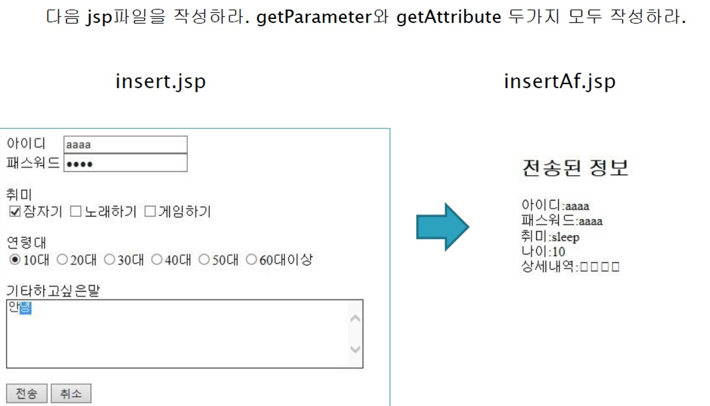

## JSP 2

#### JSP 내장객체, request, getParameter, 내장객체, 포워드

### 1. JSP 내장객체

내장객체는 암시객체라고도 하며 따로 동적할당을 하지 않고 사용할 수 있는 객체이며, JSP가 서블릿으로 변환될 때 컨테이너가 자동으로 생성하는 서블릿 멤버 변수를 말한다. JSP에서 제공하는 내장 객체들은 request, response, out, session, application, config 등 9개가 있는데, 특히 자주 쓰이는 것(request, response, session, pageContext) 위주로 그 사용법을 인지해두자. 

request - 클라이언트의 요청 정보를 저장

response - 응답 정보를 저장

session - 세션 정보를 저장

pageContext - JSP 페이지에 대한 정보를 저장

(추가로) out - JSP 페이지에서 결과를 출력


---------

### 예시3 (request, getParameter)

```jsp
<%@ page language="java" contentType="text/html; charset=UTF-8"
    pageEncoding="UTF-8"%>
<!DOCTYPE html>
<html>
<head>
<meta charset="UTF-8">
<title>Insert title here</title>
</head>
<body>

<%
// 내장 객체: 동적 할당을 하지 않고 사용할 수 있는 객체 
// request == 요청 
// HttpServletRequest -> Servlet

String name = request.getParameter("name");
String age = request.getParameter("age");

String hobby[] = request.getParameterValues("hobby");
%>

<h3>이름:<%=name %></h3>
<h3>나이:<%=age %></h3>

<%
for(int i = 0; i < hobby.length; i++){
%>
	<%=hobby[i] %>			<!-- 다소 정신없게 느껴지기도 한다.. -->
<%	
}
%>

</body>
</html>
```


---------

### 예시4 (내장객체, 포워드)

- **index3.jsp**

  ```jsp
  <%@page import="jspSample1.Member"%>
  <%@ page language="java" contentType="text/html; charset=UTF-8"
      pageEncoding="UTF-8"%>
  
  <%
  
  Member mem = new Member("김판호");
  
  // 짐싸라
  request.setAttribute("member", mem);
  //session.setAttribute("member", mem);
  
  
  // 잘가라
  // forward(짐을 들고 이동)
  request.getRequestDispatcher("index4.jsp").forward(request, response);
  pageContext.forward("index4.jsp");
  
  
  //SendRedirect(짐없이 이동)
  response.sendRedirect("index4.jsp");
  
  %>
  
  <!DOCTYPE html>
  <html>
  <head>
  <meta charset="UTF-8">
  <title>Insert title here</title>
  </head>
  <body>
  
  </body>
  </html>
  ```


- **index4.jsp**

  ```jsp
  <%@page import="jspSample1.Member"%>
  <%@ page language="java" contentType="text/html; charset=UTF-8"
      pageEncoding="UTF-8"%>
  
  <%
  // 짐 풀어!
  Member mem = (Member)request.getAttribute("member");
  // Member mem = (Member)session.getAttribute("member");
  
  %>
  
  <!DOCTYPE html>
  <html>
  <head>
  <meta charset="UTF-8">
  <title>Insert title here</title>
  </head>
  <body>
  
  <h1>Index4</h1>
  
  
  
  <%
  if(mem !=null){
  %>
  	<%=mem.toString() %>
  <% 	
  }
  %>
  </body>
  </html>
  ```


- **Member.java(참고)**

  ```java
  package jspSample1;
  
  public class Member {
  	private String name;
  
  	public Member(String name) {
  		super();
  		this.name = name;
  	}
  
  	@Override
  	public String toString() {
  		return "Member [name=" + name + "]";
  	}
  }
  ```

  

---

### practice(getParameter)




- **Insert.jsp**

  ```jsp
  <%@ page language="java" contentType="text/html; charset=UTF-8"
      pageEncoding="UTF-8"%>
  <!DOCTYPE html>
  <html>
  <head>
  <meta charset="UTF-8">
  <title>Insert title here</title>
  <script src="https://ajax.googleapis.com/ajax/libs/jquery/3.5.1/jquery.min.js"></script>
  </head>
  <body>
  
  
  <!-- <form action="InsertAf.jsp"> -->
  <form id="frm">
  아이디 <input type="text" name ="id" id="id">
  <br>
  패스워드 <input type="password" name ="password" id="password">
  <br><br> 
  취미 
  <input type="checkbox" name = "hobby" value="잠자기">잠자기
  <input type="checkbox" name = "hobby" value="노래하기">노래하기
  <input type="checkbox" name = "hobby" value="게임하기">게임하기
  <br><br> 
  연령대
  <input type="radio" name = age value="10대">10대
  <input type="radio" name = age value="20대">20대
  <input type="radio" name = age value="30대">30대
  <input type="radio" name = age value="40대">40대
  <input type="radio" name = age value="50대">50대
  <input type="radio" name = age value="60대이상">60대이상
  <br><br>
  기타하고싶은말
  <br>
  <textarea rows="5" cols="40" name="etc">안녕</textarea>
  <br><br>
  <!-- <button type="submit">전송</button> -->
  <button type="button" id="send">전송</button>
  <button type="reset">취소</button>
  </form>
  
  <script type="text/javascript">
  //JavaScript
  // 검사를 해주고 난 후에 넘기기 위해서! 검사라 함은 빈 값은 아닌지 확인
  $(document).ready(function() {
  	$("#send").click(function() {		// 전송을 눌렀는데 
  		if($("#id").val().trim() == ''){	
              					// 만약 id가 공백이면 id로 포커싱을 한다. 
              					// trim으로 스페이스바로 공백을 넣은 것도 필터링 
  			alert('ID를 입력해주세요')
  			
  			$("#id").val("");	
  // ID입력해주세요 알림을 띄우고, id창을 공백으로 만들어서 아이디를 치도록 한다.
  			
  			$("#id").focus();
  			
  			return;
  		}	
  		/* form에 action을 안적어놨을 때 방법  */
  		$("#frm").attr("action","InsertAf.jsp").submit();	
  		
  		/* form에 action을 적어놨을 때 방법  */
  		$("#frm").submit();
  	}); 
  });
  </script>
  </body>
  </html>
  ```

  


- **InsertAf.jsp**

  ```jsp
  <%@ page language="java" contentType="text/html; charset=UTF-8"
      pageEncoding="UTF-8"%>
      
  <%
  String id = request.getParameter("id");
  String password = request.getParameter("password");
  String hobby[] = request.getParameterValues("hobby");
  String age = request.getParameter("age");
  String etc = request.getParameter("etc");
  %>
  <!DOCTYPE html>
  <html>
  <head>
  <meta charset="UTF-8">
  <title>Insert title here</title>
  </head>
  <body>
  <h2>전송된 정보</h2>
  아이디:<%=id %><br>
  패스워드:<%=password %><br><br>
  <%
  if(hobby != null){
  	for(int i = 0;i < hobby.length; i++){
  		%>
  		취미:<%=hobby[i] %><br>
  		<%
  	}
  }
  %><br><br>
  나이:<%=age %><br><br>
  <%
  if(etc.equals("") == false){	// 공백이 아니면, 하고싶은 말: 내용 출력 
  	%>
  	하고싶은 말:<%=etc %>
  	<%
  }
  %>
  </body>
  </html>
  ```

  