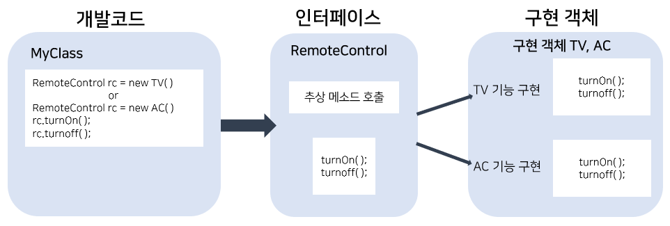

## Java 15

#### 추상클래스, 인터페이스 

### 1. 추상클래스 

객체를 직접 생성할 수 있는 클래스를 실체 클래스라고 한다면, 이러한 클래스들이 공통으로 가지는 특성들을 추출해서 선언한 클래스를 추상클래스라고 한다. 추상클래스(부모)와 실체클래스(자식)는 상속관계를 갖는다. 그러므로, 실체클래스는 추상클래스의 모든 필드와 메소드들을 물려받고, 추가적인 필드와 메소드를 가질 수 있다. 


추상클래스는 new 연산자를 사용해 인스턴스(객체)를 생성할 수 없다. 그저 추상클래스는 새로운 실체 클래스를 만들기 위한 부모 클래스로만 사용된다. 

Car라는 추상클래스가 있고, Sonata라는 클래스를 만든다고 가정하면, 

`class Sonata extend Car(......) ` 

이러한 형식을 갖는다. 


추상클래스가 존재하는 이유, 목적을 살펴보면, 2가지가 있다. 

첫째, 실체 클래스들이 공통으로 가지는 필드와 메소드의 이름을 통일하기 위해

둘째, 실체 클래스를 작성할 시간을 절약할 수 있다는 이점 


**MainClass**

```java
package main;

import cls.AbstractClass;
import cls.MyClass;

public class MainClass_abstractsample {

	public static void main(String[] args) {
		/*
		 	Abstract Class : 추상 클래스 
		 					 추상 메소드를 하나 이상 포함하고 있는 클래스 
		 					 내용은 없고, 선언만 되어 있는 메소드 
		 					 이미 만들어져 있는 기능에 대해 커스터마이징을 하거나, 그 기능을 받아서 쓰는 경우에 사용한다.
		 					 그러므로, 우리가 처음부터 시작한 프로젝트에서 쓰는 빈도는 거의 낮을 것이다.
		 		
		 					 
		 	일반메소드 
		 	public void method(int n){		<- 프로토타입 
		 			처리 
		 	}
		 	
		 	추상메소드 
		 	public abstract void method(int n);   <- 추정해서 선언만 해놓고, 처리는 없다. 
		 	
		*/
		
		// AbstractClass acls = new AbstractClass(); (x)
		
		// 이 방식은 여러클래스에서 추상클래스를 쓸 때 사용한다.
		MyClass cls = new MyClass();
		cls.method();
		cls.abstractMethod();
			

		// 이렇게도 가능한데, 주로 하나의 클래스에서 추상클래스를 쓸 때 사용한다.
		AbstractClass acls = new AbstractClass() {
			
			@Override
			public void abstractMethod() {
				System.out.println("AbstractClass abstractMethod()");
				
			}
		};
		acls.method();
		acls.abstractMethod();
	
	}
}
```


**추상클래스**

```java
package cls;

public abstract class AbstractClass {
	
	private int number; // 멤버 변수
	
	public void method() { // 일반 멤버 메소드
		System.out.println("AbstractClass method()");
	}
	
	public abstract void abstractMethod();
	
}
```


**자식클래스**

```java
package cls;

public class MyClass extends AbstractClass {

	@Override // == namespace
	public void abstractMethod() {
		System.out.println("MyClass abstractMethod()");
	}
}
```


### 2. 인터페이스 

- 인터페이스는 자바에서 객체의 사용 방법을 정의한 타입이다. 인터페이스는 다형성 구현에 매우 중요한 역할을 수행하는데, 객체의 교환성을 높히기 때문이다. 이러한 인터페이스는 개발 코드와 객체가 서로 통신하는 중간다리 역할을 한다. 

  원리에 대해 얘기해보면,  개발 코드가 인터페이스에 있는 메소드를 호출하면, 인터페이스는 객체의 메소드를 호출한다. 그러므로 개발 코드는 객체 내부의 구조를 알 필요없이 인터페이스의 메소드만 알면 되는 것이다. 

  여기서 인터페이스라는 중간다리를 거치지 않고, 개발 코드가 직접 객체와 통신하면 된다고 생각할 수 있는데, 인터페이스를 사용하면 개발 코드를 수정하지 않고, 사용하는 객체를 변경할 수 있다. 또한 인터페이스는 여러 객체들과 사용이 가능하기 때문에 객체에 따라 실행 내용과 리턴값이 다를 수 있다. 다시 말해, 개발 코드 입장에서 보면, 코드를 변경하지 않고, 실행 내용과 리턴값을 다양화할 수 있는 것이다.  

- 클래스와 몇가지 비교해보면, 

1. 클래스는 필드, 생성자, 메소드를 구성요소로 가지지만, 인터페이스는 상수와 메소드만을 구성요소로 갖는다. 
2. 인터페이스는 생성자를 가질 수 없다.
3. 클래스와 달리 인터페이스는 다중 상속이 가능하다.


- 원리를 알기 쉽게 설명하면 다음과 같다. 

  

  

  

- 인터페이스의 형식을 보면 다음과 같다. 

```java
// 인터페이스 선언
[public] interface 인터페이스명{

// 상수 
	[public static final] 타입 상수명 = 값;

// 추상 메소드 : 리턴 타입, 메소드명, 매개변수만 기술되고 {}가 붙지 않는 메소드 
   [public abstract] 타입 메소드명(매개변수, ...);

// 디폴트 메소드
   [public] default 타입 메소드명(매개변수, ...){
        
    }
  
// 정적 메소드 
    [public]static 타입 메소드명(매개변수, ...){
        
    }
}
```


**MainClass**

```java
package main;

public class MainClass_interfacesample {

	public static void main(String[] args) {
		/*
		 	abstract class : 일반 멤버변수 + 일반 멤버메소드 + 추상메소드
		
		
			interface : 추상 메소드. 선언만 되어 있고, 비어있다. 
						메소드의 타입만이 설정되어 있다. 
						다중 상속이 가능하다.
						빠르게 클래스의 사양을 파악할 수 있다. (목차를 보는 것과 같은 기능)
						
		*/

		// MyInterface myinit = new MyInterface();
		
	 
		/* 방법1 클래스
		MyClass mycls = new MyClass()
		mycls.method();
		mycls.func();
		*/  
		
		// 방법2 인터페이스 호출
		MyInterface myint = new MyClass();
		myint.method();
		myint.func();
	
	}
}
```


**MyClass**

```java
package main;

public class MyClass implements MyInterface{ // interface를 상속받을 때는 extend가 아니라 implement

	@Override
	public void method() {
		System.out.println("MyClass method()");
		
	}

	@Override
	public void func() {
		System.out.println("MyClass func()");
		
	}
}
```


**MyInterface**

```java
package main;

public interface MyInterface {    
	// private int number;	// 변수 선언 불가 
	
	/*
	private void method() {		
	}
	*/
	
	public void method(); 
	public void func();
}
```


**YouClass**

```java
package main;

public class YouClass implements HeInterface,SheInterface {
// 이렇게 interface는 implements로 다중상속을 받을 수 있다. 
// 클래스는 다중상속이 불가하다. 
}
```


#### NameCard, PhoneCard 예시 (인터페이스를 사용하지 않을 때)

**MainClass**

```java
package main;

import cls.NameCard;
import cls.PrintNameCard;
import cls.PrintPhoneCard;

public class MainClass {

	public static void main(String[] args) {
		
		NameCard ncard = new NameCard("김경훈", "123-4567","KH@naver.com");

		ncard.setPrintNameCard(new PrintNameCard());
		ncard.print();
	
		
		ncard.setPrintPhoneCard(new PrintPhoneCard());
		ncard.phoneprint();
	}
}
```


**NameCardClass**

```java
package cls;

public class NameCard {
	String name; 
	String phone;
	String email;
	
	PrintNameCard printNameCard;  // 클래스, 변수 생성
	
	public NameCard(String name, String phone, String email) {	// 생성자
		this.name = name;
		this.phone = phone;
		this.email = email;
	}
	
	public void setPrintNameCard(PrintNameCard p) {  // 메소드, 외부에서 파라미터가 들어오면 
		printNameCard = p;					 
	}
	
	public void print() {
		printNameCard.print(this);			// this, 멤버변수의 name을 통해서 PrintNameCard클래스로 간다. 
	}
	
	
	// PrintPhoneCard 
	PrintPhoneCard printPhoneCard;
	
	public void setPrintPhoneCard(PrintPhoneCard p) {  // 메소드
		printPhoneCard = p;					
	}
	
	public void phoneprint() {
		printPhoneCard.print(this);		
	}
}
```


**PrintNameCard **

```java
package cls;

public class PrintNameCard {
	
	public void print(NameCard nc) {		// 이름 출력 메소드
		System.out.println("이름: " + nc.name);
	}
}
```


**PrintPhoneCard**

```java
package cls;

public class PrintPhoneCard {
	
	public void print(NameCard nc) {		// 전화번호 출력 메소드
		System.out.println("전화번호: " + nc.phone);
	}
}
```


**위 아래 비교!**


#### NameCard, PhoneCard 예시 (인터페이스를 사용할 때)

**MainClass**

```java
package main;

import cls.NameCard;
import cls.PrintInterface;
import cls.PrintNameCard;
import cls.PrintPhoneCard;

public class MainClass_namecardinterface {
	public static void main(String[] args) {
		
		NameCard nc = new NameCard("훈경김", "234-2123", "HK@naver.com");

		PrintInterface p = new PrintNameCard();
		p.print(nc);
		
		PrintInterface p1 = new PrintPhoneCard();
		p1.print(nc);
		
		/*
		nc.setPrintNameCard(new PrintNameCard());
		nc.print();
	
		
		nc.setPrintNameCard(new PrintPhoneCard());
		nc.print();
		*/
	}
}
```


**NameCardClass**

```java
package cls;

public class NameCard {
	
	String name;
	String phone;
	String email;
	
	public NameCard(String name, String phone, String email) {
		this.name = name;
		this.phone = phone;
		this.email = email;
	}
	
	PrintInterface printInterface ;
	public void setPrintNameCard(PrintInterface p) {
		printInterface = p;
	}
	
	public void print() {
		printInterface.print(this);
	}	
}
```


**PrintInterface** 

```java
package cls;

public interface PrintInterface {

	public void print(NameCard nc);
}
```


**PrintNameCardClass**

```java
package cls;

public class PrintNameCard implements PrintInterface {
						// PrintNameCard 가 PrintInterface에서 상속을 받음 
	@Override
	public void print(NameCard nc) {
		System.out.println("이름: " + nc.name);
	}
}
```


**PrintPhoneCardClass**

```java
package cls;

public class PrintPhoneCard implements PrintInterface {

	@Override
	public void print(NameCard nc) {
		System.out.println("전화번호: " + nc.phone);
	}
}
```