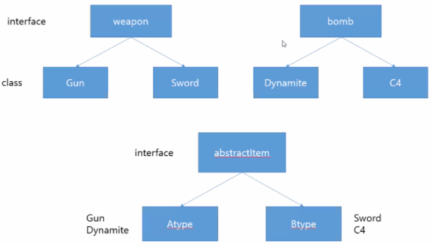

## Java 18 

#### 싱글톤, 팩토리패턴

### 1. 싱글톤(Singleton)

싱글톤은 class간 대화를 목적으로 객체를 하나만 생성해서 데이터에 접근할 수 있도록 하는 패턴이다. 예시를 통해 이해해보자 

- **비교예시**

먼저, 비교를 위해 싱글톤 없이 멤버변수를 주고받는 코드를 보자 

멤버변수 name을 넘기는 클래스에서는 getter를 사용한다.

```java
public class MyClass {
	
	private String name;

	public MyClass(String name) {
		super();
		this.name = name;
	}
	
	public String getName() {
		return name;
	}
}

```


멤버변수를 받는 클래스에서는  setter를 사용한다.

```java
public class YouClass {

	private String name; 

	public void setName(String name) {
		this.name = name;
	}
	
	@Override
	public String toString() {
		return "YouClass [name=" + name + "]";
	}
}
```


MainClass에서는 getname / setname을 이용해서 값을 받는다. 

```java
MyClass mycls = new MyClass("홍길동");
YouClass youcls = new YouClass();

String name = mycls.getName();		
youcls.setName(name);	
System.out.println(youcls.toString());
```

이 방식은 외부로 코드가 너무 많이 노출된다는 단점이 있다. 그리고 간단한 작업을 하는데도 손이 많이 간다는 단점도 있다. 


- **싱글톤 예시**

이제 singleton을 사용해서 멤버변수를 주고받아 보자 

MyClass 코드

```java
import single.Singleton;

public class MyClass {
	
	private String name;

	public MyClass(String name) {
		super();
		this.name = name;
	}
	
	public void method() {
		Singleton si = Singleton.getInstance();
		si.sname = name;   
        // 싱글톤에 있는 sname에 name을 넣고, 이를 youclass에서 가져오는 원리 보기 
	}
	
}

```


YouClass 코드 (MyClass에서 name멤버변수를 받고, HeClass로 age를 넘긴다)

```Java
import single.Singleton;

public class YouClass {

	private String name;
	private int age = 24; 	// HeClass도 추가. 아래 확인

	
	public void func() {
		Singleton si = Singleton.getInstance();
		name = si.sname;	// 싱글톤에서 가져온 sname을 name에 넣는다. 
	}
	
	public void method() {
		Singleton si = Singleton.getInstance();
		si.sage = age;
	}
	
	@Override
	public String toString() {
		return "YouClass [name=" + name + "]";
	}
}

```


HeClass(MyClass에서 age멤버변수를 받는다)

```java
import single.Singleton;

public class HeClass {

	private int age;


	
	public void method() {
		Singleton si = Singleton.getInstance();
		age = si.sage;
	}

	@Override
	public String toString() {
		return "HeClass [age=" + age + "]";
	}
	
}

```


MainClass에서 호출

```java
MyClass mycls = new MyClass("홍길동");
YouClass youcls = new YouClass();
HeClass hcls = new HeClass();
		
		
		
mycls.method();
youcls.func();
youcls.method();
hcls.method();
		
	
System.out.println(youcls.toString());		// 출력값 YouClass [name=홍길동]
System.out.println(hcls.toString());		// 출력값  HeClass [age=24]
```


### 2. 팩토리 패턴 

팩토리 패턴은 팩토리 메소드 패턴으로 더 널리 알려져 있는데, 인스턴스를 만드는 절차를 추상화하는 생성 패턴 중 하나이다. 팩토리 패턴은 여러개의 서브 클래스를 가지고 있는 부모 클래스가 있을 때, 입력값에 따라 하나의 자식 클래스의 인스턴스를 리턴하는 형태이다. 

팩토리 패턴의 장점을 살펴보면 보다 팩토리 패턴을 이해하기 쉽다. 팩토리 패턴의 가장 큰 장점은  결합도를 낮춘다는 것이다. 예를 들어, A 클래스와 그 외에 A를 참조하고 있는 B, C, D, E, F, G,,,클래스가 있다고 해보자. 만약 이럴 때 A 클래스의 생성자가 바뀐다고 하면, A를 제외한 나머지 클래스들 모두를 변경해야 한다. 이는 굉장히 손이 많이가고 시간 소모적이다. 팩토리 패턴을 적용해보면, 객체 생성을 각 클래스에서 하는 것이 아니라, 팩토리 클래스에서 생성되고, 클래스들은 생성된 객체를 가져다가 쓰는 구조이다. 따라서 A 클래스에 변동이 생겨도 팩토리 클래스만 변경 해주면 되기 때문에 훨씬 효율적이다. 

정말 간단한 예시를 살펴보자. 예시의 구조는 아래 형태와 같다. 

- **예시**




weapon 인터페이스와 자식 클래스들(Gun, Sword)

```java
package weapon;

public interface Weapon {

	public void drawWeapon();
}


package weapon;

public class Gun implements Weapon {

	@Override
	public void drawWeapon() {		
		System.out.println("weapon:총");
	}
}


package weapon;

public class Sword implements Weapon {

	@Override
	public void drawWeapon() {
		System.out.println("weapon:장검");
	}
}
```


bomb인터페이스와 자식 클래스들(Dynamite, C4)

```java
package bomb;

public interface Bomb {

	public void drawBomb();
}


package bomb;

public class Dynamite implements Bomb {

	@Override
	public void drawBomb() {		
		System.out.println("bomb:다이너마이트");
	}
}


package bomb;

public class C4 implements Bomb {

	@Override
	public void drawBomb() {		
		System.out.println("bomb:시한폭탄");
	}
}
```


abstractItem 인터페이스와 자식 클래스들(A type, B type)

```java
package types;

import bomb.Bomb;
import weapon.Weapon;

public interface AbstractItem {

	public Weapon createWeapon();
	public Bomb createBomb();
}


package types;

import bomb.Bomb;
import bomb.Dynamite;
import weapon.Gun;
import weapon.Weapon;

public class Atype implements AbstractItem {

	@Override
	public Weapon createWeapon() {		
		return new Gun();
	}

	@Override
	public Bomb createBomb() {		
		return new Dynamite();
	}
}


package types;

import bomb.Bomb;
import bomb.C4;
import weapon.Sword;
import weapon.Weapon;

public class Btype implements AbstractItem {

	@Override
	public Weapon createWeapon() {		
		return new Sword();
	}

	@Override
	public Bomb createBomb() {		
		return new C4();
	}
}
```


person(팩토리 클래스) 및 MainClass

```java
package person;

import bomb.Bomb; 
import types.AbstractItem;
import weapon.Weapon;

public class Person {

	public Weapon mWeapon;
	public Bomb mBomb;
	
	public void create(AbstractItem item) {
		
		mWeapon = item.createWeapon();
		mBomb = item.createBomb();		
	}
}


package main;

import person.Person;
import types.Atype;
import types.Btype;

public class MainClass {
	public static void main(String[] args) {
		
		Person char1 = new Person();
		char1.create(new Btype());
		
		char1.mWeapon.drawWeapon();
		char1.mBomb.drawBomb();	
	}
}

/* 출력값
weapon:장검
bomb:시한폭탄
*/
```


