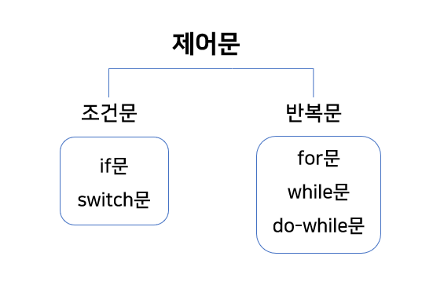
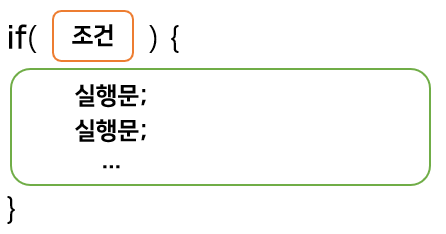
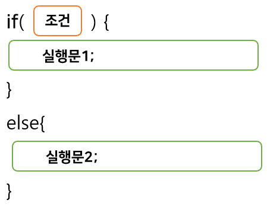
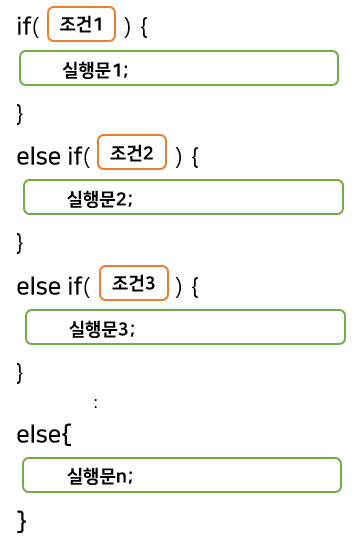
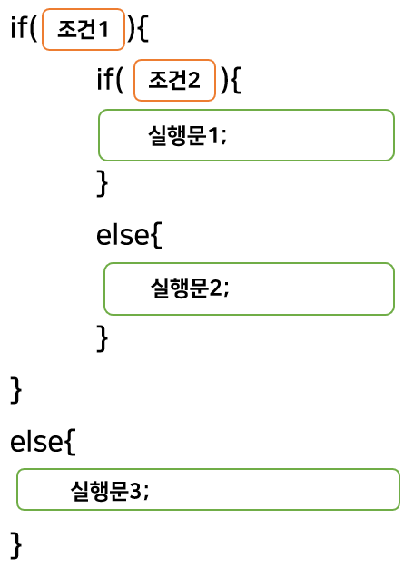
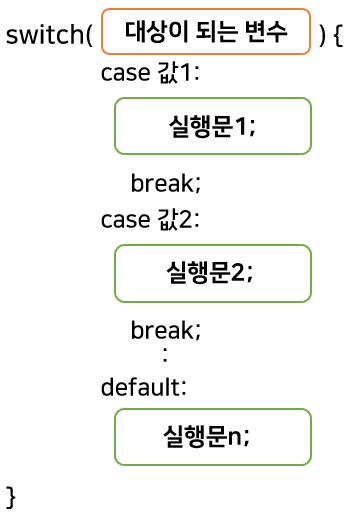

## Java 4 

#### (제어문, If문, Switch문)


### 1. 제어문

Java 프로그램은 main 메소드가 시작하는 첫 중괄호부터 끝 중괄호까지 위에서 아래로 코드가 실행되는 일련의 흐름을 가지고 있다. 이러한 흐름을 개발자가 원하는 방향으로 바꿀 수 있는 도구가 바로 제어문이다. 제어문의 개괄적으로 보면 다음과 같다. 



조건문과 반복문 각각을 예시 위주로 살펴보며, 이번과 다음 두번에 걸쳐서 포스팅을 해보려고 한다. 


### 2. if문 

**2.1. if문의 형식과 기본조건** 



if문은 위와 같은 형식을 가지고 있다. if문은 "만약 조건이 참이라면 중괄호 안의 실행문을 처리하고, 

거짓이면 실행문을 처리하지마"라는 의미를 가지고 있다. 조건문에 올 수 있는 조건들은 다음과 같다. 


<center><     if( A < B )

<center>==     if( A == B )

<center>\>=     if( A >= B )

<center><=     if( A <= B )

<center>!=     if( A != B )

```java
int number = 5;
if(number > 0) {
	System.out.println("number는 0보다 큽니다.");  
}                                                      // True, 실행문 처리 
			
if(number < 10) {
	System.out.println("number는 10보다 작습니다.");
}                                                      // True, 실행문 처리 
		
if(number == 5) {
	System.out.println("number는 5입니다.");
}                                                      // True, 실행문 처리 
	
if(number != 0) {
	System.out.println("number는 0이 아닙니다.");
}                                                      // True, 실행문 처리 

if(number%5 == 0) {
	number = number * 2; 
}                                                      // True, 실행문 처리 
System.out.println(number);
```


**2.2. 논리연산자 조건** 

논리연산자에는 and, or, not 등이 있다. 한번 기호로 살펴보자. 


논리 연산자: 

<center>&&(and)                        조건1 && 조건2 (그리고)               둘 다 참이어야만 참                        

<center>||(or)                               조건1 || 조건2 (또는)                       둘 중 하나라도 참이면 참

<center>! (not)                             !(조건1) (부정, 아니다)                   조건1이 아니다의 응답이 참이면 참 / 거짓이면 거짓 

```java
int age = 26;

if (age >= 19) {
	System.out.println("당신은 성인입니다.");
}                                                     // True, 실행문 처리

if (age > 19 && age < 30) {
	System.out.println("당신은 20대입니다.");
}                                                   // True, 실행문 처리

if (age > 19 && age < 22) {
	System.out.println("당신은 19보다 많고, 22보다 작습니다.");
}                                                     // False, 실행문 미처리

if (age > 20 || age <=27) {		                      // true || true
	System.out.println("당신은 20보다 많거나 27보다 작거나 같습니다.");
}                                                     // True, 실행문 처리

if (age < 20 || age >=30) {		                      // false || false
	System.out.println("당신은 20보다 어리거나 30보다 크거나 같습니다.");
}                                                     // False, 실행문 미처리

if (!(age < 24)) {		// age >= 24 이런 식으로 더 많이 쓴다.
	System.out.println("당신은 24보다 크거나 같습니다.");
}                                                      // True, 실행문 처리

boolean setup = false;

if (setup==true) {
	System.out.println("setup은 되어 있습니다.");
}                                                     // False, 실행문 미처리

if (setup) {
	System.out.println("setup은 되어 있습니다.");
}                                                     // False, 실행문 미처리

if (setup == false) {
	System.out.println("setup은 false입니다.");
}                                                    // True, 실행문 처리

if (!setup) {                               
    // !로 false를 부정 == True
	System.out.println("setup은 false입니다.");
}                                                   // True, 실행문 처리
```


**2.3. if - else문** 

if - else문은 false일 때는 아무런 실행문 처리도 일어나지 않는 if문과는 달리,  조건이 true일 때는 실행문1을 처리하고, false일 때는 실행문2를 처리하는 기능을 한다. 



```java
int num = 15
if (num > 18) {
	System.out.println("당신은 성인입니다");
}
else {
	System.out.println("당신은 성인이 아닙니다");
}                                                      
// False이므로 else문의 실행문을 처리 
```


**2.3.1. 삼항 연산자**

여기서 잠깐! if - else문과 비슷한 역할을 하는 삼항 연산자에 대해 소개해보려고 한다. 

삼항 연산자의 형식은 아래와 같다. 


형식: 

<center>값 = (조건)?  값1  :  값2 

삼항 연산자를 풀어보면, 조건이 참이면 값1을 값에 대입하고 거짓이면 값2를 값에 대입하는 형태이다. 

```java
number = 20; 
int a = 0; 
if (number>20) {
	a = 1;
}
else {
	a = 2;
}
System.out.println("a = "+ a);                             
// false이므로 출력값 a = 2
	

int b = 0;
b = (number > 20)? 1 : 2;
System.out.println("b = " + b);                            
// false이므로 출력값 b = 2

String msg; 
msg = (number > 0)? "양수" : "음수"; 
System.out.println("msg는 " + msg + "입니다.");            
// true이므로 출력값 msg는 양수입니다.
```


**2.4. 조건분기( if - else if - else문 )**

형식:



if - else if - else문은 첫 조건1부터 시작해서 조건1이 false이면, 조건2로 내려가고, 조건2도 false이면 조건3으로 넘어가고, 계속 내려가면서 이 실행을 하다가 모든 조건에 부합하지 않으면, 마지막에 위치한 else문의 실행문을 처리하는 것이다. 조건분기하면 가장 대표적인 예시인 학점을 통해 이해해보자 

```java
number = 50;

if (number == 100) {
	System.out.println("A+입니다.");
}
else if (number >= 90) {
	System.out.println("A입니다.");
}
else if (number >= 80) {
	System.out.println("B입니다.");
}
else if (number >= 70) {
	System.out.println("C입니다.");
}
else if (number >= 60){
	System.out.println("D입니다.");
}
else {
	System.out.println("F입니다.");
}                                                // 50점이므로 출력값 F입니다.

```

만약 조건문에 있는 점수를 60점이상, 70점이상, 80점이상 이런식으로 역순으로 배치하면 어떻게 될까?

그러면 80,  90, 100점을 맞는 학생 모두 다 60점이상이라는 조건에 true이므로 모두 "D입니다"가 출력된다. 

그러므로 논리적인 관계를 잘 생각해서 코딩을 해야한다.   


**2.5. 중첩 if문(조건 안의 조건)**

형식: 



중첩 if문은 조건1이 true이면, 그 내부에 있는 if문으로 가서 조건2의 true/false를 판별한다. 만약 조건1이 참이고, 조건2도 참이라면, 실행문1을 처리한다. 그러나 만약 조건1은 참이지만 조건2는 거짓이라면, 실행문2를 처리한다. 만약 처음 조건1부터 false인 경우에는 else문의 실행문3을 처리한다. 아래의 예시에서 90점 이상인 학생은 A이지만, 그 중에서도 95점이상인 학생들은 A+를 주도록 중첩 if문을 사용해보자. 

```java
number = 95; 
if (number >=90 && number <=100) {
	if (number>=95) {
		System.out.println("A+");
	}
	else {
		System.out.println("A");
	}
}
else if (number >=80 && number <90) {
	System.out.println("B");
}
else if (number >=70 && number <80) {
	System.out.println("C");
}
else{
    System.out.println("D");
}                                   // 95점으로 중첩 if문까지 충족하여 출력값 A+
```


**2.6. String을 활용한 if문 예시** 

```java
String str1 = "안녕하세요"; 
String str2 = "안녕";
str2 = str2 + "하세요";

if (str1 == str2) {
	System.out.println("같은 문자열입니다.");
}
else {
	System.out.println("다른 문자열입니다.");
}
// 겉보기에는 분명 같으나  == 연산자 문자열 비교를 해보면 출력값 false

		
if (str1.equals(str2)) {
	System.out.println("같은 문자열입니다.");
}
else {
	System.out.println("다른 문자열입니다.");
}
// String 클래스의 equals메소드를 통해 확인해보면 출력값 true


String str3 = "나는 반드시 성공할 것입니다.";
if (str3.contains("성공") == true) {
	System.out.println("성공을 포함한 문자열입니다.");
}
else{
    System.out.println("성공을 포함하지 않은 문자열입니다.");
}                                        // 출력값은 성공을 포함한 문자열입니다.
```


### 3. switch문

switch문의 형식을 보기 전에 특징을 먼저 살펴보자. 

특징: 

switch문은 if문과 비슷하다.

조건으로 오는 값이 명확해야 한다. 

if문과 다르게 범위를 지정할 수 없다.   (num > 0과 같은 부등호 연산이 오지 못한다.)

소수값을 사용할 수 없다.    (case 1.1과 같은 소수값은 오지 못한다.)


형식:



switch문의 형식을 보면, 대상이 되는 변수가 딱 떨어지는 명확한 값1과 같으면 실행문1을 처리하고 break가 걸려서 더 이상 아래의 case 값2로 내려가지 않게된다. 그러나 만약 같지 않다면, 값2와 비교를 하게되고, 맞을 때까지 밑으로 내려가며 이 과정을 반복해서 case의 마지막 값까지 비교를 하게된다. 그런데 만약 마지막까지 일치하는 값이 없을 경우에는 default에서 정해놓은 실행문n을 처리하게 되는 것이다. 아래 예시를 통해 보자.

```java
int number = 2; 
		
switch(number) {
	case 1:		                                      // == if(number == 1)
		System.out.println("number는 1입니다.");
		break;           // 여기 break를 빼먹으면 1입니다 2입니다 둘 다 출력된다. 
	case 2:		                                 // == else if(number == 2)
		System.out.println("number는 2입니다.");
		break; 
	default:	                                                // == else 
		System.out.println("number는 1도 아니고 2도 아닙니다");
}                                                 // 출력값 number는 2입니다.
```

제어문 중 조건문 완료..! 요즘 하루종일 코딩 수업듣고, 복습하고, 잠깐 강아지 산책 다녀오고, 포스팅하면 하루가 끝이 나는데, 솔직히 앉아있는 시간이 10시간 이상은 되는데 아직까지는 크게 힘든지 모르겠다. 교육 초기라서 그런가? 나중에 더 어려운 내용이 나오고 헤매기도 하면 달라지려나..? 더 어려운 내용이 나오기 전에 기초를 잘 다져서 미래를 대비해야겠다. 악!!!  이번 주 포스팅은 조건문으로 끝! 

 