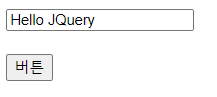
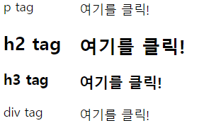
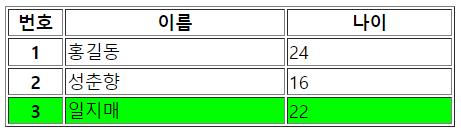

## JQuery 1

### 1. JQuery 

Java Script : Front end에서 만들어 놓은 부분에 대한 제어, 처리
			  client(front)
			  resource(입력창, image)의 값을 변경, 설정 

JQuery > React > Vue

JQuery : JS 경량화, 간략화 
		 Ajax(비동기 통신) -> RESTful


- **형식**

  ```HTML
  형식 : $(tag명, id, class, name).핸들러 함수(매개변수)
  	
  	 getter, setter 
  	 
  
  	 // JS와 비교
  	 // JS 일반 태그
  	 <p id = "demo">p tag</p>
  	 let v = document.getElementById("demo").innerHTML	  	//getter
  	 document.getElementById("demo").innerHTML = "p태그";		 	//setter
   	
  
  	 // JS input 태그, form 태그
  	 <input type = "text" id = "name">
  	 let name = document.getElementById("demo").value = "홍길동"
  	 
  	 // JQuery의 경우
  	 innerHTML => html(), text()
  	 value => val()
  
  
  <p>여기가 p 태그입니다.</p>
  <script type="text/javascript">
  
  //JS
  //let pval = document.getElementsByTagName("p")[0].innerHTML;
  //console.log(pval)
  
  
  //JQuery
  let pval = $("p").html();		// getter
  //alert(pval);
  
      
  //$("p").html("hello <b>p</b> tag");		
  
  $("p").text("hello <b>p</b> tag text")
      
  // .html(), .text() 둘 다 setter
  // 차이는 .html()은 html코드를 인식하지만, .text()는 문자열로 인식한다.  
  
  </script>
  ```


- **JQuery 사용하기 위한 script 태그** 

  ```html
  <!-- 
  JQuery를 사용하기 위해서는 아래의 코드를 head태그 안에 작성해주어야 한다. (참고로 나의 경우엔 w3의 JQuery파트에서 복붙했다)
  -->
  
  <script src="https://ajax.googleapis.com/ajax/libs/jquery/3.5.1/jquery.min.js"></script>
  
  
  
  참고로 이 script태그 내의 주소를 외부파일로 빼서 관리하면 내 코드가 외부로 노출되는 것을 막을 수 있다.
  위 script의 주소를 웹브라우저에서 열면 정신없는 코드들이 줄을 잇는다. 여기서 우클릭 > 다른 이름으로 저장 > 저장한 파일을 이클립스의 프로젝트 폴더의 WebContent에 넣기 > 작업공간에 와서 <script src = "jquery.min.js"></script> 이렇게 파일 형태를 소스로 지정해주면 된다. 
  
  ```

  


- **JQuery영역, 모든 P태그에 공통된 문자열 넣기**

```html
<p id = "demo">p tag id demo</p>

<h3 class ="cls">h3 tag class cls</h3>

<p class = "cls">p tag class cls</p>

<script type="text/javascript">
/* $(document).ready(function() {		
// JQuery영역이며, 문서(document부분)를 다 읽고 준비된 다음에 함수를 적용해라 
	
	//getter
	let demo = $("#demo").html();
	alert(demo);
	
	//setter(id, class,)
	$("#demo").text("p tag text입니다.");
	
	$(".cls").text("cls class setter 설정");
	
	func();
	
	
	
}); */

// JavaScript를 사용해서 모든 P태그에 공통된 문자열 넣기 
/* let ptagArr = document.getElementsByTagName("p");		
// p태그가 붙은 모든 애들을 배열로 만든다.
for(i=0; i < ptagArr.length; i++){
	ptagArr[i].innerHTML = "p 태그입니다!!!";	
} */
function func() {
	let ptagArr = document.getElementsByTagName("p");		// p태그가 붙은 모든 애들을 배열로 만든다.
	for(i=0; i < ptagArr.length; i++){
		ptagArr[i].innerHTML = "p 태그입니다!!!";	
	}
}

// JQuery
$("p").html("p태그 입니다!!!!!!")		// JS보다 훨씬 간편하다.
</script>
```


- **Button예시 (JQuery 다양한 사용방식)**

  ```html
  <!DOCTYPE html>
  <html>
  <head>
  <meta charset="UTF-8">
  <title>Insert title here</title>
  </head>
  <body>
  <p id = "demo">p tag</p>
  <button type="button" id = "btn" onclick="btnClick()">버튼</button>
  
  <script src="https://ajax.googleapis.com/ajax/libs/jquery/3.5.1/jquery.min.js"></script>
  <script type="text/javascript">
  
  //JQuery
  // 태그 사용
  $("button").click(function () {
  	alert('click');
  });
  
  // 아이디 사용
  $("#btn").click(function () {
  	alert('id click');
  });
   
  // 아이디를 사용한 다른 방식 
  $("#btn").on("click",function(){
  	alert('on click');
  });
   
  // JS에서 정의한 함수와 섞어서 JQuery를 사용할 수도 있다. 
  $("#btn").on("click",btnClick);
  function btnClick(){
  	alert('on func click');
  }
  
  //JavaScript - 함수 사용
  function btnClick() {
  	alert('btnclick');
  }
  
  </script>
  </body>
  </html>
  ```

  

- **input태그 .val( )로 받기**

  

  ```
  <!DOCTYPE html>
  <html>
  <head>
  <meta charset="UTF-8">
  <title>Insert title here</title>
  </head>
  <body>
  <input type = "text" id = "text">
  <br><br>
  <button type="button" id = "btn">버튼</button>
  
  <script src="https://ajax.googleapis.com/ajax/libs/jquery/3.5.1/jquery.min.js"></script>
  <script type="text/javascript">
  $("#btn").click(function () {
  	//alert('click');
  	
  	//getter
  	let value=$("#text").val();
  	alert(value);
  	
  	//setter
  	$("#text").val("Hello JQuery");
  
  });
  
  
  </script>
  </body>
  </html>
  ```

   

- **this로 접근하는 방식**

  

  ```html
  <!DOCTYPE html>
  <html>
  <head>
  <meta charset="UTF-8">
  <title>Insert title here</title>
  <script src = "jquery.min.js"></script>
  
  </head>
  <body>
  <p class = "cls">p tag</p>
  <h2 class = "cls">h2 tag</h2>
  <h3 class = "cls">h3 tag</h3>
  <div class = "cls">div tag</div>
  
  <script type="text/javascript">
  $(document).ready(function() {
  	$(".cls").click(function(){
  		//alert('cls click')	
  		$(this).text("여기를 클릭!");	
          // this로 접근이 가능, 클릭하면 내용이 바뀐다. 
  	
  	});
  });
  
  </script>
  </body>
  </html>
  ```

  



```html
<!DOCTYPE html>
<html>
<head>
<meta charset="UTF-8">
<title>Insert title here</title>

<script src="jquery.min.js"></script>
</head>
<body>

<table border="1">
<col width="50"><col width="200"><col width="150">
<tr>
	<th>번호</th><th>이름</th><th>나이</th>
</tr>
<tr class="cls">
	<th>1</th><td>홍길동</td><td>24</td>
</tr>
<tr class="cls">
	<th>2</th><td>성춘향</td><td>16</td>
</tr>
<tr class="cls">
	<th>3</th><td>일지매</td><td>22</td>
</tr>
</table>

<script type="text/javascript">
$(document).ready(function() {
	
	$("tr.cls").mouseover(function() {
		$(this).css("background", "#00ff00");
	});
	
	$("tr.cls").mouseout(function() {
		$(this).css("background", "#ffffff");
	});
	
	$("td").on("click", function () {
		let txt = $(this).text();
		alert(txt);
	});
	
	// html(), text(), css()
	
});
</script>

</body>
</html>
```

