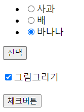
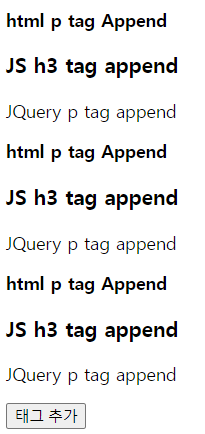

## JQuery 2

#### Property, Attribute로 getter setter, Radio, CheckBox, 태그추가방법 3가지

### 1. Property, Attribute로 getter setter

```html
<!DOCTYPE html>
<html>
<head>
<meta charset="UTF-8">
<title>Insert title here</title>
<script src="https://ajax.googleapis.com/ajax/libs/jquery/3.5.1/jquery.min.js"></script>
<style>
.back{
	background-color: blue;
	color: yellow;
}
</style>
</head>
<body>

<p>p tag</p>

<button type="button">버튼</button>

<script type="text/javascript">
$(document).ready(function () {
	
	$("button").click(function(){
	
	// attribute(속성) 추가
	
	// setter   프로퍼티를 추가
 	$('p').css("background", "green");
	//			property명       값 
	
	$('p').css({"background":"green","color":"red"});
	//$('p').css("color","white");
	
	//getter		-> 프로퍼티만 적고 그 값을 가져오는 것 
	let color = $("p").css("background");
	alert(color); 
	
        
	
	//attribute(속성) 추가
	$('p').attr("id", "demo");
	
	let ptext = $('p').attr("id");
	alert(ptext);
	
	$("p").attr("class","back");
	
	// html(),text(),val(), css(), attr(), prop() 다 가능하다 
	});

});
</script>
</body>
</html>
```


### 2. Radio, CheckBox



```html
<!DOCTYPE html>
<html>
<head>
<meta charset="UTF-8">
<title>Insert title here</title>
<script src="https://ajax.googleapis.com/ajax/libs/jquery/3.5.1/jquery.min.js"></script>
</head>
<body>
<!-- radio -->
<ul>
	<li><input type="radio" name="radio_test" value="apple" checked="checked">사과</li>
	<li><input type="radio" name="radio_test" value="pear">배</li>
	<li><input type="radio" name="radio_test" value="banana">바나나</li>
</ul>

<button type="button" id="choice">선택</button>


<script type="text/javascript">
$(function () {
	
	
	$("#choice").click(function() {
		// getter	-> 체크된 값을 받아서 alert로 띄운다.
		let rVal = $("input[name='radio_test']:checked").val();
		//alert(rVal);
		
		// setter	-> 체크가 바나나로 가게 설정한다.
		$("input[name='radio_test']").val(["banana"]);		
	});	
});


</script>

<br><br>

<!-- checkbox -->
<input type="checkbox" id ="ch" checked="checked">그림그리기
<br><br>
<button type="button" id="btn">체크버튼</button>

<script type="text/javascript">
$("#btn").click(function(){
	// getter 2가지 접근 방식
	//let check = $("#ch").is(":checked");
	//let check = $("input:checkbox[id='ch']").is(":checked");	
    // 두번째는 더 복잡하다.
	//alert(check);
	
	//setter
	$("#ch").prop("checked",true);		
    // 체크를 없애고 버튼을 누르면 체크가 된다. 
	
	
});
</script>
</body>
</html>
```


### 3. 태그추가방법 3가지



```html
<!DOCTYPE html>
<html>
<head>
<meta charset="UTF-8">
<title>Insert title here</title>
<script src="https://ajax.googleapis.com/ajax/libs/jquery/3.5.1/jquery.min.js"></script>
</head>
<body>

<div id="demo"></div>

<button type="button">태그 추가</button>

<script type="text/javascript">
$(function() {
	$("button").click(function() {
		
		// 태그추가방법 3가지
		// html(text) 추가
		let txt = "<p><b>html p tag Append</b></p>";
		$("#demo").append(txt);
		
		
		// JavaScript 추가
		let element = document.createElement("h3");
		element.innerHTML = "JS h3 tag append";			
        // <h3>JS h3 tag append</h3>
		$("#demo").append(element);
		
		
		// JQuery 추가 
		let element2 = $("<p></p>").html("JQuery p tag append");
		// let element2 = $("<p>").html("JQuery p tag append");		
        // </p> 닫는 태그가 빠져도 정상작동한다.
		$("#demo").append(element2);
	});
});
</script>
</body>
</html>
```

