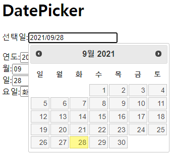

## JQuery 3

#### Datepicker, Kakao 주소출력(post)

### 1. Datepicker 




먼저 JQuery UI datepicker를 검색해서 미니 달력의 소스를 따왔다.

부트스트랩과 같은 역할을 해준다고 보면 된다. 


해당 사이트에서 소스보기에서 위 두줄만 복사해서 내 작업공간에 불여넣기를 해주었다. 

```html
<!DOCTYPE html>
<html>
<head>
<meta charset="UTF-8">
<title>Insert title here</title>

<link rel="stylesheet" href="//code.jquery.com/ui/1.12.1/themes/base/jquery-ui.css">
<script src="https://ajax.googleapis.com/ajax/libs/jquery/3.5.1/jquery.min.js"></script>
<script src="https://code.jquery.com/ui/1.12.1/jquery-ui.js"></script>

</head>
<body>

<h1>DatePicker</h1>
<p>선택일:<input type="text" id="date"></p>

연도:<input type="text" id="year"> <br>
월:<input type="text" id="month"> <br>
일:<input type="text" id="day"> <br>
요일:<input type="text" id="week"> <br>

<script type="text/javascript">
$(document).ready(function() {
	let week = ['일', '월', '화', '수', '목', '금', '토'];
	$("#date").datepicker({
		dateFormat: "yy/mm/dd",
		dayNamesMin: week,
		monthNames: ['1월', '2월', '3월', '4월', '5월', '6월', '7월', '8월', '9월', '10월', '11월', '12월'],
		onSelect: function(d) {
		//	alert(d) ;	
		
		let arr = d.split("/");
		$("#year").val(arr[0].trim());
		$("#month").val(arr[1]);
		$("#day").val(arr[2]);
		
		let weekday = new Date($("#date").datepicker({dateFormat: "yy/mm/dd"}).val());
		//alert(weekday.getDay());	// 일요일 0 ~ 토요일 6
		
		$("#week").val(week[weekday.getDay()]);	// weekday를 통해 날짜(getDay)를 얻어와서 요일 출력한다.
		}
	});
});

</script>

</body>
</html>
```


### 2. Kakao 주소출력(post)


카카오 우편번호 서비스 사이트 주소 http://postcode.map.daum.net/guide


```html
<!DOCTYPE html>
<html>
<head>
<meta charset="UTF-8">
<title>Insert title here</title>
</head>
<body>

<input type="text" id="sample4_postcode" placeholder="우편번호">
<input type="button" onclick="sample4_execDaumPostcode()" value="우편번호 찾기"><br>
<input type="text" id="sample4_roadAddress" placeholder="도로명주소">
<input type="text" id="sample4_jibunAddress" placeholder="지번주소">
<span id="guide" style="color:#999;display:none"></span>
<input type="text" id="sample4_detailAddress" placeholder="상세주소">
<input type="text" id="sample4_extraAddress" placeholder="참고항목">

<script src="//t1.daumcdn.net/mapjsapi/bundle/postcode/prod/postcode.v2.js"></script>
<script>
    //본 예제에서는 도로명 주소 표기 방식에 대한 법령에 따라, 내려오는 데이터를 조합하여 올바른 주소를 구성하는 방법을 설명합니다.
    function sample4_execDaumPostcode() {
        new daum.Postcode({
            oncomplete: function(data) {
                // 팝업에서 검색결과 항목을 클릭했을때 실행할 코드를 작성하는 부분.

                // 도로명 주소의 노출 규칙에 따라 주소를 표시한다.
                // 내려오는 변수가 값이 없는 경우엔 공백('')값을 가지므로, 이를 참고하여 분기 한다.
                var roadAddr = data.roadAddress; // 도로명 주소 변수
                var extraRoadAddr = ''; // 참고 항목 변수

                // 법정동명이 있을 경우 추가한다. (법정리는 제외)
                // 법정동의 경우 마지막 문자가 "동/로/가"로 끝난다.
                if(data.bname !== '' && /[동|로|가]$/g.test(data.bname)){
                    extraRoadAddr += data.bname;
                }
                // 건물명이 있고, 공동주택일 경우 추가한다.
                if(data.buildingName !== '' && data.apartment === 'Y'){
                   extraRoadAddr += (extraRoadAddr !== '' ? ', ' + data.buildingName : data.buildingName);
                }
                // 표시할 참고항목이 있을 경우, 괄호까지 추가한 최종 문자열을 만든다.
                if(extraRoadAddr !== ''){
                    extraRoadAddr = ' (' + extraRoadAddr + ')';
                }

                // 우편번호와 주소 정보를 해당 필드에 넣는다.
                document.getElementById('sample4_postcode').value = data.zonecode;
                document.getElementById("sample4_roadAddress").value = roadAddr;
                document.getElementById("sample4_jibunAddress").value = data.jibunAddress;
                
                // 참고항목 문자열이 있을 경우 해당 필드에 넣는다.
                if(roadAddr !== ''){
                    document.getElementById("sample4_extraAddress").value = extraRoadAddr;
                } else {
                    document.getElementById("sample4_extraAddress").value = '';
                }

                var guideTextBox = document.getElementById("guide");
                // 사용자가 '선택 안함'을 클릭한 경우, 예상 주소라는 표시를 해준다.
                if(data.autoRoadAddress) {
                    var expRoadAddr = data.autoRoadAddress + extraRoadAddr;
                    guideTextBox.innerHTML = '(예상 도로명 주소 : ' + expRoadAddr + ')';
                    guideTextBox.style.display = 'block';

                } else if(data.autoJibunAddress) {
                    var expJibunAddr = data.autoJibunAddress;
                    guideTextBox.innerHTML = '(예상 지번 주소 : ' + expJibunAddr + ')';
                    guideTextBox.style.display = 'block';
                } else {
                    guideTextBox.innerHTML = '';
                    guideTextBox.style.display = 'none';
                }
            }
        }).open();
    }
</script>

</body>
</html>
```

