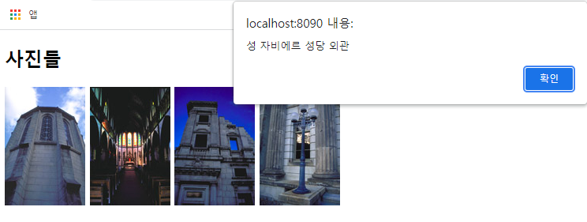

## JQuery 4

#### Practice(사진 클릭 시 설명 띄우기, 이미지 자동 삽입 및 삭제 )

### 1. 사진 클릭 시 설명 띄우기



- **내 방식**

  ```html
  <!DOCTYPE html>
  <html>
  <head>
  <meta charset="UTF-8">
  <title>Insert title here</title>
  <script src="https://ajax.googleapis.com/ajax/libs/jquery/3.5.1/jquery.min.js"></script>
  </head>
  <body>
  <h2>사진들</h2>
  
  
  
  
  
  <script type="text/javascript">
  
  $(document).ready(function(){
  	$(".img1").click(function(){
  		alert('성 자비에르 성당 외관의 사진입니다.')
  	});
  });
  
  $(document).ready(function(){
  	$(".img2").click(function(){
  		alert('성 자비에르 성당 내부의 사진입니다.')
  	});
  });
  
  $(document).ready(function(){
  	$(".img3").click(function(){
  		alert('낡은 건물의 사진입니다.')
  	});
  });
  
  $(document).ready(function(){
  	$(".img4").click(function(){
  		alert('가로등의 사진입니다.')
  	});
  });
  
  </script> 
  </body>
  </html>
  ```

  

- **다른 방식** 

  ```html
  <!DOCTYPE html>
  <html>
  <head>
  <meta charset="UTF-8">
  <title>Insert title here</title>
  <script src="https://ajax.googleapis.com/ajax/libs/jquery/3.5.1/jquery.min.js"></script>
  </head>
  <body>
      
  <!-- picname은 사용자 지정 attribute 사용 -->
  <h2>사진들</h2>
  	
  
  
  
  
  <script type="text/javascript">
  $(document).ready(function(){
  	$("img").click(function(){
  		let picname = $(this).attr('picname');
  		alert(picname);
  	});
  });
  </script>
  
  </body>
  </html>
  ```

  


### 2. 이미지 자동 삽입 및 삭제


- **내 방식**

  ```html
  <!DOCTYPE html>
  <html>
  <head>
  <meta charset="UTF-8">
  <title>Insert title here</title>
  <script src="https://ajax.googleapis.com/ajax/libs/jquery/3.5.1/jquery.min.js"></script>
  </head>
  <body>
  <h2>이미지 자동 삽입</h2>
  <p>다음 그림은 "JQuery"에 의해 자동 삽입되어 있습니다.</p>
  <div id="demo"></div>
  
  <script type="text/javascript">
  $(document).ready(function() {
  	for(i=1;i<10;i++){
  		$("#demo").append("");
  	}
  	
  	$("img").click(function() {
  		$(this).remove();
  	});
  });
  </script>
  </body>
  </html>
  ```


- **다른 방식**

  ```html
  <!DOCTYPE html>
  <html>
  <head>
  <meta charset="UTF-8">
  <title>Insert title here</title>
  <script src="https://ajax.googleapis.com/ajax/libs/jquery/3.5.1/jquery.min.js"></script>
  </head>
  <body>
      
  <!-- 다른 방식 2가지 --> 	
  // 삭제 되어선 안될 다른 이미지도 있을 수 있기 때문에 속성을 줘서 가져온 이미지들에 class photo라는 속성을 추가로 부여해서 코딩		
  
  <h1>이미지 자동 삽입</h1>
  
  <div class="pic">
  </div>
  
  <script type="text/javascript">
  $(document).ready(function() {
  	
  	let imgname = [ "", "" ];
  	
  	for(i = 1;i < 10; i++){
  		
  		//let img = $("</img>").attr("src", "./image/photo_" + i + ".jpg").attr("class", "photo");
  		
  		let img = $("</img>").attr({					
  											"src":"./image/photo_" + i + ".jpg",
  											"class":"photo"									// Json을 활용 방법 
  										});
  		
  		$(".pic").append(img);
  	}
  	
  	$(".photo").click(function () {
  		$(this).remove();
  	});
  });
  </script>
  </body>
  </html>
  ```

