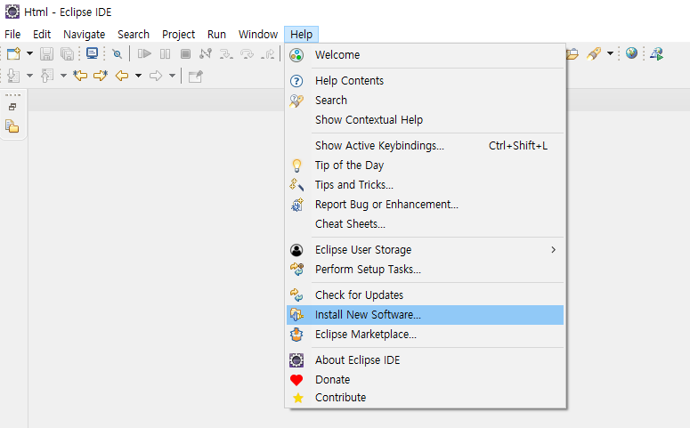
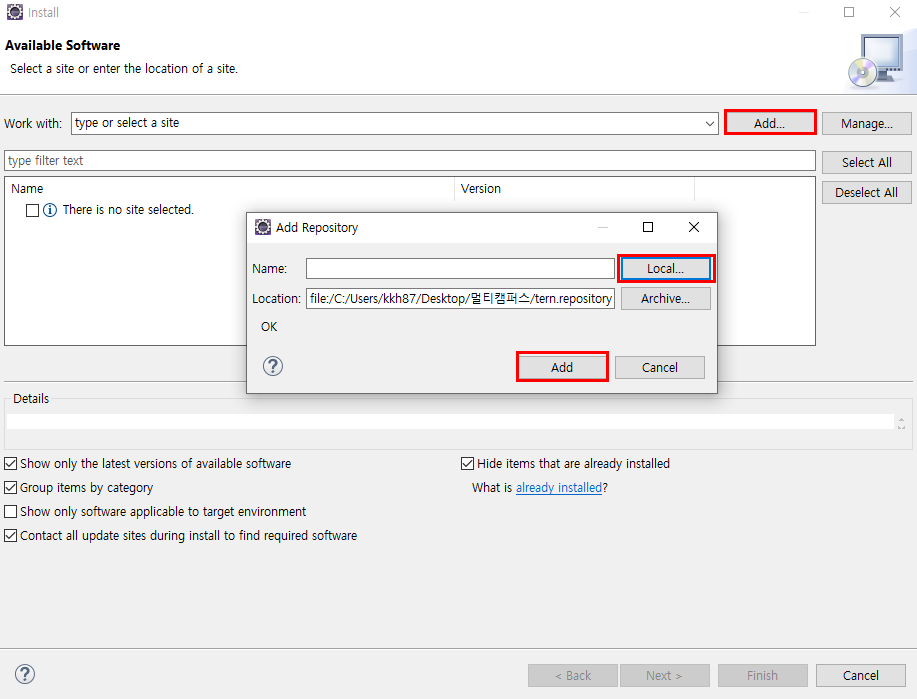
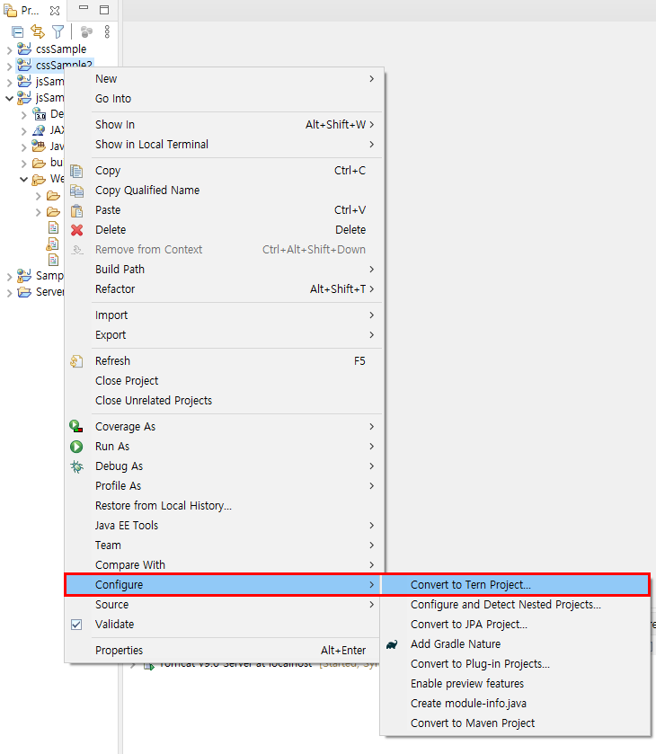
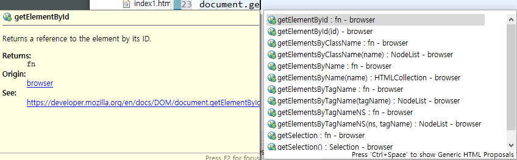

## JS 1

#### 자바스크립트, 기본 문법, 자동완성기능 추가

### 0. 자바스크립트

JavaScript != Java
Client쪽 언어, Front end
목적:웹브라우저의 Tag들에 접근하기 위한 스크립트 
		보조 프로그래밍 언어이다. 
		컴파일을 하지 않는다 -> 가볍다 -> 속도가 빠르다
	
JavaScript 간략화, 경량화 -> JQuery(->Ajax) -> Vue, React

예) 회원가입 -> 빈칸을 조사, ID 글자 수를 조사, PW에 숫자, 문자 포함
   CSS에 대해서 제어, 구현 
   Timer를 설정해서 특수효과 같은 처리 가능


element(요소)
id		-> 현재 웹 페이지에서 1개만 유효. JS용 
class	-> 다수의 tag에 적용이 가능하다, 거의 CSS에서 많이 쓰인다.
name	-> 다수의 tag에 적용이 가능하다, 값을 전달할 때 사용한다. 

 

- **자바스크립트 출력 방법**

  ```javascript
  <p id="demo">p태그입니다</p>
  
  <script type="text/javascript">
  // script태그의 내부는 JS영역이다.
  // JS실행 확인하는 방법 두가지 console, alert
  console.log('JavaScript가 실행되었습니다.');
  
  
  alert('JavaScript가 실행되었습니다.');
  
  
  var v = document.getElementById("demo").innerHTML; 
  // getter,   Id demo에 있는 요소를 받아오겠다
  alert(v)
  
  document.getElementById("demo").innerHTML = "p tag id demo";  
  // setter
  </script>
  ```

  

### 1. 기본 문법

- **변수** 

  자바와 비교

  ```javascript
  // 자바 
  Integer, Double, String, Object, MyClass
   
  Integer in = 234;
  String str = "Hello"
  String str = new string("hello");
  MyClass cls = new MyClass();
  
  Object mc = new MyClass();
  Object mc = new YouClass();
  // Object를 사용하면 다 생성이 가능 
  
  
  // var
  var num = 123;
  var pi = 3.141592;
  var name = "홍길동";
  var str = '안녕하세요'; // JS에서는 작은따옴표도 허용
  
  var num = 234;
  alert(num); 
  // var를 쓰면 num이라는 같은 변수로 중복 설정을 해도 에러를 잡아내지 못한다.
  // var은 여러 이유로 요즘은 권장되지 않는다. let을 쓰기를 권장한다. 
  
  // let 
  let num = 123;
  let num = 234;		// let을 쓰면 변수를 잡아준다.
  alert(num);
   
  let num = 123;
  let pi = 3.121592;
  let name = "홍길동";
  let answer = true;	// 어떤 변수명이든 let으로 다 받을 수 있다. 
  
  num = num +234;
  console.log(num);	// 연산도 가능
  
  ```

  

- **Array**

  ```java
  // let cars = []; 초기화
  let cars = ["Volvo","BMW","KIA"];
  console.log(cars[1]);	// 1번지는 BMW
  
  cars = new Array(3);	// String cars[] = new String[3]; 와 동일
  cars[0] = "볼보";
  cars[1] = "비엠더블유";
  cars[2] = "기아";
  console.log(cars[2]);
  ```

  

- **for문 / for each문** 

  ```javascript
  // for문
  for(let i=0;i<cars.length;i++){	// let은 생략 가능 
  	console.log(cars[i]);
  }
  
  //for each문
  for(car in cars ){	// let은 생략 가능
  	console.log(car);	// 번지수 출력 
  	// car를 i로 바꾸고 console.log(i);
  }
  
  //for each문
  for(car in cars ){	// let은 생략 가능
  	console.log(cars[car]);
  }
  ```

  

- **Object**

  ```javascript
  let obj = {
  		firstname: "홍",   // key:value -> hashmap -> Json(web)
  		lastname: "길동",
  		age:24,
  		func:function(){
  			console.log("func함수호출");
  			console.log(this.firstname+this.lastname);
  		},
  		method:function(a,b){
  			this.age=a;
  		}
  }
  console.log(obj.firstname);		// 홍
  console.log(obj.lastname);		// 길동
  console.log(obj.age);			// 24
  obj.func();						// func함수호출 홍길동 
  ```

  

- **Class**

  가볍게 알아두기 

  ```js
  class Person{			// 멤버변수 필요없음
  	constructor(name,age){		
  		this.name = name;	
  		this.age = age;		
  	}
  	allprint(){			// return 필요없음 
  		console.log(this.name + " " + this.age);
  	}
  }
  let pobj = new Person("일지매", 22);
  console.log(pobj.name);		// 일지매
  console.log(pobj.age);		// 22
  pobj.allprint();			// 일지매 22 
  ```

  

### 3. 자동완성기능 추가 

**3.1. 파일 다운로드**

https://github.com/angelozerr/tern.java/releases/download/tern.java-1.2.1/tern.repository-1.2.1.zip

이 파일을 다운로드해서 압축을 푼다. 


**3.2. 소프트웨어 설치하기**





이렇게 파일을 추가하고 Add > Finish를 클릭하면 파일들을 선택할 수 있는데, 그렇게 무겁지 않은 파일들이라 다 선택을 하고 확인을 누르면 소프트웨어 설치가 진행된다. 

어느정도 되면 해당 창이 꺼지는데 우측 하단을 보면, 설치가 여전히 진행중으로 뜬다. 진행 중에 팝업창이 뜨는데, 이 때, **Anyway Install**을 눌러주고 좀 기다리면 **restart**하라는 창이 뜬다. restart를 누르면 이클립스가 재시작된다. 


3.3. 프로젝트마다 설정해주기 



여기서 들어가보면, 어떤 프로그램을 설정할지가 나오는데, browser에서 2개, jquery에서 mobile을 제외하고 3개를 선택하고 설정을 마쳤다. 이렇게 하면 아래처럼 javascript도 자동완성 기능을 사용할 수 있게 된다. 


