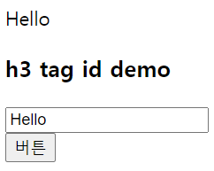
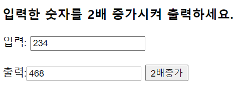
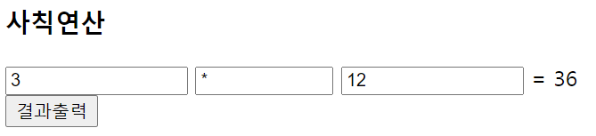

## JS 2

#### 함수, 문서 객체

- **예1**

  

  ```html
  <body>
  <p id = "demo">p tag id demo</p>	<!-- 일반태그(입력은 없고 출력만 있음) (p, h1~h6, div ..)-->
  
  <h3 id ="demo">h3 tag id demo </h3> <!-- id는 무조건 하나이므로 적용이 되지 않음 -->
  
  <input type="text" id = "text" value="" size="20" placeholder="여기입력"> <!-- form태그 입출력 모두 있음  -->
  <br>
  <input type="button" value="버튼" onclick="btnclick()" > 
  <br>
  
  <script type="text/javascript">
  function btnclick(){			// 버튼을 클릭했을 때 text에 입력한 글로 p태그가 바뀌도록 하고싶다.
  	// alert('btnclick()');
  	
  	document.getElementById("demo").innerHTML = "버튼 클릭!";
  	// 일반태그의 경우에는 innerHTML로 받는다
  	
  	let val = document.getElementById("text").value;
  	// alert(val);	// 텍스트에 타이핑한 내용(hello)을 val에 넣는데까지 진행
  	// value를 갖고있는 태그일 경우에는 value로 받는다. 
  	document.getElementById("demo").innerHTML = val;
  }
  </script>
  </body>
  ```

  

  

- **예2**

  

  ```html
  <!DOCTYPE html>
  <html>
  <head>
  <meta charset="UTF-8">
  <title>Insert title here</title>
  
  <!--<script type="text/javascript" src="myJS.js" > </script> 
  이렇게 해서 외부파일로 script를 옮겨서 할 수 있다. 배포시에 권장한다.
  JavaScript file(.js)을 만들어서 script태그 내부의 코드만 넣으면 된다. -->
  
  <body>
  <h3>입력한 숫자를 2배 증가시켜 출력하세요.</h3>
  입력: <input type="text" id="num" value = "">
  <br><br>
  출력:<input type="text" id="out">
  <button type="button" onclick="inputBtn()">2배증가</button>
  
  <script type="text/javascript">
  function inputBtn() {
  	let number = document.getElementById("num").value;
  	
  	document.getElementById("out").value = parseInt(number)*2;
  }
  </script>
  
  <!-- 코딩할 때 script는 가급적 head보다는 body부분에서 하는 걸 권장한다. 종종 에러가 나기때문이다.
  그리고 나중에 배포를 하게 되면 외부파일로 옮겨서 하는 것을 권장한다.
  -->
  </body>
  </html>
  ```


- **예3**

  

  ```html
  <h3>사칙연산</h3>
  
  <input type="text" id="num1" value="" size="15" placeholder="첫 번째 숫자 입력"> 
  
  <input type="text" id="oper" value="" size="10" placeholder="연산자(+, -, *, /) 입력">
  
  <input type="text" id="num2" value="" size="15" placeholder="두 번째 숫자 입력"> = 
  <span id = result>계산결과</span> 
  <br>
  <button type="button" onclick="calculator()">결과출력</button>
  
  
  <script type="text/javascript">
  function calculator(){
  	let number1 = document.getElementById("num1").value;
  	if(number1 == ''){
  		alert('숫자를 입력해 주세요');
  		return;
  	}
  	let operator = document.getElementById("oper").value;
  	let number2 = document.getElementById("num2").value;
  	if(number2 == ''){
  		alert('숫자를 입력해 주세요');
  		return;
  	}
  	
  	let n1 = parseInt(number1);
  	let n2 = parseInt(number2);
  	let result = 0;
  	
  	if(operator == '+'){
  		result = n1 + n2;
  	}
  	else if(operator == '-'){
  		result = n1 - n2;
  	}
  	else if(operator == '*'){
  		result = n1 * n2;
  	}
  	else if(operator == '/'){
  		result = n1 / n2;
  	}
  	else{
  		result = "연산자를 잘못 입력하셨습니다. 다시 입력해주세요.";
  	}
  	
  	document.getElementById("result").innerHTML = result;
  	
      
  	/* 방법2 
  	if(operator == '+'){
  		document.getElementById("result").innerHTML = parseInt(number1) + parseInt(number2);
  	}
  	else if(operator == '-'){
  		document.getElementById("result").innerHTML = parseInt(number1) - parseInt(number2);
  	}
  	else if(operator == '*'){
  		document.getElementById("result").innerHTML = parseInt(number1) * parseInt(number2);
  	}
  	else if(operator == '/'){
  		document.getElementById("result").innerHTML = parseInt(number1) / parseInt(number2);
  	}
  	else{
  		document.getElementById("result").innerHTML = "연산자를 잘못 입력하셨습니다. 다시 입력해주세요.";
  	}
  	*/  
  }
  </script>
  ```

  