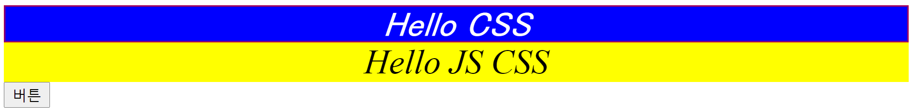
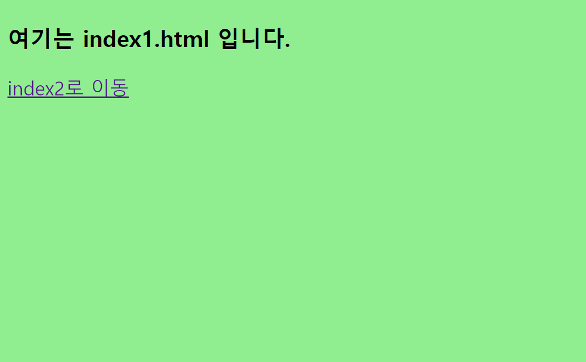
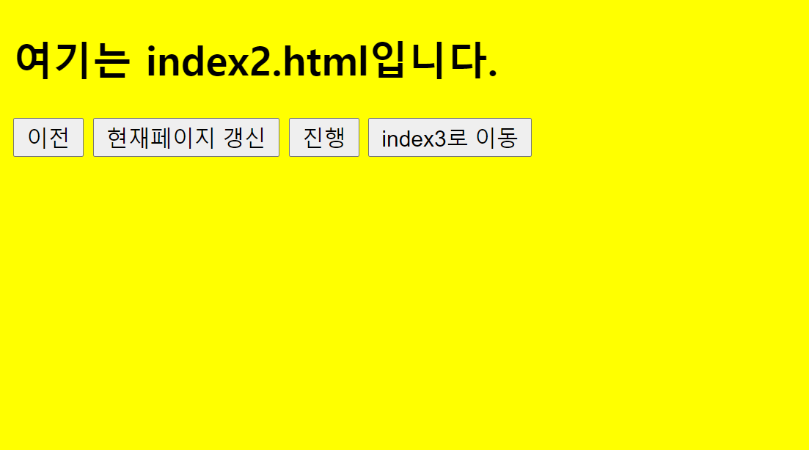
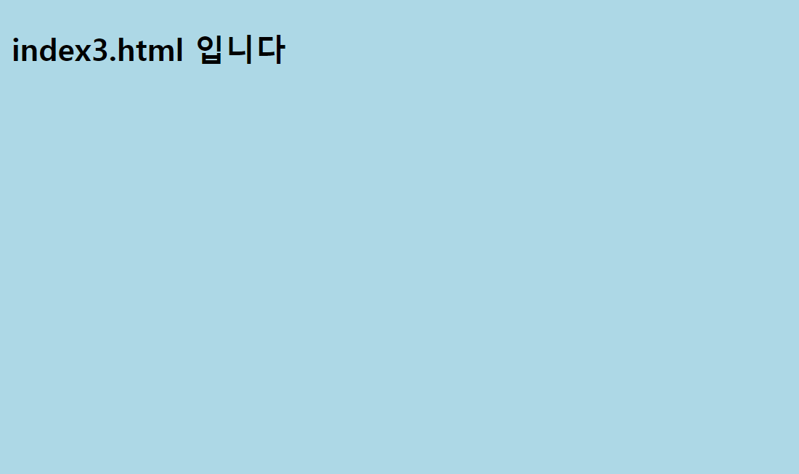

## JS 3 

#### 날짜와 시간, CSS와 비교, 선택자, 페이지 이동

### 1. 날짜와 시간

```html
<!DOCTYPE html>
<html>
<head>
<meta charset="UTF-8">
<title>Insert title here</title>
</head>
<body>

<p id = "demo"></p>

<script type="text/javascript">
function displayDate(){      	//displayDate(); -> 정해진 시간을 보여준다.
	document.getElementById("demo").innerHTML = Date();
	
}


setInterval("displayDate()",1000);	
// 밀리세컨이므로 1000이 1초 
// 시간의 흐름을 볼 수 있다. 

</script>
<br><br>

<p id = "date"></p>

<script type="text/javascript">

let date = new Date();	// 현재 날짜 시간을 가져온다

    
// setter (년 월 일 시 분 초 ms 셋팅 )
date = new Date(2021,12-1,3,6,25,10,0);
date = new Date("October 12, 2021 12:35:35");

document.getElementById("date").innerHTML = date;

document.getElementById("date").innerHTML = date.getDay();	// 요일
document.getElementById("date").innerHTML = date.getFullYear(); // 년도 
document.getElementById("date").innerHTML = date.getMonth()+1; // 월 +1
document.getElementById("date").innerHTML = date.getDate(); // 일
document.getElementById("date").innerHTML = date.getHours(); // 시
document.getElementById("date").innerHTML = date.getMinutes();  // 분
document.getElementById("date").innerHTML = date.getSeconds();  // 초 
</script>
</body>
</html>
```


### 2. CSS와 비교



```html
<body>
<div style="background-color: blue; color: white; text-align: center; border-style: double; border-color: red; font-family: Ms PGothic; font-style: italic; font-size: 24pt">Hello CSS</div>

<div id = "cssset">Hello JS CSS</div>
<button type="button" onclick="func()">버튼</button>

<!-- <span>Hello CSS</span>
<span>Hello JS CSS</span> -->

<script type="text/javascript">
function func() {
	let obj = document.getElementById("cssset");
	
	obj.style.backgroundColor = 'yellow';
	obj.style.color = 'black';
	obj.style.textAlign = 'center';
	obj.style.borderstyle = 'double';
	obj.style.borderColor = 'blue';
	obj.style.fontFamily = 'Times New Roman';
	obj.style.fontStyle = 'italic';
	obj.style.fontSize = '24pt';
}
</script>
</body>
```


### 3. 선택자

```html
<!--  
access attribute

id		: 1개만 접근, (빈칸)검사
class	: 다수, CSS
name	: 다수, 데이터 전송
-->

<p id = "pdemo">p tag</p>
<p id = "pdemo">p tag</p>
<br>
<br>
<h3 class = "hdemo">h3 tag</h3>
<p class = "hdemo">p tag</p>
<br>
<br>
<p name = "pname"> p tag</p> <!-- 잘 안쓰는 방식이라 경고가 뜬다. -->


<button type="button" onclick="btnclick()">클릭</button>
<script type="text/javascript">
function btnclick() {
	// id에 적용 -> 중복 적용은 안되기 때문에 위 하나에만 적용된다. 
	document.getElementById("pdemo").innerHTML = 'p 태그입니다.';
	
	// class에 적용 -> 번지에 따라 적용이 가능하다
	document.getElementsByClassName("hdemo")[1].innerHTML = 'class는 hdemo';
	// alert(document.getElementsByClassName("hdemo").length);
	
	// 배열 class가 hdemo인 애들을 hdemo변수에 넣는 순간 hdemo는 배열이 된다. 
	let hdemo = document.getElementsByClassName("hdemo");
	
	//alert(hdemo[0].innerHTML);
	
	// class들에 한번에 적용하는 방법은 배열로 받아서 for문 돌리기 
	for (i = 0; i < hdemo.length; i++) {
		hdemo[i].innerHTML = 'class는 hdemo입니다.';
	}
	
	// name으로도 접근이 가능하다. 
	document.getElementsByName("pname")[0].innerHTML ="pname입니다.";		
	
	// Tag명으로도 접근이 가능하다.
	document.getElementsByTagName("p")[0].innerHTML ="이것으로 결정!";				// 0번지이므로 첫 번째 p태그에 적용된다.
}
</script>

</body>
```


### 4. 페이지 이동

- **index1.html**

  ```html
  <!DOCTYPE html>
  <html>
  <head>
  <meta charset="UTF-8">
  <title>Insert title here</title>
  </head>
  <body bgcolor="orange">
  <!-- 
  파일이동
  HTML
  <a href="이동할 파일, URL">
  <form action="NewFile.jsp">
  
  
  Java Script
  location.href
  -->
  
  
  <h3>여기는 index1.html 입니다.</h3>
  <a href="index2.html">index2로 이동</a>
  
  <script type="text/javascript">
  document.bgColor = "lightgreen" ;		   // js에서는 bgColor로 C가 대문자이다.
  document.ge
  </script>
  
  </body>
  </html>
  ```

  

- **index2.html**

  ```html
  <!DOCTYPE html>
  <html>
  <head>
  <meta charset="UTF-8">
  <title>Insert title here</title>
  </head>
  <body bgcolor="yellow">
  
  <h2>여기는 index2.html입니다.</h2>
  <input type="button" value="이전" onclick="history.back()">
  <input type="button" value="현재페이지 갱신" onclick="location.reload()">
  <input type="button" value="진행" onclick="history.forward()"> 
  <!--history.forward는 앞으로 이동하고 난 다음부터 그 페이지를 기억해서 이동하는 것이다.-->
  <input type="button" value="index3로 이동" onclick="gopage()">
  
  <script type="text/javascript">
  function gopage(){
  	location.href = "index3.html";	
  }
  </script>
  
  </body>
  </html>
  ```


- **index3.html**

  ```html
  <!DOCTYPE html>
  <html>
  <head>
  <meta charset="UTF-8">
  <title>Insert title here</title>
  </head>
  <body bgcolor="lightblue">
  
  <h3>index3.html 입니다</h3>
  </body>
  </html>
  ```

  

  

  

  

