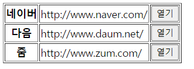

## JS 4 

#### practice(버튼 클릭 주소 이동, Select 사진 선택 출력)

### 1. 버튼을 누르면 주소로 이동 



- **내 방식**

  ```html
  <!DOCTYPE html>
  <html>
  <head>
  <meta charset="UTF-8">
  <title>Insert title here</title>
  </head>
  <body>
  <table border="1">
  <col>
  	<tr>
  		<th>네이버</th>
  		<td class = "web1">http://www.naver.com/</td>
  		<td><input type="button" value="열기" onclick="gopage1()"></td>
  	</tr>
  	<tr>
  		<th>다음</th>
  		<td class = "web2">http://www.daum.net/</td>
  		<td><input type="button" value="열기" onclick="gopage2()"></td>
  	</tr>
  	<tr>
  		<th>줌</th>
  		<td class = "web3">http://www.zum.com/</td>
  		<td><input type="button" value="열기" onclick="gopage3()"></td>
  	</tr>
  </table>
  
  <script type="text/javascript">
  function gopage1() {
  	let webArr1 = document.getElementsByClassName("web1");
  		location.href = webArr1[0].innerHTML;
  }
  function gopage2() {
  	let webArr2 = document.getElementsByClassName("web2");
  		location.href = webArr2[0].innerHTML;
  }
  function gopage3() {
  	let webArr3 = document.getElementsByClassName("web3");
  		location.href = webArr3[0].innerHTML;
  }
  </script>
  
  </body>
  </html>
  ```

  

- **모범답안 방식**

  ```html
  <!DOCTYPE html>
  <html>
  <head>
  <meta charset="UTF-8">
  <title>Insert title here</title>
  
  <style type="text/css">
  th, td{
  	padding: 10px;
  }
  </style>
  
  </head>
  <body>
  
  <h1>포털 사이트</h1>
  "열기"버튼을 클릭하면 해당 홈페이지를 새 창에서 볼 수 있습니다.
  <br><br>
  
  <table border="1">
  <tr>
  	<th style="background-color: #00ff00;padding: 10px">네이버</th>
  	<td id="naver">http://www.naver.com</td>
  	<td>
  		<button type="button" onclick="func('naver')">열기</button>
  	</td>
  </tr>
  <tr>
  	<th style="background-color: #00ff00;padding: 10px">다음</th>
  	<td id="daum">http://www.daum.net</td>
  	<td>
  		<button type="button" onclick="func('daum')">열기</button>
  	</td>
  </tr>
  </table>
  
  <script type="text/javascript">
  function func( name ) {		
  	
  	if(name == "naver"){
  		let url = document.getElementById("naver").innerHTML;
  	//	alert(url);
  		location.href = url;
  	}
  	else if(name == "daum"){
  		let url = document.getElementById("daum").innerHTML;
  		//	alert(url);
  		location.href = url;
  	}	
  }
  
  </script>
  </body>
  </html>
  ```


### 2. Select 사진 선택 출력

```html
<!DOCTYPE html>
<html>
<head>
<meta charset="UTF-8">
<title>Insert title here</title>
</head>
<body bgcolor="#000000" text="#ffffff">

<h1>사진들</h1>

<table>
<tr>
	<td>
		
	</td>
	
	<td valign="top" style="padding-left: 10px">
		<form name="frm">
	
		<select onchange="photochange()" id="choice" name="choice">
			<option value="">사진들-----</option>
			<option value="images/pic01.jpg">그림1</option>
			<option value="images/pic02.jpg">그림2</option>
			<option value="images/pic03.jpg">그림3</option>
			<option value="images/pic04.jpg">그림4</option>		
			<option value="">영화들-----</option>
			<option value="https://img.cgv.co.kr/Movie/Thumbnail/Poster/000084/84872/84872_320.jpg">보이스</option>
			<option value="https://img.cgv.co.kr/Movie/Thumbnail/Poster/000084/84617/84617_320.jpg">기적</option>
			<option value="https://img.cgv.co.kr/Movie/Thumbnail/Poster/000084/84834/84834_320.jpg">샹치와 텐 링즈의 전설</option>				
		</select>
		
		</form>
	</td>
</tr>
</table>

<script type="text/javascript">
function photochange() {	
//	alert('photochange()');

	/*
	let choiceVal = document.getElementById("choice").value;
//	alert(choiceVal);

	if(choiceVal != ''){
		document.getElementById("photo").src = choiceVal;
	}
	*/
	
	
	let selectIndex = document.frm.choice.selectedIndex;
//	alert(selectIndex);
	
	if(selectIndex != 0 && selectIndex != 5){
		document.photo.src = document.frm.choice.options[selectIndex].value;
		// form의 choice의 옵션들을 배열로 받고, 그 배열들 중 value를 받는다.
	}
}
</script>
</body>
</html>
```

