### MySQL설치하기

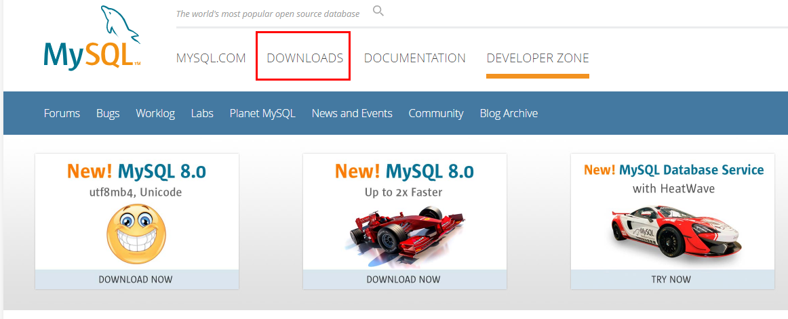

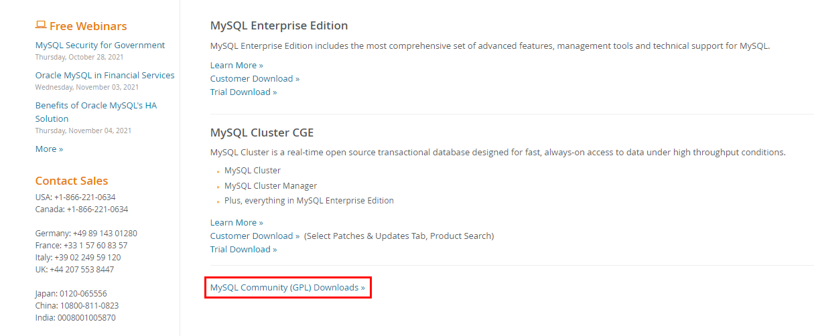

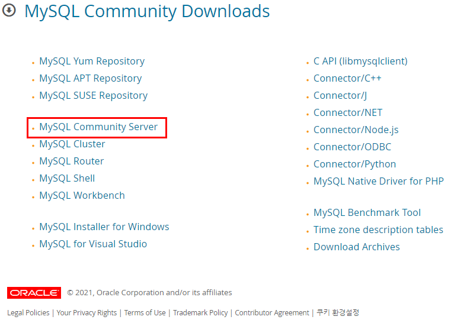

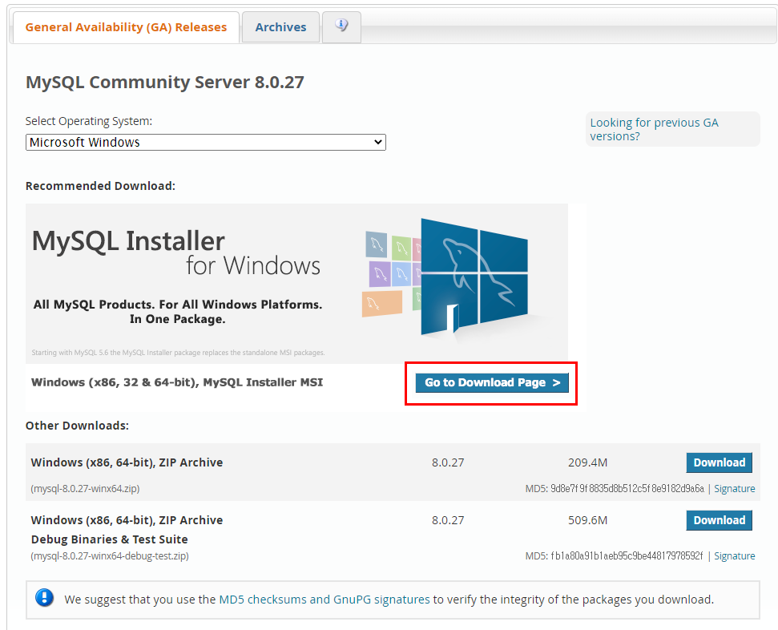

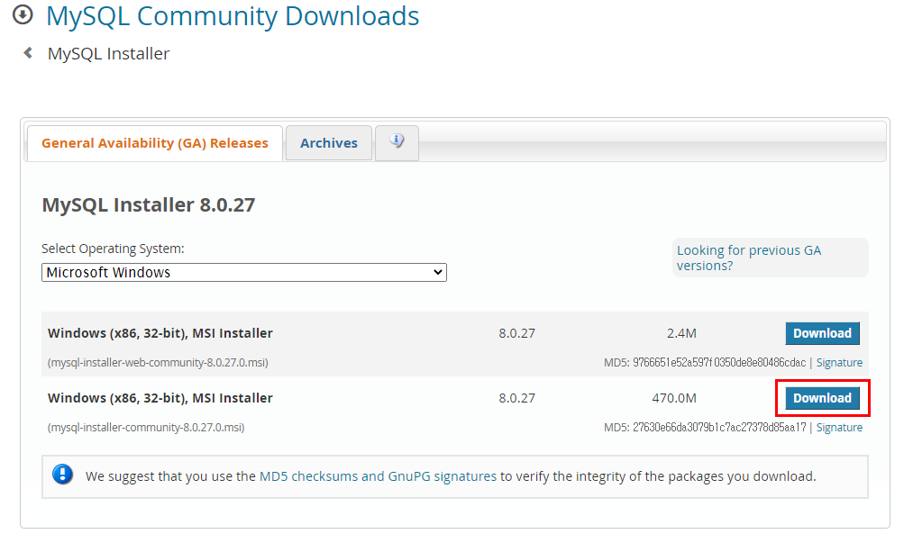

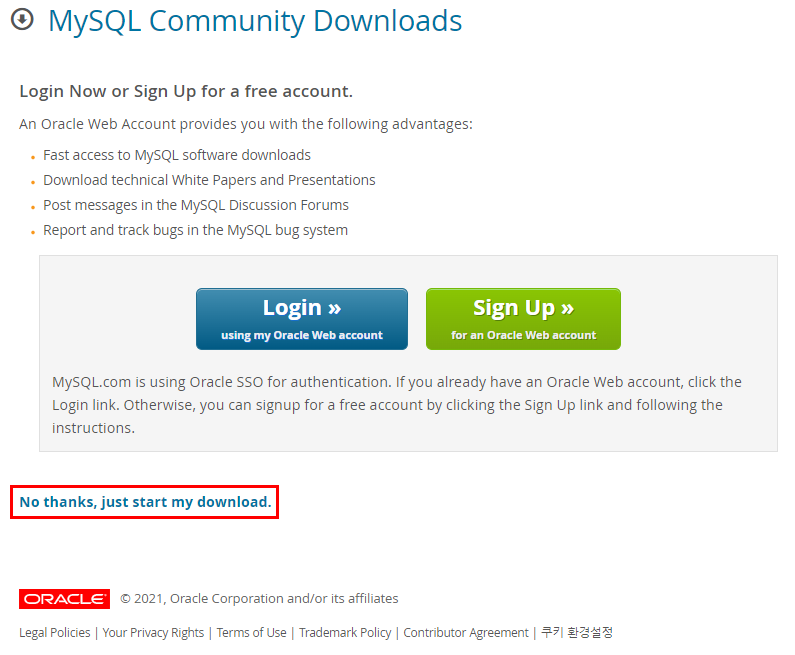

이후 설치 진행을 자연스럽게 하다보면 아래처럼 Installer가 뜬다. 

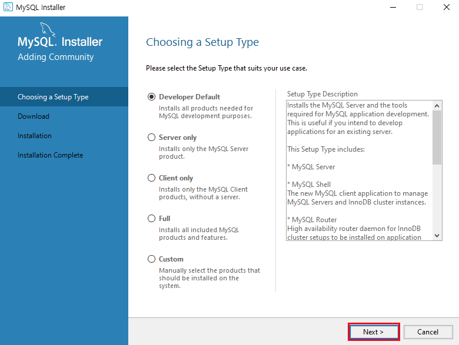

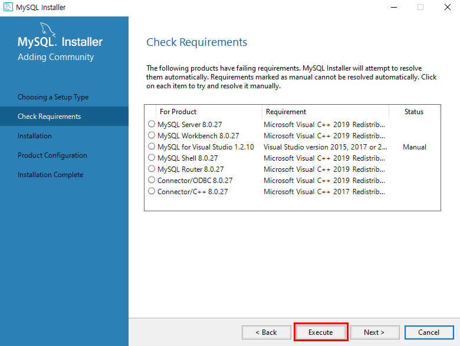

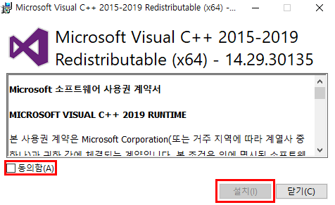

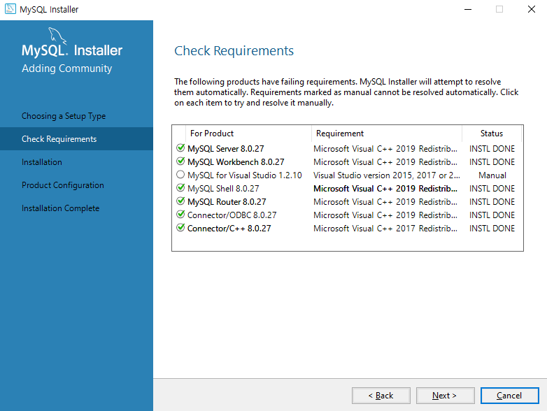

여기서 Next를 잡아준다.

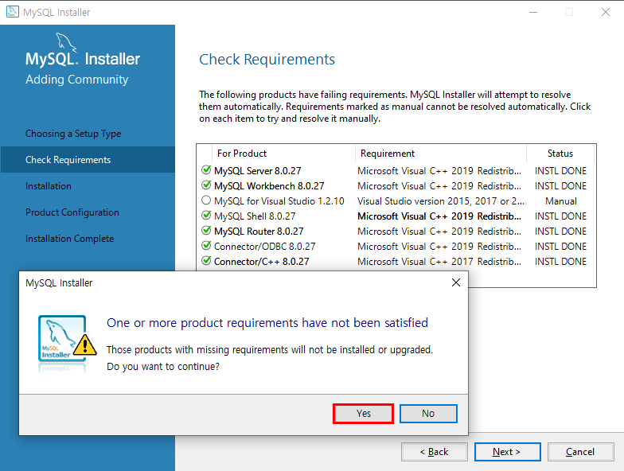

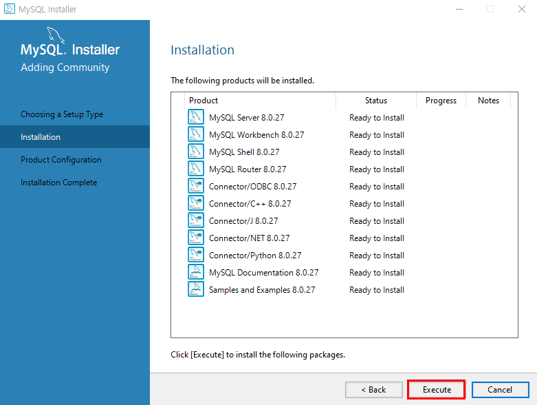

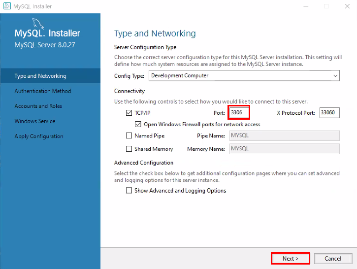

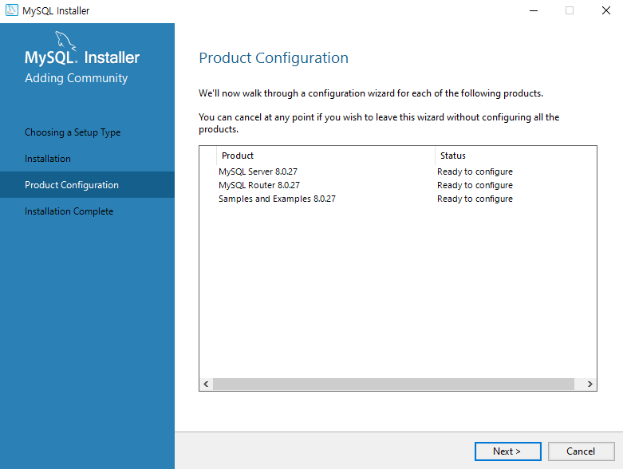

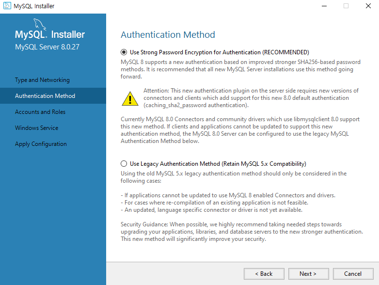

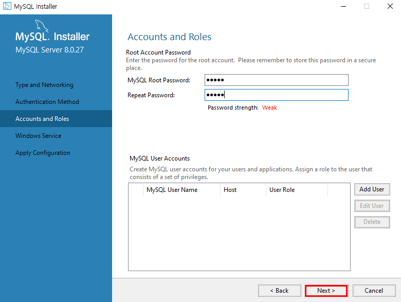

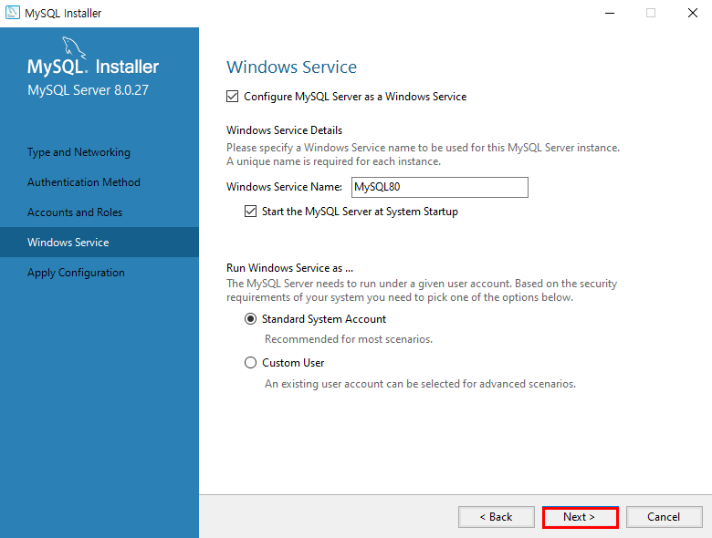

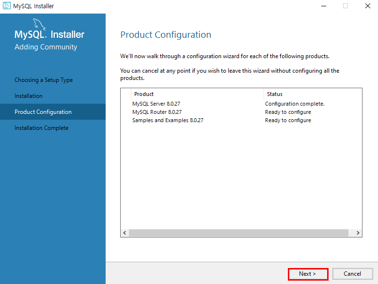

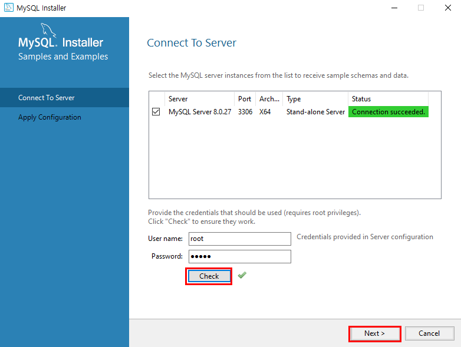

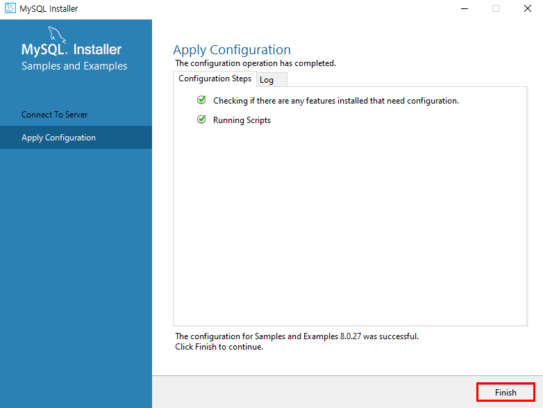

중간중간 비슷한 화면으로 나오는 부분에서는 next를 잡고 다 넘어간다 

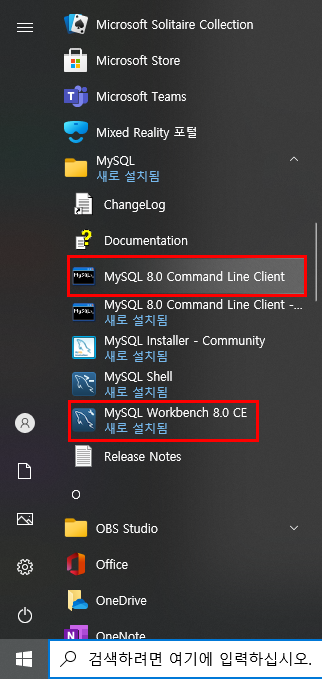

설치완료!

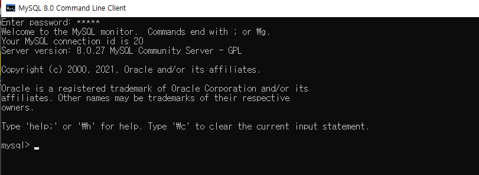

여기서 비밀번호를 입력해서 위처럼 잘 뜨는지 확인을 해준다. 그리고 콘솔창은 닫아주면 된다. 

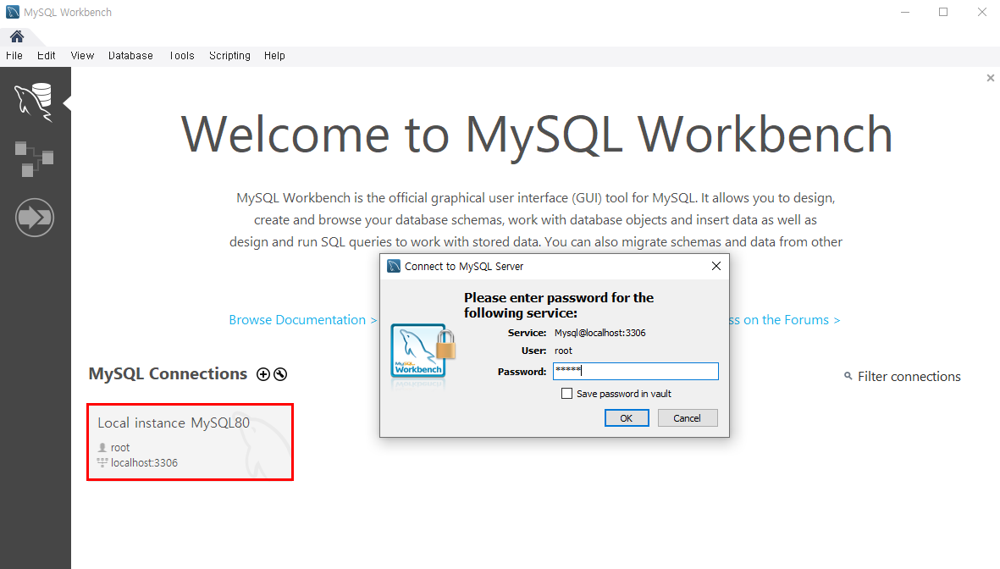

workbench접속방법은 위와 같다. Connection을 누르고 비밀번호를 입력하여 접속한다. 