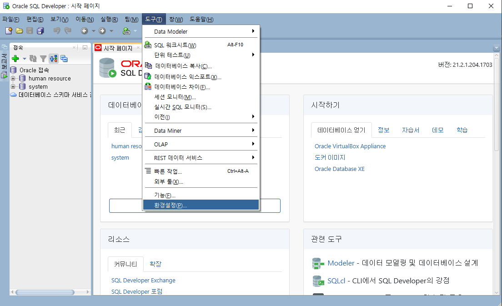
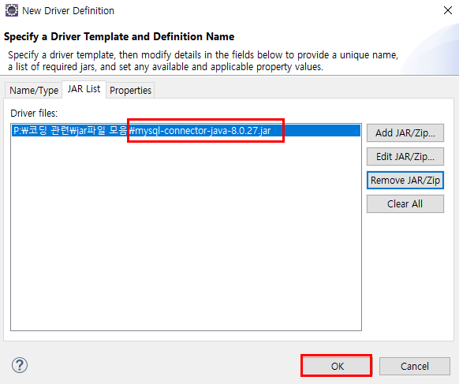

### MySQL 연동하기(Sqldeveloper, JDBC)

#### 1. Sqldeveloper 연동 

아래의 주소로 가서 먼저 jar파일을 다운로드 해준다!

 https://dev.mysql.com/downloads/connector/j/

파일 다운로드 후에 압축을 풀고 해당 폴더 안에서 .jar파일만 따로 빼둔다. 

#### 2. JDBC연동 

이상 MySQL과 Sqldeveloper, JDBC 연동 끝!