## Oracle 0 

#### 작업환경 구축 

### 1. 오라클 XE 18c 다운로드 

[오라클 홈페이지](https://www.oracle.com/index.html) 접속 후 Product클릭

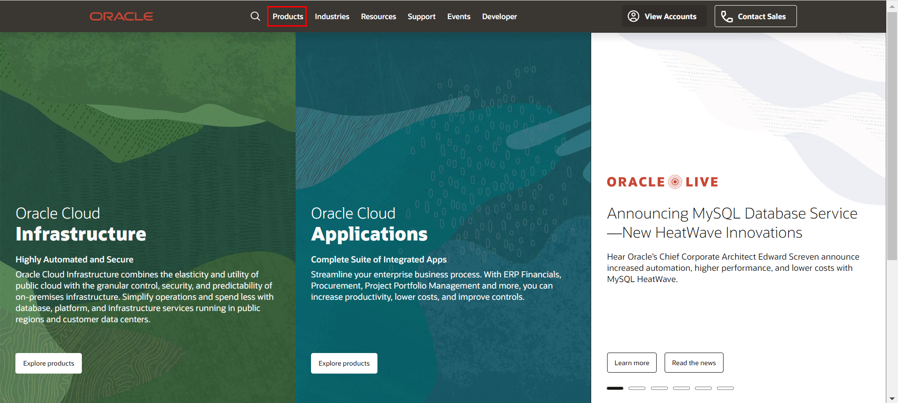

Oracle Database 클릭

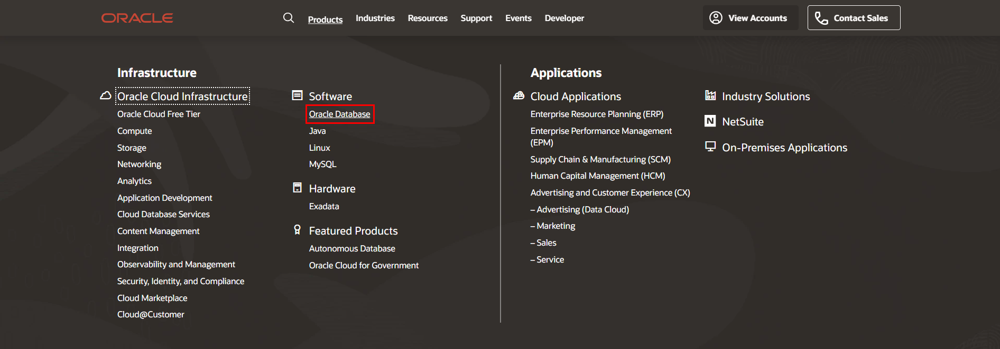

아래 빨간 박스 클릭 

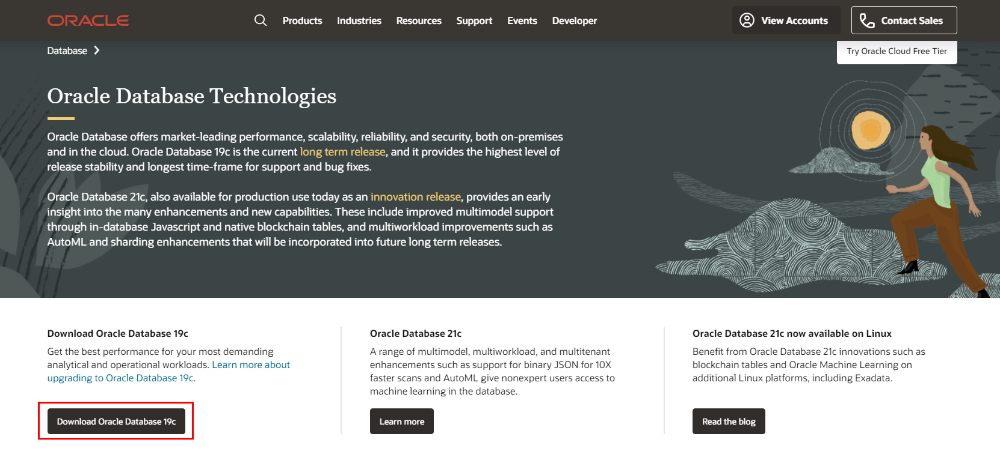

Database 19C로 들어와서 Express Edition 을 다운로드 받는다! (19C로 받으면 안된다!! 추후에 과금이 되기 때문에..)

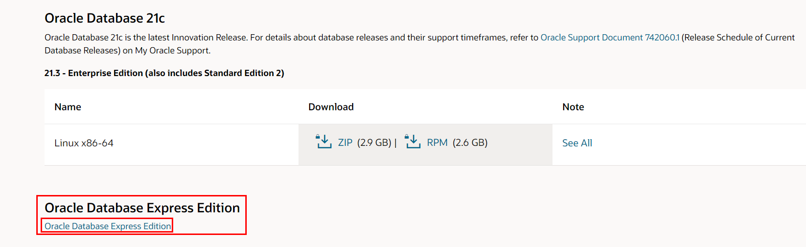

윈도우 x64 다운로드 클릭 

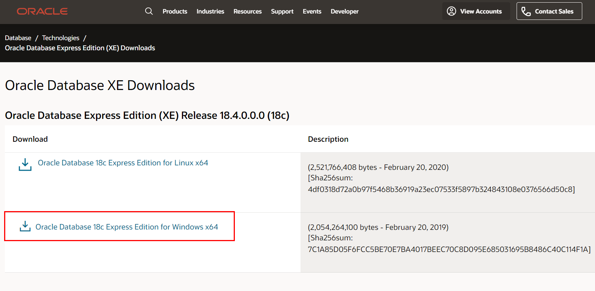

알집을 다운로드 받았으면, 압축을 해제한다. 

그리고 Setup을 눌러서 설치를 시작한다. 

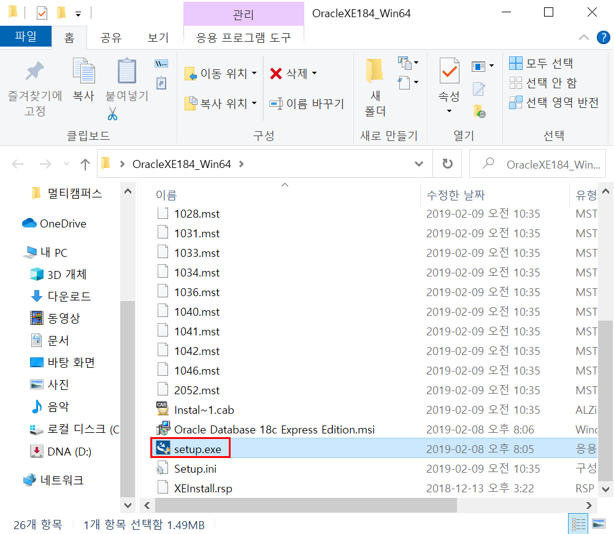


동의함! next!

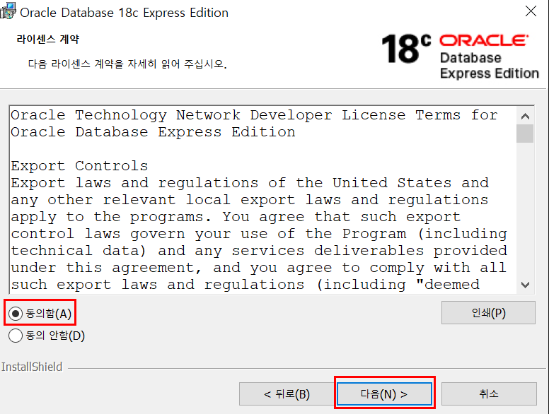

이 후에 하다 보면, 저장소를 선택하는 창이 뜨는데, C드라이브보다는 D드라이브나 다른 드라이브에 설치할 것을 권한다. C드라이브에 다운로드를 받게 되면 OS 보안 상의 문제로 설치가 제대로 진행되지 않는 경우가 종종 있기 때문이다. 참고로 4500MB정도의 여유공간이 필요한 바람에 나는 어쩔 수 없이 C드라이브에 다운로드했는데,,, 그러다가 에러나서 멈춘 사람이 바로 나,,(지난 주에 시킨 SSD가 아직도 안왔다!!!!!!)암튼 그래도 다운로드를 불가피하게 당장 받아야 해서, 나는 C드라이브 - 사용자 폴더에서 오라클이 디폴트로 다운로드 받으라고 해놓은 위치에 깔았더니, 이번엔 설치가 잘 되었다! 

그리고 비밀번호 설정이 뜨는데 비밀번호 설정도 하시고요 

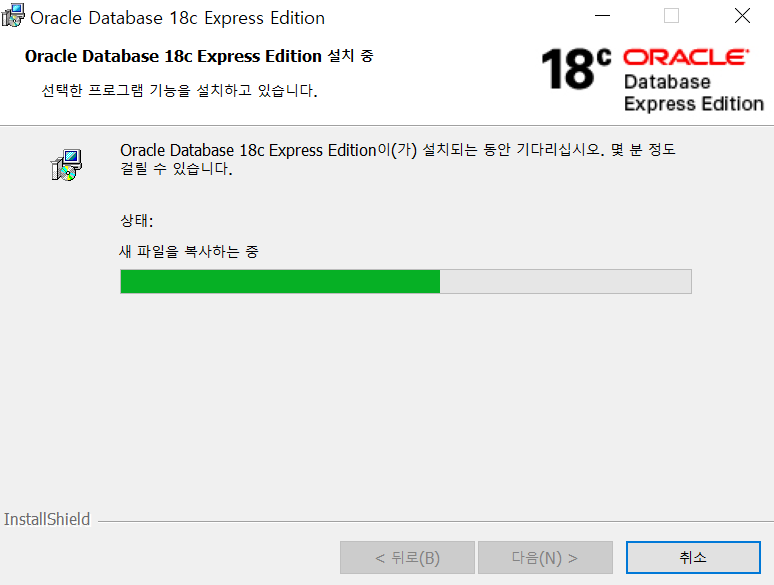

여기서 기다리면 설치가 완료됐다고 뜬다. 

### 2. SQL PLUS에서 HR스키마 설정(Oracle 18c) 

다운로드가 완료되면 시작 키를 눌러서 내려보면 아래처럼 새로 생성된 Oracle 폴더가 있고 그 안에 SQL Plus가 있다. 

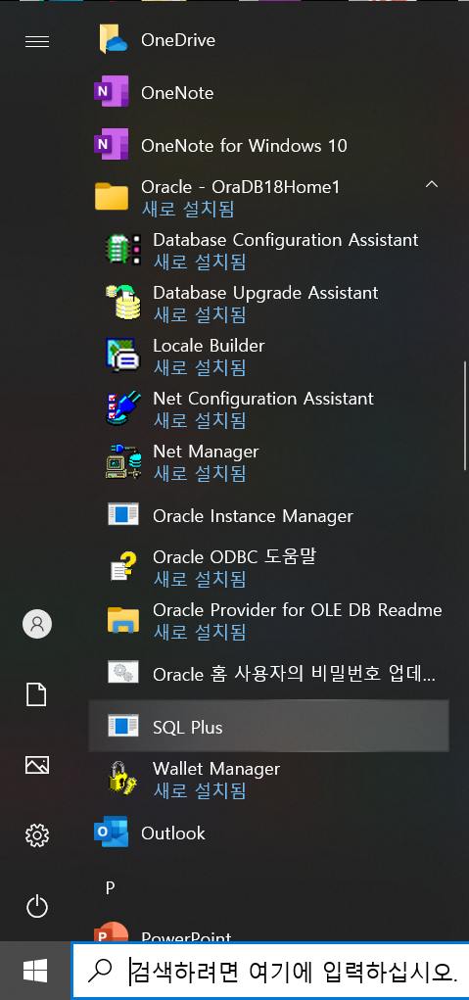


SQL Plus를 누르면 명령프롬프트 같은 창이 하나 뜨는데 여기서 아래의 코드들을 순서대로 입력해주면 된다. SQL>이 있는데 꺽새 우측부터 입력해주면 된다. 

```bash
SQL> conn SYSTEM/SYSTEM

SQL> ALTER SESSION SET "_ORACLE_SCRIPT"=true;

SQL> @?/demo/schema/human_resources/hr_main.sql

specify password for HR as parameter 1:

Enter value for 1: hr


specify default tablespace for HR as parameter 2:

Enter value for 2: users


specify temporary tablespace for HR as parameter 3:

Enter value for 3: temp
 

specify log path as parameter 4:

Enter value for 4: $ORACLE_HOME/demo/schema/log/
 
ALTER USER HR ACCOUNT UNLOCK IDENTIFIED BY 사용할비밀번호; 
```


### 3. SQL Developer 다운로드 및 Oracle 연결

SQL Developer를 설치하면 Oracle을 더 편리하게 사용할 수 있다.

아래 링크로 가면 바로 쉽게 다운로드가 가능하다. 

[SQL Deeveloper 다운로드 주소](https://www.oracle.com/tools/downloads/sqldev-downloads.html)


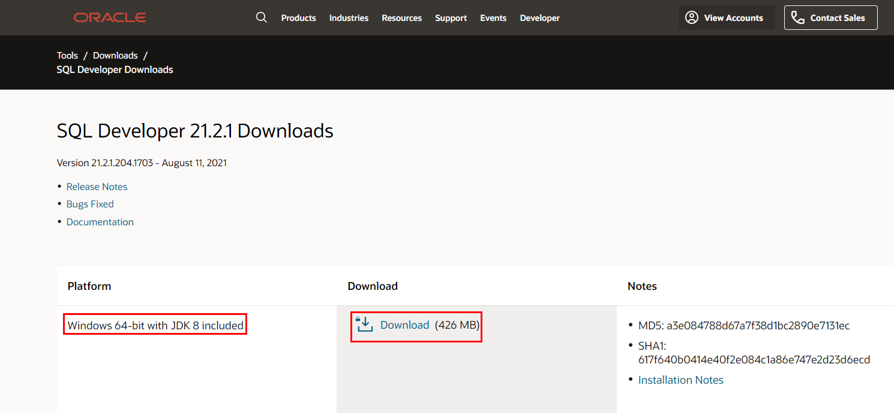

주소로 이동해서 내 os에 맞는 Windows 64-bit를 받아서 압축까지 풀어준다. 

다운받으면 첫 파일 속 파일에 sqldeveloper라는 폴더가 있는데 자주 쓰게 될 예정이라 따로 빼서 일단 D드라이브에 넣어두었다!

sqldeveloper에 들어가서 아래의 sqldeveloper.exe파일을 실행시켜준다.

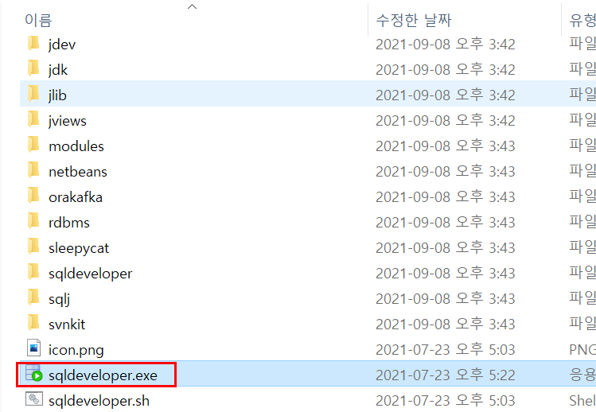


실행하면, 아래의 로딩창이 먼저 뜨고 로딩되는 중간에 두번의 팝업창이 뜬다. 하나는 이전 환경설정을 임포트하겠냐고 묻는 메시지인데, 첫 설치이기 때문에 <아니오>를 클릭했다. 

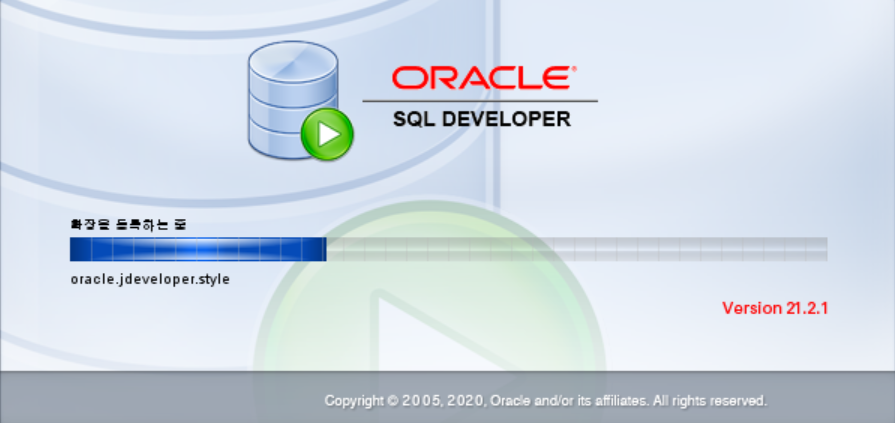

두번째 팝업창에서는 오라클 사용 추적이 나오는데 중요한 건 아니라 그냥 확인을 눌러주면 된다. 체크박스가 나올 수도 있는데,, 내용을 잘 읽고 판단해야 한다.(절대로 기억이 안나는게,,,안난다,,무슨 체크였더라)

이후 드디어 창이 뜬다! 

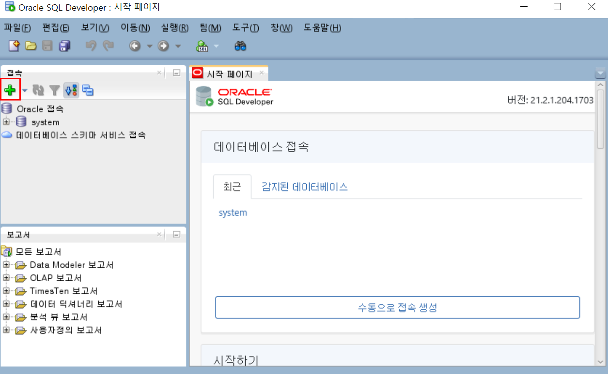

나 같은 경우는 이미 접속이 이뤄졌기 때문에 최근 목록에 뜬다. 하지만 처음이라면 좌측 상단에 +를 눌러준다. 

그러면 새로 만들기/ 데이터베이스 접속 선택이라는 창이 뜬다! 

나는 아래처럼 작성을 하고, + 비밀번호도 입력하고 테스트를 눌렀다..!

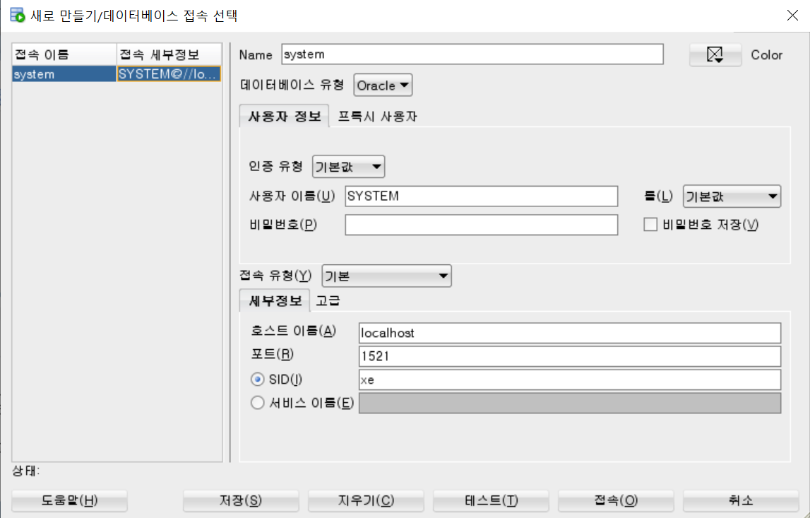

좌측 하단 "상태:"에 **성공**이 뜨면 정상이다! 나는 다행히 한번에 성공이 떴다 후후 그리고 저장을 누르고 접속을 눌러 연결하였다! 

와우