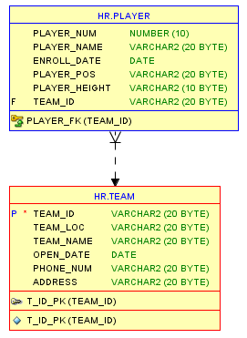
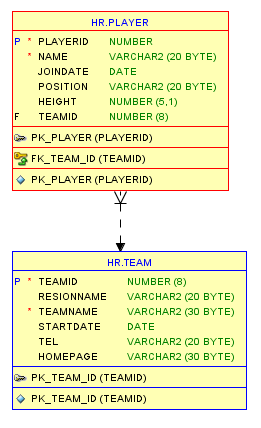
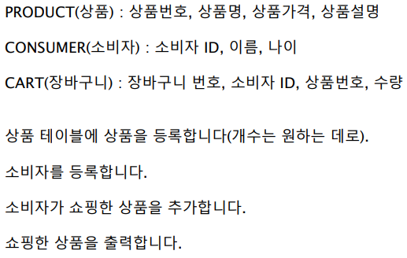
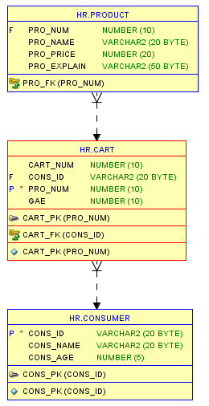
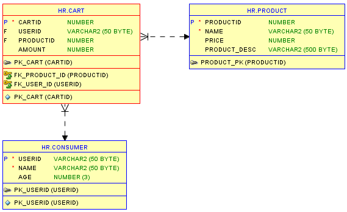

## Oracle 11 

#### Practice (Work 7, Work 8)

### 1. Work 7-1 (TABLE)


- **내 코드**

```sql
-- 팀 테이블 
CREATE TABLE TEAM(
    TEAM_ID VARCHAR2(20),
    TEAM_LOC VARCHAR2(20),
    TEAM_NAME VARCHAR2(20),
    OPEN_DATE DATE,
    PHONE_NUM VARCHAR2(20),
    ADDRESS VARCHAR2(20),
    CONSTRAINT T_ID_PK PRIMARY KEY(TEAM_ID)
);
-- 팀 등록 
INSERT INTO TEAM(TEAM_ID, TEAM_LOC, TEAM_NAME, OPEN_DATE, PHONE_NUM, ADDRESS)
VALUES('1004', '서울', '호랑이', '20/09/15', '02-123-456', 'www.tiger.com');

INSERT INTO TEAM(TEAM_ID, TEAM_LOC, TEAM_NAME, OPEN_DATE, PHONE_NUM, ADDRESS)
VALUES('1005', '부산', '돌고래', '19/02/13', '02-142-426', 'www.dolphin.com');

-- 플레이어 테이블 
CREATE TABLE PLAYER(
    PLAYER_NUM NUMBER(10),
    PLAYER_NAME VARCHAR2(20),
    ENROLL_DATE DATE,
    PLAYER_POS VARCHAR2(20),
    PLAYER_HEIGHT VARCHAR2(10),
    TEAM_ID VARCHAR2(20),
    CONSTRAINT TIGER_FK FOREIGN KEY(TEAM_ID)
    REFERENCES TEAM(TEAM_ID)
);
-- 선수 등록 
INSERT INTO PLAYER(PLAYER_NUM, PLAYER_NAME, ENROLL_DATE, PLAYER_POS, PLAYER_HEIGHT, TEAM_ID)
VALUES(7, '김선수','20/10/11', '공격수', '185', '1004');

INSERT INTO PLAYER(PLAYER_NUM, PLAYER_NAME, ENROLL_DATE, PLAYER_POS, PLAYER_HEIGHT, TEAM_ID)
VALUES(4, '이선수','20/10/11', '수비수', '175', '1004');

INSERT INTO PLAYER(PLAYER_NUM, PLAYER_NAME, ENROLL_DATE, PLAYER_POS, PLAYER_HEIGHT, TEAM_ID)
VALUES(11, '황선수','20/11/22', '수비수', '181', '1004');

INSERT INTO PLAYER(PLAYER_NUM, PLAYER_NAME, ENROLL_DATE, PLAYER_POS, PLAYER_HEIGHT, TEAM_ID)
VALUES(3, '돌선수','19/05/20', '수비수', '175', '1005');

INSERT INTO PLAYER(PLAYER_NUM, PLAYER_NAME, ENROLL_DATE, PLAYER_POS, PLAYER_HEIGHT, TEAM_ID)
VALUES(1, '핀선수','19/3/11', '골키퍼', '181', '1005');

INSERT INTO PLAYER(PLAYER_NUM, PLAYER_NAME, ENROLL_DATE, PLAYER_POS, PLAYER_HEIGHT, TEAM_ID)
VALUES(9, '래선수','19/3/11', '공격수', '168', '1005');

SELECT P.PLAYER_NAME, T.TEAM_NAME, T.PHONE_NUM, T.ADDRESS
FROM TEAM T, PLAYER P
WHERE T.TEAM_ID = P.TEAM_ID AND P.PLAYER_NAME = '돌선수';
```

 내 코드로 만든 테이블의 모델 


- 모범답안 코드

  ```sql
  -- TEAM : 팀아이디, 지역, 팀명, 개설날짜, 전화번호, 홈페이지
  CREATE TABLE TEAM(
      TEAMID NUMBER(8) CONSTRAINT PK_TEAM_ID PRIMARY KEY,
      RESIONNAME VARCHAR2(20),
      TEAMNAME VARCHAR2(30) NOT NULL,
      STARTDATE DATE,
      TEL VARCHAR2(20),
      HOMEPAGE VARCHAR2(30)
  );
  
  -- PLAYER : 선수번호, 선수명, 등록일, 포지션, 키, 팀아이디
  CREATE TABLE PLAYER(
      PLAYERID NUMBER CONSTRAINT PK_PLAYER PRIMARY KEY,
      NAME VARCHAR2(20) NOT NULL,
      JOINDATE DATE,
      POSITION VARCHAR2(20),
      HEIGHT NUMBER(5, 1),
      TEAMID NUMBER(8)
  );
  
  ALTER TABLE PLAYER
  ADD
  CONSTRAINT FK_TEAM_ID FOREIGN KEY(TEAMID)
  REFERENCES TEAM(TEAMID);
  
  -- 팀추가
  INSERT INTO team(TEAMID, RESIONNAME, TEAMNAME, STARTDATE, TEL, HOMEPAGE)
  VALUES(1000, '서울', '베어즈', SYSDATE, '02-123-4567', 'http://www.bears.com');
  
  INSERT INTO team(TEAMID, RESIONNAME, TEAMNAME, STARTDATE, TEL, HOMEPAGE)
  VALUES(2000, '대구', '라이온즈', '91/03/12', '031-234-5678', 'http://www.lions.com');
  
  -- 선수추가
  INSERT INTO player(PLAYERID, NAME, JOINDATE, POSITION, HEIGHT, TEAMID)
  VALUES(100, '홍길동', TO_DATE('2020/09/12 09:12:35', 'YYYY/MM/DD HH/MI/SS'), '투수', 181.1, 1000);
  
  INSERT INTO player(PLAYERID, NAME, JOINDATE, POSITION, HEIGHT, TEAMID)
  VALUES(101, '성춘향', SYSDATE, '1루수', 165.3, 2000);
  
  INSERT INTO player(PLAYERID, NAME, JOINDATE, POSITION, HEIGHT, TEAMID)
  VALUES(102, '일지매', SYSDATE, '좌익수', 178.8, '');
  
  SELECT p.playerid, name,
      p.teamid, t.teamid,
      t.teamname, t.homepage
  FROM PLAYER p, TEAM t
  WHERE name = '홍길동'
      AND position = '투수'
          AND p.teamid = t.teamid;
  ```

 모범답안 코드로 만든 테이블의 모델 


### 2. Work 7-2(TABLE)



- 내 코드

  ```sql
  CREATE TABLE CONSUMER(
      CONS_ID VARCHAR2(20),
      CONS_NAME VARCHAR2(20),
      CONS_AGE NUMBER(5),
      CONSTRAINT CONS_PK PRIMARY KEY(CONS_ID)
  );
  
  -- 소비자 정보 등록
  INSERT INTO CONSUMER(CONS_ID, CONS_NAME, CONS_AGE)
  VALUES('HKD01', '홍길동', 20);
  
  INSERT INTO CONSUMER(CONS_ID, CONS_NAME, CONS_AGE)
  VALUES('SCH02', '성춘향', 18);
  
  
  
  CREATE TABLE CART(
      CART_NUM NUMBER(10),
      CONS_ID VARCHAR2(20),
      PRO_NUM NUMBER(10),
      GAE NUMBER(10),
      CONSTRAINT CART_PK PRIMARY KEY(PRO_NUM),
      CONSTRAINT CART_FK FOREIGN KEY(CONS_ID)
      REFERENCES CONSUMER(CONS_ID)
  );
  
  -- 장바구니 정보 등록
  INSERT INTO CART(CART_NUM, CONS_ID, PRO_NUM, GAE)
  VALUES(21122,'SCH02',1, 5);
  
  INSERT INTO CART(CART_NUM, CONS_ID, PRO_NUM, GAE)
  VALUES(23142,'HKD01',2, 3);
  
  
  
  CREATE TABLE PRODUCT(
      PRO_NUM NUMBER(10),
      PRO_NAME VARCHAR2(20),
      PRO_PRICE NUMBER(20),
      PRO_EXPLAIN VARCHAR2(50),
      CONSTRAINT PRO_FK FOREIGN KEY (PRO_NUM)
      REFERENCES CART(PRO_NUM)
  );
  
  -- 제품 등록
  INSERT INTO PRODUCT(PRO_NUM, PRO_NAME, PRO_PRICE, PRO_EXPLAIN)
  VALUES(1,'감자칩',1500, '감자로 만든 과자');
  
  INSERT INTO PRODUCT(PRO_NUM, PRO_NAME, PRO_PRICE, PRO_EXPLAIN)
  VALUES(2,'고구마칩',1500, '고구마로 만든 과자');
  
  SELECT CO.CONS_NAME AS "소비자 이름", CA.PRO_NUM 제품코드 , P.PRO_NAME 제품명, P.PRO_PRICE AS 제품가격
  FROM CONSUMER CO, CART CA, PRODUCT P
  WHERE CO.CONS_ID = CA.CONS_ID AND CA.PRO_NUM = P.PRO_NUM AND CO.CONS_NAME='홍길동';
  
  ```

 내 코드로 만든 테이블의 모델


- 모범답안 코드

  ```sql
  -- 온라인 마켓 TABLE을 작성하라.
  -- PRODUCT(상품) : 상품번호, 상품명, 상품가격, 상품설명
  
  DROP TABLE PRODUCT
  CASCADE CONSTRAINTS;
  
  CREATE TABLE PRODUCT(
      PRODUCTID NUMBER PRIMARY KEY,
      NAME VARCHAR2(50) NOT NULL,
      PRICE NUMBER,
      PRODUCT_DESC VARCHAR(500)
  );
  
  -- CONSUMER(소비자) : 소비자 ID, 이름, 나이
  CREATE TABLE CONSUMER(
      USERID VARCHAR2(50) CONSTRAINT PK_USERID PRIMARY KEY,
      NAME VARCHAR2(50) NOT NULL,
      AGE NUMBER(3)
  );
  
  -- CART(장바구니) : 장바구니 번호, 소비자 ID, 상품번호, 수량
  CREATE TABLE CART(
      CARTID NUMBER CONSTRAINT PK_CART PRIMARY KEY,
      USERID VARCHAR2(50),    -- 외래키
      PRODUCTID NUMBER,       -- 외래키
      AMOUNT NUMBER
  );
  
  ALTER TABLE CART
  ADD
  CONSTRAINT FK_PRODUCT_ID FOREIGN KEY(PRODUCTID)
  REFERENCES PRODUCT(PRODUCTID);
  
  ALTER TABLE CART
  ADD
  CONSTRAINT FK_USER_ID FOREIGN KEY(USERID)
  REFERENCES CONSUMER(USERID);
  
  -- 상품을 등록
  INSERT INTO PRODUCT(PRODUCTID, NAME, PRICE, PRODUCT_DESC)
  VALUES(1001, '새우깡', 1500, '맛있어요');
  
  INSERT INTO PRODUCT(PRODUCTID, NAME, PRICE, PRODUCT_DESC)
  VALUES(1002, '포테이토칩', 2400, '감자맛입니다');
  
  INSERT INTO PRODUCT(PRODUCTID, NAME, PRICE, PRODUCT_DESC)
  VALUES(1003, '카누', 5500, '인스턴트식품입니다');
  
  -- 소비자를 등록
  INSERT INTO CONSUMER(USERID, NAME, AGE)
  VALUES('HGD', '홍길동', 24);
  
  INSERT INTO CONSUMER(USERID, NAME, AGE)
  VALUES('SCH', '성춘향', 16);
  
  -- 쇼핑등록
  INSERT INTO CART(CARTID, USERID, PRODUCTID, AMOUNT)
  VALUES(1, 'SCH', 1003, 2);
  
  INSERT INTO CART(CARTID, USERID, PRODUCTID, AMOUNT)
  VALUES(2, 'SCH', 1001, 1);
  
  INSERT INTO CART(CARTID, USERID, PRODUCTID, AMOUNT)
  VALUES(3, 'HGD', 1002, 3);
  
  SELECT * 
  FROM cart
  WHERE userid = 'SCH';
  
  SELECT c.userid, c.productid, p.name, p.price * c.amount
  FROM cart c, product p
  WHERE c.productid = p.productid
      AND c.userid = 'SCH';
  
  ```

 모범답안으로 만든 테이블의 모델 


### 3. Work 8 (VIEW)

```SQL
-- 문제1) EMPLOYEES 테이블에서 20번 부서의 세부 사항을 포함하는 EMP_20 VIEW를 생성 하라
CREATE OR REPLACE VIEW EMP_20VIEW           -- OR REPLACE 를 넣으면, 같은 이름의 파일이 있으면 덮어쓰고, 없으면 새로 생성을 한다.
AS
SELECT *
FROM employees
WHERE department_id = 20;

SELECT *
FROM emp_20view;


-- 문제2) EMPLOYEES 테이블에서 30번 부서만 
-- EMPLOYEE_ID 를 emp_no 로 LAST_NAME을 name으로 SALARY를 sal로 바꾸어 EMP_30 VIEW를 생성하라.
CREATE VIEW EMP_30VIEW          
AS
SELECT employee_id as emp_no, last_name as name, salary as sal
FROM employees
WHERE department_id = 30;

SELECT *
FROM emp_30view;


CREATE VIEW EMP_30VIEW_1(emp_no,name, sal)        
AS
SELECT employee_id, last_name, salary 
FROM employees
WHERE department_id = 30;

SELECT *
FROM emp_30view_1;


-- 문제3) 부서별로 부서명,최소 급여,최대 급여,부서의 평균 급여를 포함하는 DEPT_SUM VIEW을 생성하여라.
CREATE VIEW DEPT_SUMVIEW(dname, minsal, maxsal, avgsal)
AS
SELECT d.department_name, MIN(e.salary), MAX(e.salary), TRUNC(AVG(salary))
FROM departments d, employees e
WHERE d.department_id = e.department_id
GROUP BY d.department_name;


-- 문제4) 앞에서 생성한 EMP_20,EMP_30 VIEW을 삭제하여라.
DROP VIEW emp_20VIEW;
DROP VIEW emp_30VIEW;
```


