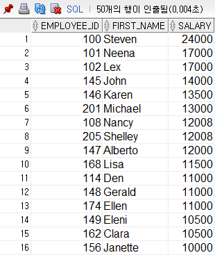
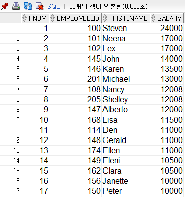
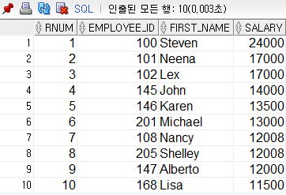

## Oracle 7

#### 특수쿼리, 집합, 오버함수, 분석함수, SELECT문 정리

### 1. 특수쿼리 

- **CASE** 

CASE는 자바로 보자면 switch문과 유사하며 아래 두 형태로 작성이 가능하다. 

```sql
SELECT employee_id, first_name, phone_number,
        CASE SUBSTR(phone_number, 1, 3)
                WHEN '515' THEN '서울'
                WHEN '590' THEN '부산'
                WHEN '650' THEN '광주'
                ELSE '기타'
        END as 지역
FROM employees;


SELECT employee_id, first_name, phone_number,
        CASE 
                WHEN SUBSTR(phone_number, 1, 3) =  '515' THEN '서울'
                WHEN SUBSTR(phone_number, 1, 3) =  '590' THEN '부산'
                WHEN SUBSTR(phone_number, 1, 3) =  '650' THEN '광주'
                ELSE '기타'
        END as 지역
FROM employees;
```


- **DECODE**

DECODE도 기능은 CASE와 동일하다.

```sql
SELECT employee_id, first_name, phone_number,
        DECODE( SUBSTR(phone_number, 1, 3), 
                             '515', '서울',
                             '590', '부산',
                             '650', '광주',
                             '기타') AS 지역
FROM employees;
```


### 2. 집합 

JOIN으로 표현가능하기 때문에 JOIN을 더 많이 쓴다. 사용빈도는 낮다.

합집합 : UNION - FULL OUTER JOIN 
교집합 : INTERSECT - INNER JOIN 
차집합 : MINUS

- **UNION 합집합**

  ```sql
  SELECT job_id
  FROM employees
  WHERE job_id IN('AD_VP','FI_ACCOUNT')
  UNION ALL
  SELECT job_id
  FROM jobs
  WHERE job_id IN('AD_VP','FI_ACCOUNT');
  ```

  

- **INTERSECT 교집합**

  ```sql
  SELECT employee_id
  FROM employees;
  INTERSECT     -- 사원들을 제외한 매니저들만 출력
  SELECT manager_id
  FROM employees;
  ```

  

- **INNER JOIN을 이용(교집합)**

  ```sql
  SELECT DISTINCT(b.employee_id)
  FROM employees a, employees b   -- a:사원테이블 b:매니저테이블 이라고 생각하고 하기
  WHERE a.manager_id = b.employee_id;
  ```

  

- **MINUS 차집합**

  ```sql
  SELECT employee_id
  FROM employees
  MINUS       -- 전체 직원들 중 매니저들만 제외하고 사원들만 출력 
  SELECT manager_id
  FROM employees;
  ```


### 3. 오버함수 

- OVER()

  SELECT 절에서만 사용 
  GROUP BY를 보강하기 위해서 나온 함수 
  GROUP 함수와 같이 쓸 수 있게 해주는 함수(GROUP BY없이) 
  COUNT 외에도 다른 GROUP함수와도 같이 쓴다.
  OVER함수에서 PARTITION BY를 써서 그룹을 나눠 쓸 수 있다.  

```sql
-- COUNT(*) OVER() : 전체 행을 반환 
-- COUNT(*) OVER(PARTITION BY 컬럼) : 해당 컬럼을 그룹으로 나누어 ROW의 수를 반환 
```


- **간단 용례**

```sql
SELECT department_id, COUNT(*)
FROM employees;                              -- 이렇게만 있으면 에러가 뜬다

SELECT department_id, COUNT(*)
FROM employees
GROUP BY department_id;                		 -- 묶어주어야 에러가 안뜬다. 


SELECT department_id, COUNT(*) OVER()
FROM employees;                              -- 일단 이렇게하면 에러는 안난다. 


SELECT department_id, COUNT(DISTINCT department_id) OVER()
FROM employees; 
```


- **PARTITION BY**

  SELECT절 안의 GROUP BY

  ```sql
  SELECT department_name, COUNT(*) OVER(PARTITION BY department_id)
  FROM departments;
  
  
  SELECT department_id, first_name, salary, job_id,
          COUNT(*) OVER(PARTITION BY department_id),
          COUNT(*) OVER(PARTITION BY job_id)
  FROM employees;
  ```

  

### 4. 분석함수 

순위함수    - 숫자를 할당하기 위한 함수 
RANK()                         	 1   2   3   3   5   6
DENSE_RANK()        	    1   2   3   3   4   5 
ROW_NUMBER         	  1   2   3   4   5   6   
ROWNUM               	     1   2   3   4   5   6

- **RANK(), DENSE_RANK(), ROW_NUMBER()**

  ```sql
  SELECT employee_id, first_name
  FROM employees 
  WHERE employee_id >= 100 AND employee_id <= 109;
  
  SELECT employee_id, first_name, salary
  FROM employees 
  ORDER BY salary DESC;  -- 여기서 상위 10명만을 뽑는다고 할 때, 어떻게 할래? 
  
  
  SELECT first_name, salary,
          RANK() OVER(ORDER BY salary DESC) AS RANK,
          DENSE_RANK() OVER(ORDER BY salary DESC) AS DENSERANK,
          ROW_NUMBER() OVER(ORDER BY salary DESC) AS ROW_NUMBER
  FROM employees;
  
  ```

  


- **ROWNUM 사용법** 

  1. 순위(정렬)
  2. 번호 지정
  3. 범위 지정

  ```sql
  SELECT RNUM, employee_id, first_name,salary
  FROM
      ( SELECT ROWNUM as RNUM, employee_id, first_name,salary            												   -- 2. 서브쿼리로 번호지정을 했다(RNUM)
      FROM ( SELECT employee_id, first_name,salary
             FROM employees
             ORDER BY salary DESC )      -- 1. salary역순으로 순서(순위)를 만들었다(정렬)
                   )
  WHERE RNUM >= 1 AND RNUM <= 10;        -- 3. 범위를 지정했다. 번호에 순서를 맞춰준다
  ```


​		출력값으로 보면 이해가 더 쉽다. 

1. salary역순으로 순서(순위)를 만들었다(정렬)

   

   

   2. 서브쿼리로 번호지정을 했다(RNUM)

      

      

      3. 범위를 지정하고 지정된 범위의 번호에 순서를 맞춰준다

         


### 5. SELECT문 정리

```sql
SELECT 컬럼, 표준함수, 그룹함수, 서브쿼리, OVER() PARTITION BY
FROM 테이블, 서브쿼리
[WHERE] 조건 IN, AND, OR, NULL, ALL, ANY, LIKE, 부등호(> < >= <= != <>), 서브쿼리
[GROUP BY] 컬럼
[HAVING] 그룹핑 조건
[ORDER BY] 컬럼 ASC, DESC
[START BY] 계층형
```

