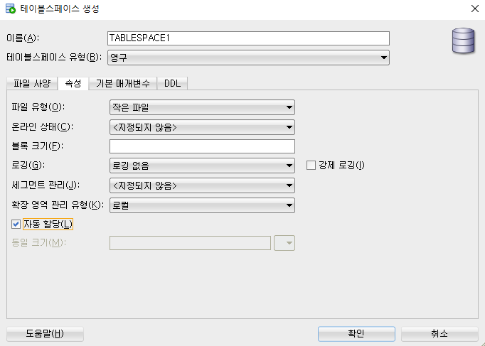

## Oracle 8

#### 테이블 스페이스, 테이블, 데이터

### (1. 테이블 스페이스) 

(미리 말해두자면, **테이블 스페이스는 이런 것도 있구나 정도로만 읽고 넘어갈 것!** )

(주니어 개발자가 실무에 나가서 직접 테이블 스페이스를 건드릴 일은 없기 때문에..)


테이블 스페이스는 에디터로 만들 수도 있고, 쿼리문을 사용해 직접 손으로 짤 수도 있다. 
에디터가 편하기 하지만, 쿼리를 보고 한눈에 알 수 있다는 장점이 있기 때문에쿼리로 짜는게 보다 더 많이 쓰인다. 

- **테이블 스페이스 에디터로 만들기** 

  상단 보기 > DBA > 저장영역 > 테이블 스페이스 > 우클릭 새로 만들기 

  

  

  

  

  

  확인 누르면 생성 완료! 근데 정말 그러려니 하고 패스하면 될 듯 싶다. 

  

- **테이블 스페이스 쿼리로 만들기**

  ```sql
  
  CREATE TABLESPACE TABLESPACE2
  DATAFILE 'D:\temp\TEST_TBS.DBF' SIZE 10M
  AUTOEXTEND ON NEXT 1M MAXSIZE UNLIMITED
  LOGGING
  EXTENT MANAGEMENT LOCAL AUTOALLOCATE
  BLOCKSIZE 8K 
  SEGMENT SPACE MANAGEMENT AUTO
  FLASHBACK ON;
  
  
  -- object에서 명령어 -  CREATE(생성), ALTER(수정), DROP(삭제)
  -- data에서 명령어 - INSERT(생성), UPDATE(수정), DELETE(삭제) 
  
  -- 수정
  ALTER TABLESPACE TABLESPACE1
  RENAME TO TEST_TBS1; 
  
  -- 수정
  ALTER DATABASE 
  DATAFILE 'D:\temp\FILE_SPECIFICATION1' RESIZE 7M;
  
  -- 삭제
  DROP TABLESPACE TEST_TBS1
  INCLUDING CONTENTS AND DATAFILES
  CASCADE CONSTRAINTS;
  
  ```


### 2. 테이블

 Table : 열(column)과 행(row)으로 구분  
테이블도 에디터로 만들 수 있고, 쿼리문으로도 만들 수 있다. 

- **테이블 생성** 

  ```SQL
  CREATE TABLE TB_TEST01(
          COL1 VARCHAR2(10),
          COL2 VARCHAR2(10),
          COL3 VARCHAR2(10)
  );
  -- 이렇게 쿼리를 적고 테이블을 생성하면, 추가적인 내용들(에디터로 만들었을 때, sql부분에서 보이는 내용)은 해당 테이블의 sql부분을 보면, 자동으로 생성된다. 
  ```

  

- **테이블 복제 : 데이터를 포함**

  ```SQL
  CREATE TABLE TB_TEST03(JNAME, JTITLE, SALMIN,SALMAX)
  AS
  SELECT * FROM jobs;
  
  SELECT *
  FROM tb_test03;
  
  DROP TABLE tb_test03;
  ```

  

- **테이블 복제 : 데이터를 미포함 (데이터는 안가져오고 컬럼만 가져오기)**

  ```SQL
  CREATE TABLE TB_TEST04
  AS
  SELECT *
  FROM employees
  WHERE 1 = 2;        -- 성립되지 않는 조건을 넣음 
  ```

  

- **테이블 수정 - 테이블명 수정** 

  ```SQL
  ALTER TABLE TB_TEST04
  RENAME
  TO TB_TEST99;
  ```

  

- **테이블 수정 - 컬럼 추가**

  ```SQL
  ALTER TABLE TB_TEST99
  ADD
  NEWCOL VARCHAR2(20);
  ```

  

- **테이블 수정 - 컬럼 수정** 

  ```SQL
  ALTER TABLE TB_TEST99
  MODIFY 
  NEWCOL DATE;
  ```

  

- **테이블 수정 - 컬럼 삭제** 

  ```SQL
  ALTER TABLE TB_TEST99
  DROP
  COLUMN NEWCOL; 
  ```

  

- **테이블 수정 - 컬럼명 수정** 

  ```SQL
  ALTER TABLE TB_TEST99
  RENAME
  COLUMN EMPLOYEE_ID TO EMPNO;
  ```

  

- **테이블 삭제** 

 삭제해도 쿼리문으로 다 남아있기 때문에 괜찮다. 그리고 휴지통에도 남아있다. 

```sql
DROP TABLE TB_TEST99;
```


### 3. 데이터 

- **데이터 추가 INSERT**

  ```sql
  INSERT INTO tb_test03(JNAME, JTITLE, SALMIN, SALMAX)
  VALUES ('SALES_AD', '영업부', 8000, 20000);
  
  
  INSERT INTO tb_test03
  VALUES('BALL_MO', '야구부', 8500, 25000); 
  
  
  -- 순서를 바꿔서 넣어도 잘 들어간다. 그러나 비추
  INSERT INTO tb_test03(JTITLE, JNAME, SALMAX, SALMIN) 
  VALUES ('창고부', 'STORE', 23000, 10000);  
  
  
  -- NULLABLE이 YES이면 빈 값은 NULL로 들어가게 된다. NO는 아예 안 된다. 
  INSERT INTO tb_test03(JTITLE, SALMAX)
  VALUES('전화상담', 20000);   
  ```

  

- **데이터 삭제 DELETE**

  ```sql
  DELETE FROM tb_test03
  WHERE JNAME = 'STORE';
  
  
  DELETE FROM tb_test03
  WHERE SALMAX = 20000;  
  -- 중복되는 값이 있는 경우에는 해당 데이터들을 싹 다 지우기 때문에 중복 확인 필수!! 
  
  ```

  

- **데이터 수정 UPDATE**

  ```sql
  UPDATE tb_test03
  SET JNAME = 'DB_PROG', JTITLE = 'DB개발', SALMAX = 25000, SALMIN = 9000
  WHERE JNAME = 'BALL_MO'; 
  ```

  

