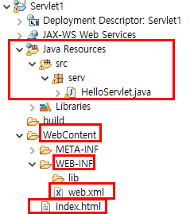

## Servlet 1 

#### Servlet, 예시1(서블릿 기본 설정, 기초), 예시2 (하나의 값, 배열 받기, 콘솔창 한글 깨질 때)

### 1. Servlet

서블릿은 클라이언트의 요청(Request)에 따라 동적으로 서비스를 제공하는 자바의 클래스이다. 서블릿은 서버에서 실행되다가 웹 브라우저에서 요청을 하면, 해당 기능을 수행한 뒤에 웹 브라우저에 결과를 전송한다. 

서블릿의 동작 과정을 설명해보면, 가장 먼저 클라이언트가 웹 서버에 요청을 보내면 웹 서버는 그 요청을 톰캣과 같은 WAS(웹 어플리케이션 서버)에 위임한다. 그러면 WAS는 각 요청에 해당되는 서블릿을 실행하고, 서블릿은 요청에 대한 기능을 수행한 후 결과를 반환하여 클라이언트에 전송한다. 서블릿은 서버 쪽에서 실행되며 기능을 수행하고, 동적인 여러 기능을 제공하며, 컨테이너에서 실행된다는 몇가지 특징을 갖는다. 참고로 뒤에 배울 JSP는 서블릿을 보완한 형태라고 보면 되는데, 간단히 각각 아래와 같은 특징을 갖는다. 

Servlet - Java 코드 안에 html을 같이 쓸 수 있는 형태 
JSP - html 코드 안에 Java코드를 같이 쓸 수 있는 형태 

이번에는 주로 HttpServlet클래스에서 doGet과 doPost 메서드를 위주로 학습하였고, 이에 대해 커밋하려고 한다. 

먼저 서블릿을 사용할 때, 어떤 형태로 구성되어 있는지 프로젝트 이미지로 확인해보자



사진으로 보면 위와 같다. 좀 더 부연설명을 하자면, 프로젝트를 Dynamic Web Project로 생성한다. servlet을 작성하는 파일은 자바의 클래스 형태로 생성한다. Java Resources > src에는 서블릿 파일 외에도 Dao, Dto같은 소스코드가 들어가고, WebContent에는 html, jsp 파일들이 들어간다. jar 파일의 경우, lib이라는 라이브러리폴더에 들어간다. 


### 예시1(서블릿 기본 설정, 기초)

- **HelloServlet.java**

  ```java
  package serv;
  
  import java.io.IOException;
  
  import javax.servlet.ServletException; 
  import javax.servlet.http.HttpServlet;
  import javax.servlet.http.HttpServletRequest;
  import javax.servlet.http.HttpServletResponse;
  
  // HttpServlet으로 확장을 해주어야 한다! 
  public class HelloServlet extends HttpServlet{
  
  // 상단 메뉴의 source > Override/Implement Methods를 눌러서 doget과 dopost만 선택해서 받아온다. 
      
  	@Override	// doGet은 서블릿이 GET 요청을 수행하기 위한 메서드
  	protected void doGet(HttpServletRequest req, HttpServletResponse resp) throws ServletException, IOException {
  		System.out.println("HelloServlet doGet()");
  	}
  
  	@Override	// doPost는 서블릿이 POST 요청을 수행하기 위한 메서드
  	protected void doPost(HttpServletRequest req, HttpServletResponse resp) throws ServletException, IOException {
  		System.out.println("HelloServlet doPost()");
  	}
  }
  ```

  

- **web.xml** 

  ```xml
  <!-- 아래의 web-app태그는 톰캣 web.xml에서 복붙하면 된다 -->
  <?xml version="1.0" encoding="UTF-8"?>
  <web-app xmlns="http://xmlns.jcp.org/xml/ns/javaee"
    xmlns:xsi="http://www.w3.org/2001/XMLSchema-instance"
    xsi:schemaLocation="http://xmlns.jcp.org/xml/ns/javaee
                        http://xmlns.jcp.org/xml/ns/javaee/web-app_4_0.xsd"
    version="4.0">
    
      
  <!-- servlet 설정 -->
  <servlet>
  	<servlet-name>helloServlet</servlet-name>	
  <!-- servlet-name태그의 이름은 위와 아래의 태그가 동일해야한다. -->
  	<servlet-class>serv.HelloServlet</servlet-class>
  </servlet>  
  
  <servlet-mapping>
  	<servlet-name>helloServlet</servlet-name>	
  <!--/location이라는 패턴이 걸리면 저 클래스(serv.HelloServlet)로 이동하라는 것 -->
  	<url-pattern>/location</url-pattern>
      <!-- location은 url에서 볼 수 있다. -->
  </servlet-mapping>  
  </web-app>
  ```


- **index.html**

  ```html
  <!DOCTYPE html>
  <html>
  <head>
  <meta charset="UTF-8">
  <title>Insert title here</title>
  </head>
  <body>
  
  <h1>Servlet 기본</h1>
  
  <a href="location">Hello Servlet(doGet)으로 이동</a>
  
  <form action="location" method = "get">
  	<input type="submit" value = "doGet">
  </form>
  
  <form action="location" method = "post">
  	<input type="submit" value = "doPost">
  </form>
  <!-- web.xml에서 설정한 location을 주소 위치에 넣어줌으로써 해당 요청이 들어올 경우 지정된 메서드를 실행시킨다. -->
  </body>
  </html>
  ```


-------------------

### 예시2 (하나의 값, 배열 받기, 콘솔창 한글 깨질 때)

- **HelloServlet.java**

  참고로 서블릿에서 아래처럼 PrintWriter로 HTML구문을 작성하였는데, 아래같은 형태는 쓰면 안되는 것은 아니지만, 보이는 바와 같이 작성하기에 매우 번거롭기 때문에 잘 쓰지는 않는다. 

  ```java
  package serv;
  
  import java.io.IOException;
  import java.io.PrintWriter;
  
  import javax.servlet.ServletException;
  import javax.servlet.http.HttpServlet;
  import javax.servlet.http.HttpServletRequest;
  import javax.servlet.http.HttpServletResponse;
  
  public class HelloServlet extends HttpServlet {
  
  	@Override
  	protected void doGet(HttpServletRequest req, HttpServletResponse resp) throws ServletException, IOException {
  		System.out.println("HelloServlet doGet()");
  	
  		String name = req.getParameter("name");
          // 하나의 값을 받을 때는 위와 같이 코드를 작성한다. 
  		System.out.println(name);
  		
  		String hobby[] = req.getParameterValues("hobby");
  		// 배열로 값을 받을 때는 위와 같이 코드를 작성한다. 
          
  		resp.setContentType("text/html; charset = utf-8");
  		
  		PrintWriter pw = resp.getWriter();
  		
  		pw.println("<html>");
  		
  		pw.println("<head>");
  		pw.println("<title>HelloServletHtml</title>");
  		pw.println("</head>");
  		
  		pw.println("<body>");
  		pw.println("<h3>Hello Servlet</h3>");
  		
  		pw.println("<p>이름:" + name + "</p>");
  		
  		if(hobby != null) {
  			for(int i = 0; i <hobby.length; i++) {
  				pw.println("<p>취미:" + hobby[i] + "</p>");
  			}
  		}
  		pw.println("</body>");
  		
  		pw.println("</html>");
  		
  		pw.close();
  	}
  
  	@Override
  	protected void doPost(HttpServletRequest req, HttpServletResponse resp) throws ServletException, IOException {
  		System.out.println("HelloServlet doPost()");
  		
  		req.setCharacterEncoding("utf-8");	
          // 콘솔창에서 한글이 깨져서 나오는 것을 해결하기 위한 코드 
  		
  		String name = req.getParameter("name");
  		System.out.println(name);	// 포스트방식은 출력이 콘솔창에서만 된다.
  	}
  }
  ```


- **web.xml** 

  ```xml
  <?xml version="1.0" encoding="UTF-8"?>
  <web-app xmlns="http://xmlns.jcp.org/xml/ns/javaee"
    xmlns:xsi="http://www.w3.org/2001/XMLSchema-instance"
    xsi:schemaLocation="http://xmlns.jcp.org/xml/ns/javaee
                        http://xmlns.jcp.org/xml/ns/javaee/web-app_4_0.xsd"
    version="4.0">
    
  <!-- servlet 설정 -->
  <servlet>
  	<servlet-name>helloServlet</servlet-name>
  	<servlet-class>serv.HelloServlet</servlet-class>
  </servlet>  
  
  <servlet-mapping>
  	<servlet-name>helloServlet</servlet-name>
  	<url-pattern>/location</url-pattern>			
  </servlet-mapping>  
  
  </web-app>
  ```

  

- **index.html**

  ```html
  <!DOCTYPE html>
  <html>
  <head>
  <meta charset="UTF-8">
  <title>Insert title here</title>
  </head>
  <body>
  
  <form action="location" method="get">
  	<input type="text" name="name">		
      <!-- location으로 HelloServlet으로 name을 가지고 가라  -->	
      <!-- get방식은 url에 넘기는 값(name)을 보여준다. -->
  	<input type="checkbox" name="hobby" value="축구"> 축구
  	<input type="checkbox" name="hobby" value="농구"> 농구
  	<input type="checkbox" name="hobby" value="야구"> 야구
  	<input type="submit" value="get">
  </form>
  
  <form action="location" method="post">
  	<input type="text" name="name"> 		
      <!-- post방식은 url(주소창)에 넘기는 값을 보여주지 않는다. -->
  	<input type="submit" value="post">
  </form>
  
  </body>
  </html>
  ```


----------

### 예시3 

