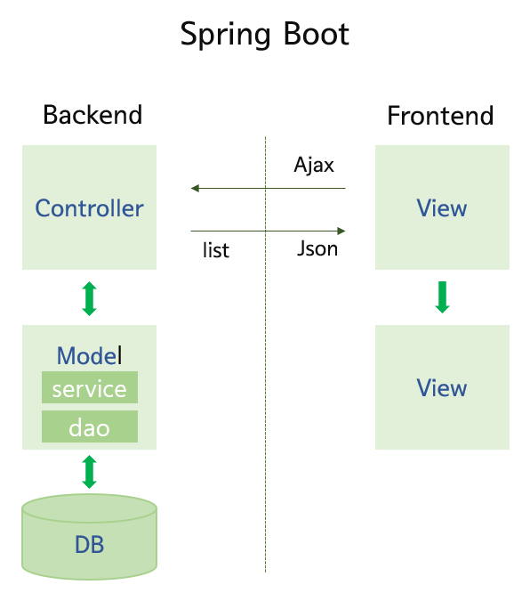
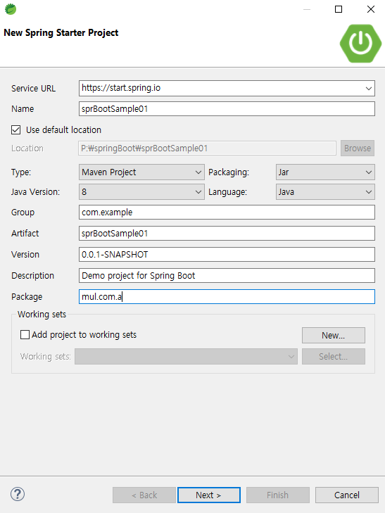

## SpringBoot 기본 



앞서 스프링 프레임워크를 이용해서 개발을 할 때는 톰캣을 포함해 여러가지 복잡한 설정을 해줘야 했다. 스프링 부트는 스프링 프레임워크보다 애너테이션 기능을 강화해 보다 쉽고 빠르게 배포 및 테스트, 관리가 가능하다. 그리고 복잡한 설정 과정을 크게 줄일 수 있어 아주 편리하다. 예를 들어,  부트는 기본적으로 내장서버를 가지고 있기 때문에 톰캣같은 서버설정을 별도로 해주지 않아도 된다. 


### 기본설정(백엔드STS/프론트엔드Eclipse)

----

#### 1. 프로젝트 생성 

\- STS에서 Open Perspective에서 Java EE를 열어준다

\- File > New > Spring Starter Project 를 누르고 아래처럼 설정해준다. 



next를 눌러주고 그 다음은 별도의 체크없이 바로 Finish를 잡아주었다. 


#### 2. pom.xml 에서 Spring Boot Starter 파일 dependency받기

\- Spring Boot Starter Web 2.5.5 와 Spring Boot Starter Tomcat 2.5.5 두개의 dependency를 복사해서 pom.xml에 넣어주고, 버젼은 지워주었다. 


#### 3. application.properties에서 백엔드 서버 포트넘버 설정 

```properties
# port
server.port=3000
```


#### 4. Jdbc, mybatis, json, ojdbc6 라이브러리도 pom.xml에 올려주기 

```xml
		<!-- JDBC -->
		<dependency>
		    <groupId>org.springframework.boot</groupId>
		    <artifactId>spring-boot-starter-jdbc</artifactId>		    
		</dependency>
		
		<dependency>
		    <groupId>org.mybatis.spring.boot</groupId>
		    <artifactId>mybatis-spring-boot-starter</artifactId>
		    <version>1.3.2</version>
		</dependency>
		
		<dependency>
           <groupId>org.mybatis</groupId>
           <artifactId>mybatis-spring</artifactId>
           <version>1.3.2</version>
        </dependency>  
           
        <dependency>
           <groupId>org.mybatis</groupId>
           <artifactId>mybatis</artifactId>
           <version>3.5.4</version>
        </dependency>
		
		<!-- 자바용 json 라이브러리(XML/YAML/CSV) data-processing 툴 --> 
	      <dependency>
	          <groupId>com.fasterxml.jackson.core</groupId>
	          <artifactId>jackson-core</artifactId>
	          <version>2.10.1</version>
	      </dependency>
	      <dependency>
	          <groupId>com.fasterxml.jackson.core</groupId>
	          <artifactId>jackson-databind</artifactId>
	          <version>2.10.1</version>
	      </dependency>
	      
	    <!-- jdbc에서 오라클을 사용하기 위해서! -->  
		<dependency>
	          <groupId>com.oracle.database.jdbc</groupId>
	          <artifactId>ojdbc6</artifactId>
	          <version>11.2.0.4</version>
	      </dependency>
```


#### 5. application.properties에서 DB설정

```properties
# DB(Oracle)
spring.datasource.driver-class-name=oracle.jdbc.driver.OracleDriver
spring.datasource.url=jdbc:oracle:thin:@localhost:1521:xe
spring.datasource.username=HR
spring.datasource.password=HR
```


#### 6. DatabaseConfig.java 생성 및 작성 

mybatis를 사용하기 위해 설정하는 부분이다 

```java
package mul.com.a;

import javax.sql.DataSource;

import org.apache.ibatis.session.SqlSessionFactory;
import org.mybatis.spring.SqlSessionFactoryBean;
import org.mybatis.spring.SqlSessionTemplate;
import org.springframework.context.annotation.Bean;
import org.springframework.context.annotation.Configuration;
import org.springframework.core.io.Resource;
import org.springframework.core.io.support.PathMatchingResourcePatternResolver;

@Configuration
public class DatabaseConfig {	
	
	@Bean
	public SqlSessionFactory sqlSessionFactory(DataSource dataSource) throws Exception{       
		System.out.println("DatabaseConfig sqlSessionFactory");
		
		SqlSessionFactoryBean sqlSessionFactoryBean = new SqlSessionFactoryBean();
		sqlSessionFactoryBean.setDataSource(dataSource);
		
		Resource arrResource[] = new PathMatchingResourcePatternResolver().getResources("classpath:sqls/*.xml");
		// sqls폴더에 .xml 파일을 모두 가져오겠다.
		sqlSessionFactoryBean.setMapperLocations(arrResource);
		sqlSessionFactoryBean.getObject().getConfiguration().setMapUnderscoreToCamelCase(true);
		
		return (SqlSessionFactory)sqlSessionFactoryBean.getObject(); 
        // sqlsessionfactory로 취급을 하겠다. 
		
	}
	
	@Bean
	public SqlSessionTemplate sqlSession(SqlSessionFactory sqlSessionFactory) {
		return new SqlSessionTemplate(sqlSessionFactory);
		
	}
}
```


#### 7. src/main/java에 sqls패키지를 생성 후 .xml 파일 만들기

```xml
<?xml version="1.0" encoding="UTF-8"?>
<!DOCTYPE mapper PUBLIC "-//mybatis.org//DTD Mapper 3.0//EN" "http://mybatis.org/dtd/mybatis-3-mapper.dtd">

<mapper namespace="mul.com.a.dao.MemberDao">

<select id="allMember" resultType="mul.com.a.dto.MemberDto">  
<!-- 패턴을 allMember로 잡았는데, 이 이름은 MemberDao에서 동일하게 쓰인다 -->
	SELECT * FROM MEMBER
</select>
</mapper>
```


#### 8. mul.com.a.Dto - MemberDto(class) 

```java
package mul.com.a.dto;

import java.io.Serializable;

public class MemberDto implements Serializable {
	private String id;
	private String pwd;
	private String name;
	private String email;
	private int auth;
	
	
	public MemberDto() {
	}


	public MemberDto(String id, String pwd, String name, String email, int auth) {
		super();
		this.id = id;
		this.pwd = pwd;
		this.name = name;
		this.email = email;
		this.auth = auth;
	}


	public String getId() {
		return id;
	}


	public void setId(String id) {
		this.id = id;
	}


	public String getPwd() {
		return pwd;
	}


	public void setPwd(String pwd) {
		this.pwd = pwd;
	}


	public String getName() {
		return name;
	}


	public void setName(String name) {
		this.name = name;
	}


	public String getEmail() {
		return email;
	}


	public void setEmail(String email) {
		this.email = email;
	}


	public int getAuth() {
		return auth;
	}


	public void setAuth(int auth) {
		this.auth = auth;
	}


	@Override
	public String toString() {
		return "MemberDto [id=" + id + ", pwd=" + pwd + ", name=" + name + ", email=" + email + ", auth=" + auth + "]";
	}
	
}
```


#### 9. mul.com.a.Dao - MemberDao(interface)

```java
package mul.com.a.dao;

import java.util.List;

import org.apache.ibatis.annotations.Mapper;
import org.springframework.stereotype.Repository;

import mul.com.a.dto.MemberDto;

@Mapper
@Repository	// mapper를 통해 Repository를 사용하겠다. mapper는 mybatis안에 있다.
public interface MemberDao {
	
	public List<MemberDto> allMember();	//여기 allMember는 Member.xml에서 id값과 동일하게!
}
```


### 10. mul.com.a.Service - MemberService(class)

```java
package mul.com.a.service;

import java.util.List;

import org.springframework.beans.factory.annotation.Autowired;
import org.springframework.stereotype.Service;
import org.springframework.transaction.annotation.Transactional;

import mul.com.a.dao.MemberDao;
import mul.com.a.dto.MemberDto;

@Service
@Transactional
public class MemberService {
	
	@Autowired 
	private MemberDao dao;
	
	public List<MemberDto> allMember(){		
	// <-여기 allMember는 반드시 dao의 메소드의 이름과 동일할 필요는 없으나(왜냐하면 컨트롤러에서 부르기 때문에), 같게 해줌
		return dao.allMember();
	}

}

```


#### 11. mul.com.a.Controller - MemberDto (class)

```java
package mul.com.a.controller;

import java.util.List;

import org.springframework.beans.factory.annotation.Autowired;
import org.springframework.web.bind.annotation.RequestMapping;
import org.springframework.web.bind.annotation.RequestMethod;
import org.springframework.web.bind.annotation.RestController;

import mul.com.a.dto.MemberDto;
import mul.com.a.service.MemberService;

@RestController	
// restful방식에 사용하는 controller이다	@RestController = @Controller + @ResponseBody
public class MemberController {

	@Autowired
	MemberService service;
						//  /test가 url에 로컬호스트 뒤에 옴 localhost:3000/test 
	@RequestMapping(value= "/test", method = RequestMethod.GET)
	public String test() throws Exception{
		System.out.println("MemberController test()");
		
		return "test";	// 이건 test.jsp가 아니다! 문자열을 리턴해준 것!
	}
	
	@RequestMapping(value= "/member", method = RequestMethod.GET)
	public MemberDto getMember() {
		System.out.println("MemberController getMember()");
		MemberDto dto = new MemberDto("aaa","111","홍두께","aaa",3);
		return dto;
	}
	
	@RequestMapping(value= "/dbtest", method = RequestMethod.GET)
	public List<MemberDto> dbtest(){
		System.out.println("MemberControllerd dbtest()");
		
		List<MemberDto> list = service.allMember();
		
		return list;
	}

	@RequestMapping(value= "/conn_param", method = RequestMethod.GET)
	public String conn_param(String title) {
		System.out.println("MemberControllerd conn_param()");
		System.out.println("title:" + title);
		return "connection success"; 
	}
	
	@RequestMapping(value= "/account", method = RequestMethod.POST)
	public String account(MemberDto dto) {
		System.out.println("MemberControllerd account()");
		System.out.println(dto.toString());
		
		return "성공";
	}
}
```


#### 12. SprBootSample01Application 에서 annotation 넣어주기 

```java
package mul.com.a;

import org.mybatis.spring.annotation.MapperScan;
import org.springframework.boot.SpringApplication;
import org.springframework.boot.autoconfigure.SpringBootApplication;

@SpringBootApplication
@MapperScan(basePackages = "mul.com.a")		// 이걸로 basepackage를 잡아주는 것이다. 
public class SprBootSample01Application {

	public static void main(String[] args) {
		SpringApplication.run(SprBootSample01Application.class, args);
	}
}
```


#### 13. 이클립스에 와서 프론트 프로젝트 생성 

\- STS에서 Open Perspective에서 Java EE를 열어준다

\- File > New > Dynamic Web Project 생성한다. 


#### 14. WebContent에 index.html을 생성 및 작성

```html
<!DOCTYPE html>
<html>
<head>
<script src="https://ajax.googleapis.com/ajax/libs/jquery/3.5.1/jquery.min.js"></script>
<meta charset="UTF-8">
<title>Insert title here</title>
</head>
<body>

<h1>Account</h1>
<form id="frm">			<!-- action을 넣지 않는다. -->
<table border="1">
<tr>
	<th>아이디</th>
	<td>
		<input type="text" id="id" name="id" placeholder="아이디 입력" size="20">
	</td>
</tr>
<tr>
	<th>패스워드</th>
	<td>
		<input type="text" id="pwd" name="pwd" placeholder="패스워드" size="20">
	</td>
</tr>
<tr>
	<th>이름</th>
	<td>
		<input type="text" id="name" name="name" placeholder="이름" size="20">
	</td>
</tr>
<tr>
	<th>이메일</th>
	<td>
		<input type="text" id="email" name="email" placeholder="이메일" size="20">
	</td>
</tr>
<tr>
	<td colspan="2">
		<button type="button" id="account">회원가입</button>
	</td>
</tr>
</table>
</form>
<script type="text/javascript">
$("#account").click(function () {
//alert ('click')

	let params = $("#frm").serialize();	// serialize()는 Jquery용 함수이다.  이 방법으로 아래처럼 data를 쭉 쓸 필요없이 params로 받을 수 있다
	// alert(params);
	
	$.ajax({
		url:"http://localhost:3000/account",
		type:"post",
		// data:{ id:$("#id").val(), pwd:$("#pwd").val(), name:$("#name").val(), email:$("#email").val()}, 	이건 너무 길다! > form태그를 주고 params를 이용해서 간단하게도 가능하다!
		// data:params,
		data: $("#frm").serialize(),
		success:function( resp ){
			alert("success");
			alert(resp); 	// 백엔드 컨트롤러의 "성공"을 출력함 
		},
		error:function(){
			alert("error");
		}
	});
	
});
</script>
</body>
</html>
```


#### ✨여기서 잠깐!✨

위까지만 하고 백엔드에서 컨트롤러를 작성하고 통신하면 프론트에서 작성한 데이터는 백엔드로 넘어가긴 한다. 그러나, 프론트 서버에서는 error가 뜨는데, 이것은 보안과 관련된 문제이다. 따라서 STS에서 mul.com.a 패키지에서 WebConfig.java를 생성해서 이를 해결해주어야 한다. 

```java
package mul.com.a;

import org.springframework.context.annotation.Configuration;
import org.springframework.web.servlet.config.annotation.CorsRegistry;
import org.springframework.web.servlet.config.annotation.WebMvcConfigurer;

@Configuration		// Configuration 애노테이션이 붙어있으면 설정이다 라고 이해하기 
public class WebConfig implements WebMvcConfigurer{

	@Override
	public void addCorsMappings(CorsRegistry registry) {
		// TODO Auto-generated method stub
		WebMvcConfigurer.super.addCorsMappings(registry);
		
		registry.addMapping("/**").allowedOrigins("http://localhost:8090");
	}
}
```

 이 코드의 역할을 설명하자면, 백엔드와 프론트가 통신을 할 때, 접속할 수 있도록 ip와 포트넘버를 허가해주어야 한다. 만약 허가받지 않은 포트넘버에서 데이터를 보내면 데이터가 들어오긴 하지만, 받지 못하도록 하는 것이다. 이 작업을 마치고 나면, 데이터도 백엔드로 잘 넘어오고 프론트에서도 success가 뜬다.