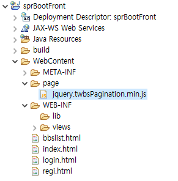

## SpringBoot 게시판 및 페이지네이션(플러그인) 

### 1. Backend

- **Bbs.xml**

```xml
<?xml version="1.0" encoding="UTF-8"?>
<!DOCTYPE mapper PUBLIC "-//mybatis.org//DTD Mapper 3.0//EN" "http://mybatis.org/dtd/mybatis-3-mapper.dtd">

<mapper namespace="mul.com.a.dao.BbsDao">

<select id="getbbslist" parameterType="mul.com.a.dto.BbsParam" resultType="mul.com.a.dto.BbsDto">
	SELECT SEQ, ID, REF, STEP, DEPTH, TITLE, CONTENT, WDATE, DEL, READCOUNT
	FROM (	SELECT ROW_NUMBER()OVER(ORDER BY REF DESC, STEP ASC) AS RNUM,
				SEQ, ID, REF, STEP, DEPTH, TITLE, CONTENT, WDATE, DEL, READCOUNT
			FROM BBS	
			WHERE 1=1
				<if test="choice != null and choice != ''
				  		and search != null and search != ''">		  	  
					  <if test="choice == 'title'">
					  		AND TITLE LIKE '%'||#{search}||'%'		  
					  </if>
					  <if test="choice == 'content'">
					  		AND CONTENT LIKE '%'||#{search}||'%'			  
					  </if>
					  <if test="choice == 'writer'">
					  		AND ID=#{search}  
					  </if>	
				</if>		
			ORDER BY REF DESC, STEP ASC)
	WHERE RNUM BETWEEN #{start} AND #{end}
</select>

<!-- 글의 총수 -->
<select id="getbbscount" parameterType="mul.com.a.dto.BbsParam" resultType="java.lang.Integer">
	SELECT NVL(COUNT(*), 0) AS CNT
	FROM BBS
	WHERE 1=1
		<if test="choice != null and choice != ''
		  		and search != null and search != ''">		  	  
			  <if test="choice == 'title'">
			  		AND TITLE LIKE '%'||#{search}||'%'		  
			  </if>
			  <if test="choice == 'content'">
			  		AND CONTENT LIKE '%'||#{search}||'%'			  
			  </if>
			  <if test="choice == 'writer'">
			  		AND ID=#{search}  
			  </if>	
		</if>
</select>
</mapper>
```


- **BbsDto**

```java
package mul.com.a.dto;

import java.io.Serializable;

public class BbsDto implements Serializable {

	private int seq;		// 중복되지 않는 순서번호
	private String id;		// 작성자
	
	private int ref;		// 그룹번호		답글용
	private int step;		// 행번호
	private int depth;		// 깊이
	
	private String title;	// 제목
	private String content;	// 내용
	private String wdate;	// 작성일	
	
	private int del;		// 삭제여부
	private int readcount;	// 조회수
	
	public BbsDto() {
	}

	public BbsDto(int seq, String id, int ref, int step, int depth, String title, String content, String wdate, int del,
			int readcount) {
		super();
		this.seq = seq;
		this.id = id;
		this.ref = ref;
		this.step = step;
		this.depth = depth;
		this.title = title;
		this.content = content;
		this.wdate = wdate;
		this.del = del;
		this.readcount = readcount;
	}

	public BbsDto(String id, String title, String content) {
		super();
		this.id = id;
		this.title = title;
		this.content = content;
	}

	public int getSeq() {
		return seq;
	}

	public void setSeq(int seq) {
		this.seq = seq;
	}

	public String getId() {
		return id;
	}

	public void setId(String id) {
		this.id = id;
	}

	public int getRef() {
		return ref;
	}

	public void setRef(int ref) {
		this.ref = ref;
	}

	public int getStep() {
		return step;
	}

	public void setStep(int step) {
		this.step = step;
	}

	public int getDepth() {
		return depth;
	}

	public void setDepth(int depth) {
		this.depth = depth;
	}

	public String getTitle() {
		return title;
	}

	public void setTitle(String title) {
		this.title = title;
	}

	public String getContent() {
		return content;
	}

	public void setContent(String content) {
		this.content = content;
	}

	public String getWdate() {
		return wdate;
	}

	public void setWdate(String wdate) {
		this.wdate = wdate;
	}

	public int getDel() {
		return del;
	}

	public void setDel(int del) {
		this.del = del;
	}

	public int getReadcount() {
		return readcount;
	}

	public void setReadcount(int readcount) {
		this.readcount = readcount;
	}

	@Override
	public String toString() {
		return "BbsDto [seq=" + seq + ", id=" + id + ", ref=" + ref + ", step=" + step + ", depth=" + depth + ", title="
				+ title + ", content=" + content + ", wdate=" + wdate + ", del=" + del + ", readcount=" + readcount
				+ "]";
	}
}
```


- **BbsParam**

```java
package mul.com.a.dto;

import java.io.Serializable;

public class BbsParam implements Serializable {

	private String choice;
	private String search;
	
	private int page; // 현재 페이지
	private int start;
	private int end;
	
	public BbsParam() {
	}

	public BbsParam(String choice, String search, int page, int start, int end) {
		super();
		this.choice = choice;
		this.search = search;
		this.page = page;
		this.start = start;
		this.end = end;
	}

	public String getChoice() {
		return choice;
	}

	public void setChoice(String choice) {
		this.choice = choice;
	}

	public String getSearch() {
		return search;
	}

	public void setSearch(String search) {
		this.search = search;
	}

	public int getPage() {
		return page;
	}

	public void setPage(int page) {
		this.page = page;
	}

	public int getStart() {
		return start;
	}

	public void setStart(int start) {
		this.start = start;
	}

	public int getEnd() {
		return end;
	}

	public void setEnd(int end) {
		this.end = end;
	}

	@Override
	public String toString() {
		return "BbsParam [choice=" + choice + ", search=" + search + ", page=" + page + ", start=" + start + ", end="
				+ end + "]";
	}
}
```


- **BbsDao**

```java
package mul.com.a.dao;

import java.util.List;

import org.apache.ibatis.annotations.Mapper;
import org.springframework.stereotype.Repository;

import mul.com.a.dto.BbsDto;
import mul.com.a.dto.BbsParam;

@Mapper
@Repository
public interface BbsDao {

	List<BbsDto> getbbslist(BbsParam param);
	int getbbscount(BbsParam param);
}
```


- **BbsService**

```java
package mul.com.a.service;

import java.util.List;

import org.springframework.beans.factory.annotation.Autowired;
import org.springframework.stereotype.Service;
import org.springframework.transaction.annotation.Transactional;

import mul.com.a.dao.BbsDao;
import mul.com.a.dto.BbsDto;
import mul.com.a.dto.BbsParam;

@Service
@Transactional
public class BbsService {
	
	@Autowired
	BbsDao dao;
	
	public List<BbsDto> getbbslist(BbsParam param) {
		return dao.getbbslist(param);
	}
	
	public int getbbscount(BbsParam param) {
		return dao.getbbscount(param);
	}
}
```


- **BbsController**

```java
package mul.com.a.controller;

import java.util.List;

import org.springframework.beans.factory.annotation.Autowired;
import org.springframework.web.bind.annotation.RequestMapping;
import org.springframework.web.bind.annotation.RequestMethod;
import org.springframework.web.bind.annotation.RestController;

import mul.com.a.dto.BbsDto;
import mul.com.a.dto.BbsParam;
import mul.com.a.service.BbsService;

@RestController
public class BbsController {

	@Autowired
	BbsService service;
	
	@RequestMapping(value = "/bbslist", method = RequestMethod.GET)
	public List<BbsDto> bbslist(BbsParam param){
		System.out.println("BbsController bbslist()");
		
		int sn = param.getPage();	// 0 1 2
		int start = sn * 10 + 1;	// 1 11 21 
		int end = (sn + 1) * 10;	// 10 20 30
		
		param.setStart(start);
		param.setEnd(end);
		
		List<BbsDto> list = service.getbbslist(param);
		
		return list;
	}
	
	// 글의 총수
	@RequestMapping(value = "/bbscount", method = RequestMethod.GET)
	public int bbscount(BbsParam param) {
		System.out.println("BbsController bbscount()");
		
		return service.getbbscount(param);
	}
}
```


## 2. Frontend

- **jquery.twbsPagination.min.js 파일 옮겨놓기 (페이지네이션 플러그인을 위한 파일)**

  

  WebContent에 page라는 폴더를 만들어 해당 파일 넣었다. 

  

- **bbslist.html**

```html
<!DOCTYPE html>
<html>
<head>
<meta charset="UTF-8">
<title>bbslist.html</title>
<script src="https://ajax.googleapis.com/ajax/libs/jquery/3.5.1/jquery.min.js"></script>

<link rel="stylesheet" href="https://maxcdn.bootstrapcdn.com/bootstrap/4.5.2/css/bootstrap.min.css">
<script src="https://maxcdn.bootstrapcdn.com/bootstrap/4.5.2/js/bootstrap.min.js"></script>

<script type="text/javascript" src="page/jquery.twbsPagination.min.js"></script>
</head>
<body>

<h2>게시판</h2>

<div id="app" class="container">

<table class="table table-striped table-hover">

<thead>
	<tr>
		<th>번호</th>
		<th>제목</th>
		<th>작성자</th>		
	</tr>
</thead>

<tbody id="blist">
</tbody>

</table>

<br><br>

<div class="container">
    <nav aria-label="Page navigation">
        <ul class="pagination" id="pagination" style="justify-content:center"></ul>
    </nav>
</div>

<br>

<table style="margin-left: auto;margin-right: auto; margin-top: 3px; margin-bottom: 3px">
<tr>
	<td>검색</td>
	<td style="padding-left: 5px">
		<select id="_choice" name="choice">
			<option value="" selected="selected">선택</option>
			<option value="title">제목</option>
			<option value="content">내용</option>
			<option value="writer">작성자</option>
		</select>	
	</td>
	<td style="padding-left: 5px">
		<input type="text" id="_search" name="search">
	</td>
	<td style="padding-left: 5px">
		<span>
			<button type="button" id="btnSearch">검색</button>
		</span>
	</td>
</tr>
</table>

</div>

<script type="text/javascript">
//let login = sessionStorage.getItem("login");
//alert(login);

getBbslist(0);
getBbsCount();

function getBbslist( page ) {
	let choice = $("#_choice").val();
	let search = $("#_search").val();
		
	$.ajax({
		url:'http://localhost:3000/bbslist',
		type:"get",
		data:{ 'choice':choice, 'search':search, 'page':page }, 	// 검색을 위해서 data가 들어감. 문자처리 해줌 
		success:function(list){
		//	alert('success');
			// session
		//	let login = JSON.parse(sessionStorage.getItem("login"));
		//	alert(login.id);
			
		//	alert(JSON.stringify(list));
		//	alert(list.length);
		
		/*
			for(i = 0;i < list.length; i++){
				let str = "<tr>";
					str += "<td>" + (i + 1) + "</td>";
					str += "<td>" + list[i].title + "</td>";
					str += "<td>" + list[i].id + "</td>";
					str += "</tr>";
					
				$("#blist").append(str);
			}
		*/
			$("#blist").html("");			// <- 초기화해주는 코드. 싹 비워주는 역할
			$.each(list, function (i, item) {
				let str = "<tr>";
				str += "<td>" + (i + 1) + "</td>";
				str += "<td>" + item.title + "</td>";
				str += "<td>" + item.id + "</td>";
				str += "</tr>";
				
				$("#blist").append(str);
			})		
		},
		error:function(){
			alert('error');
		}
	});	
}

// 글의 총수를 취득
function getBbsCount() {
	
	$.ajax({
		url:"http://localhost:3000/bbscount",
		type:"get",
		data:{ 'choice':$("#_choice").val(), 'search':$("#_search").val(), 'page':0 },
		success:function(count){
			//alert(count);
			loadPage(count);
		}
	});
}

// 검색
$("#btnSearch").click(function () {
	getBbslist(0);
	getBbsCount();
});

function loadPage( totalCount ) {
	
	let pageSize = 10;		// 페이지의 크기
	
	let _totalPages = totalCount / 10
	if(totalCount % 10 > 0){
		_totalPages++; 
	}
	
	// 페이지 갱신
	$("#pagination").twbsPagination('destroy');

	$("#pagination").twbsPagination({
		startPage: 1,
		totalPages: _totalPages,
		visiblePages: 10,
		first:'<span sris-hidden="true">«</span>',
		prev:"이전",
		next:"다음",
		last:'<span sris-hidden="true">»</span>',
		initiateStartPageClick:false,		// onPageClick 자동호출이 되도록 하지 않는다
		onPageClick:function(event, page){ // 페이지 번호를 클릭
		//	alert(page);			1 2 3 4
			getBbslist(page - 1);	// 0 1 2 3
		} 
	});	
}

</script>

</body>
</html>
```