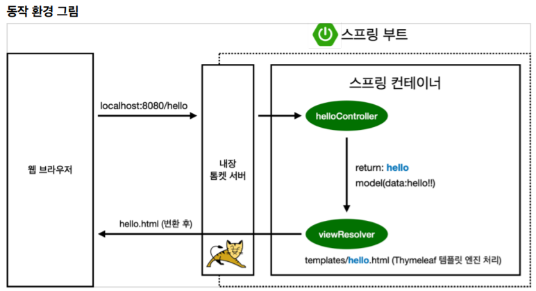

## 스프링 부트 기초1 (프로젝트 생성,라이브러리, Thymeleaf, View환경설정, 빌드)

#### 프로젝트 생성

Java 11 설치

IDE: IntelliJ설치 

스프링 부트 스타터 사이트에서 스프링 프로젝트 생성 

https://start.spring.io

- 프로젝트 옵션

  \- Project: Gradle Project 

  \- Spring Boot: 2.6.x (SNAPSHOT없는것 중 최신 버전으로!)

  \- Language: Java 

  \- Packaging: Jar Java: 11 

  \- Project Metadata 

​				groupId: hello 

​				artifactId: hello-spring

​		\- Dependencies: Spring Web, Thymeleaf


#### 스프링 부트 라이브러리

- spring-boot-starter-web 

  ​	spring-boot-starter-tomcat: 톰캣 (웹서버) 

  ​	spring-webmvc: 스프링 웹 MVC 

- spring-boot-starter-thymeleaf: 타임리프 템플릿 엔진(View) 

- spring-boot-starter(공통): 스프링 부트 + 스프링 코어 + 로깅 

  ​	spring-boot 

  ​		spring-core 

- spring-boot-starter-logging logback, slf4j 

  cf ) 실무에서 주로 System.out.println으로 출력을 안하고 log로 출력하는 이유는 
  log로 남겨야 심각한 에러만 모아볼 수 있다거나, log파일들이 관리가 된다는 등의 이점이 있기 때문이다. 

  요즘은 logging을 slf4j, logback  조합으로 운영을 많이 한다. 이 방식이 표준에 가까운 방식이다. 
  

#### 테스트 라이브러리

- spring-boot-starter-test 

  ​	junit: 테스트 프레임워크 

  ​	mockito: 목 라이브러리 

  ​	assertj: 테스트 코드를 좀 더 편하게 작성하게 도와주는 라이브러리 

  ​	spring-test: 스프링 통합 테스트 지원

  cf ) test와 관련된 라이브러리는 junit이 기본인데 junit4를 사용하다가 최근에는 junit5를 많이 사용한다. 

#### Thymeleaf = 템플릿 엔진 중 하나 

: 템플릿 엔진이란, 지정된 템플릿 양식과 데이터가 합쳐져 HTML문서를 출력하는 소프트웨어 


- 템플릿 엔진에는 서버템플릿 엔진과 클라이언트 템플릿 엔진이 있는데, 

먼저 **서버 템플릿 엔진**은 서버에서 구동되는 템플릿 엔진으로서, 서버에서 Java코드로 문자열을 만든 후 서버에서 HTML로 변환해 브라우저로 전달한다. 예를 들어 JSP, Freemarker 등이 있다. 

**클라이언트 템플릿 엔진**은 브라우저 위에서 작동하며, 브라우저에서 화면을 생성하기 때문에 서버에서 JSON, XML 형식의 데이터만 전달하고 클라이언트에서 이를 혼합하여 화면을 만든다. 예를 들어 react, Vue.js 등이 있다. 


- Thymeleaf 기본 사용법 

  ```html
  <!DOCTYPE HTML>
  <html xmlns:th="http://www.thymeleaf.org"> <!-- 이런식으로 thymeleaf 템플릿 엔진을 선언 => 그러면 thymeleaf문법을 사용할 수 있게 된다  -->
  <head>
   <title>Title</title>
   <meta http-equiv="Content-Type" content="text/html; charset=UTF-8" />
  </head>
  <body>
      
  </body>
  </html>
  ```

- 데이터 표현 형식 

  변수 : ${ }
  객체 변숫값 : *{ }
  메시지 : #{ } 
  링크 : @{ }

  

#### 메뉴얼 사용법(원하는 기능 사용방법 찾는 능력)

- thymeleaf 템플릿 엔진 thymeleaf 공식 사이트: https://www.thymeleaf.org/ 

- 스프링 공식 튜토리얼: https://spring.io/guides/gs/serving-web-content/ 

- 스프링부트 메뉴얼: https://docs.spring.io/spring-boot/docs/2.3.1.RELEASE/reference/html/spring-boot-features.html#boot-features-spring-mvc-template-engines

  Spring.io에 들어가서 Project > Spring Boot에 들어가서 두번째 탭에 Learn에 들어가서 원하는 기능에 대한 사용방법을 검색할 수 있다. 

#### 

#### View 환경설정 

- ##### Welcome page만들기 

Static폴더에 index.html 만들기 


웹 애플리케이션에서 첫번째 진입점이 Controller이다.

```java
@Controller
public class HelloController{
	@GetMapping("hello")	// 이렇게 하면 웹 어플리케이션에서 /hello라고 들어오면, 이 메소드를 호출해준다. 
	public String hello(Model model){	// model(data:hello!!) 이렇게 model에 key와 value를 넣어두는 것이다. 그리고 이를 return에 보내는 것임 
		model.addAttribute(attributeName:"data", attributeValue:"hello!!");
        return "hello";		
        // 기본적으로 spring boot는 return할 때 resources의 templates위치에서 hello를 찾도록 세팅되어있다. 그리고 찾아서 렌더링을 한다.
        // 컨트롤러에서 리턴값으로 문자를 반환하면 리졸버(viewResolver)가 화면을 찾아서 처리한다. 
	}
}


```


그 다음 resources/templates 위치에 hello.html을 생성한다.

```html
<!DOCTYPE HTML>
<html xmlns:th="http://www.thymeleaf.org">
<!-- hello.html에서 thymeleaf 템플릿 엔진 선언 th => 그러면 thymeleaf문법을 사용할 수 있게 됨 -->
<head>
 <title>Hello</title>
 <meta http-equiv="Content-Type" content="text/html; charset=UTF-8" />
</head>
<body>
<p th:text="'안녕하세요. ' + ${data}" >안녕하세요. 손님</p>
</body>
</html>
```


thymeleaf 템플릿엔진 동작 확인한다.

실행: http://localhost:8080/hello




#### 빌드하고 실행하기 => 실제 실행할 수 있는 파일 만들기 (윈도우 기준)

.jar파일 만들기 => 나중에 서버 배포해서 사용할 때 이 파일 하나만 넣고 실행하면 된다. 

1. 콘솔로 이동 명령 프롬프트(cmd)로 이동 

2. ./gradlew gradlew.bat 를 실행하면 됩니다. 명령 프롬프트에서 gradlew.bat 를 실행하려면 gradlew 하고 엔터를 치면 됩니다. 

3. gradlew build


##### Reference

인프런 김영한 [무료]스프링 입문 - 코드로 배우는 스프링 부트, 웹 MVC, DB 접근 기술 강의

https://imgzon.tistory.com/97

https://cceeun.tistory.com/163