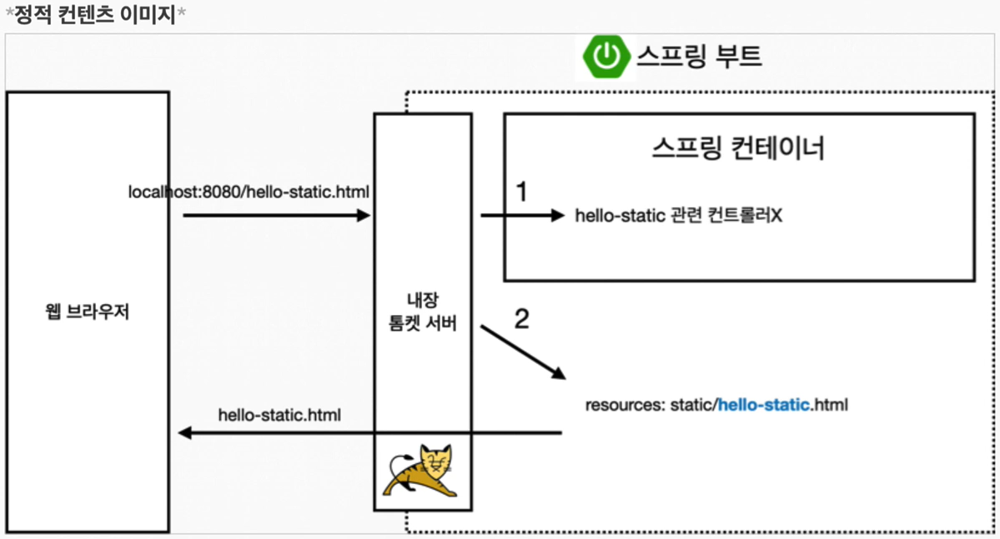
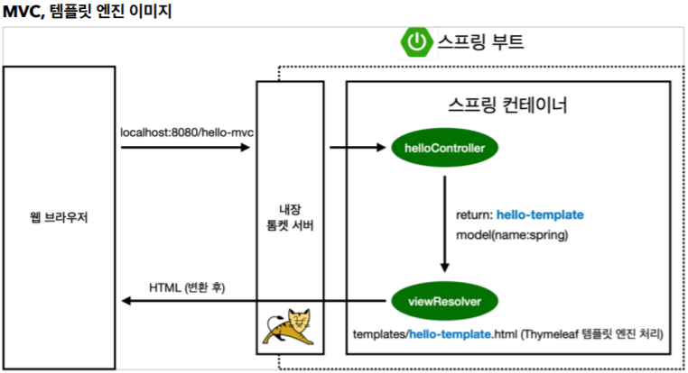
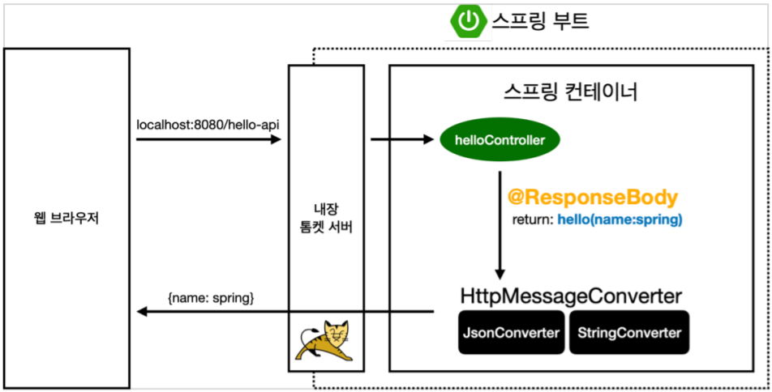

### 스프링 웹 개발 3가지 방식 

- 정적 컨텐츠
- MVC패턴과 템플릿 엔진 
- API

----

### 정적 컨텐츠(Static Content) 

- 스프링 부트 정적 컨텐츠 기능 

  resourcex > static > .html 파일 

  정적 파일이 웹 브라우저에 그대로 반환이 된다. 



요청을 스프링에 넘기면 먼저 컨트롤러에서 mapping할 컨트롤러가 있는지 확인을 하고, 관련 컨트롤러가 없을 경우, resources/static에서 uri가 일치하는 .html 파일을 찾아서 해당 파일을 반환한다. 이 때 html 파일에서는 변환은 일어나지 않고 그냥 반환한다. 


-----

### MVC패턴과 템플릿 엔진 

- MVC : Model, View, Controller

  

**Controller**

```java
@Controller
public class HelloController {
 	@GetMapping("hello-mvc")	// hello-mvc 로 맵핑 
 	public String helloMvc(@RequestParam("name") String name, Model model) {	
        // 파라미터 name을 받아서 model에 담는 것, RequestParam은 디폴트가 true인데 이 말인 즉슨, 무조건 파라미터를 받아야 한다. required = false를 "name"옆에 기입하면, 파라미터가 없어도 에러가 뜨지 않는다.   
	 model.addAttribute("name", name);
        // "name = 키", name = 값/ 파라미터로 넘어온 name을 넘겨받는 것이다.  
	 return "hello-template";
        // hello-template.html로 가는 것 
	 }
}
```


**View(hello-template.html)**

```html
<html xmlns:th="http://www.thymeleaf.org">
<body>
<p th:text="'hello ' + ${name}">hello! empty</p> 
    <!-- 서버를 구동하면, hello! empty가 "'hello ' + ${name}"로 치환된다. -->
</body>
</html>

```


**실행**

 http://localhost:8080/hello-mvc?name=KKH

이 때, 출력값은 hello KKH




스프링부트가 띄울 때 같이 띄우는 내장 톰켓 서버를 먼저 거친다. 그러면 내장 톰켓 서버는 hello-mvc라는 요청이 왔다고 스프링에 요청을 보낸다. 그러면 스프링은 먼저 컨트롤러에서 "hello-mvc"를 맵핑하고 helloMvc메소드를 호출한다. 이 후 hello-template과 model(name:spring)(key:value)를 viewResolver로 보낸다. 그러면 viewResolver는  hello-template 문자열과 동일한 html파일을 찾아서 model과 함께 타임리프 템플릿 엔진에 처리해달라고 보낸다. 그러면 타임리프는 렌더링을 거쳐 변환을 한 html 을 웹 브라우저에 넘겨준다.  


------------

### API

**@ResponseBody 문자변환**

```java
@Controller
public class HelloController {
	 @GetMapping("hello-string")
 	@ResponseBody 
 // 
 // http에서 header부와 body부 중 body부분에 return값을 직접 넣어주겠다는 것이다. 이렇게 하면 view 없이 name에 적은 그대로 그냥 바로 웹브라우저에 띄운다. 
 	public String helloString(@RequestParam("name") String name) {
	 return "hello " + name;
	 }
}
```

@ResponseBody를 사용할 경우에는, viewResolver를 사용하지 않는다. 

대신에 HTTP의 Body부분에 문자내용을 직접 반환한다. 


**실행**

 http://localhost:8080/hello-string?name=spring

출력값은 hello spring


**@ResponseBody 객체 반환**

```java
@Controller
public class HelloController {
 	@GetMapping("hello-api")
 	@ResponseBody
 	public Hello helloApi(@RequestParam("name") String name) {
	 	Hello hello = new Hello();
	 	hello.setName(name);
	 	return hello;	// 문자열이 아닌 객체를 return함 
 }
 
 static class Hello {	// Hello라는 객체를 생성 
	 private String name;  // private으로 되어있으므로 외부에서 바로 못꺼낸다. 그래서 getter setter 메소드를 생성하는 것
	 
	 public String getName() {	// getter 
	 	return name;
	 }
	 public void setName(String name) {	// setter 
		 this.name = name;
 		}
	 }
}
```

@ResponseBody를 사용하고 객체를 반환할 경우에는 객체가 JSON형태로 출력된다. 

**실행**

 http://localhost:8080/hello-api?name=spring

**출력값**

{"name":"spring"} 	




@ResponseBody 를 사용하면, 

​	HTTP의 BODY에 문자 내용을 직접 반환한다. 

​	viewResolver 대신에 HttpMessageConverter 가 동작한다. 

​	단순 문자일 경우에는 StringHttpMessageConverter 가 동작 

​	객체일 경우에는 MappingJackson2HttpMessageConverter 가 동작  => 객체를 	JSON형태로 바꾼다. 그리고 바꾼 것을 요청한 웹 브라우저 또는 서버에 응답해준다.   

​	byte 처리 등등 기타 여러 HttpMessageConverter가 기본으로 등록되어 있다. 

참고로 클라이언트의 HTTP Accept 헤더와 서버의 컨트롤러 반환 타입 정보 둘을 조합해서 HttpMessageConverter가 선택된다. 