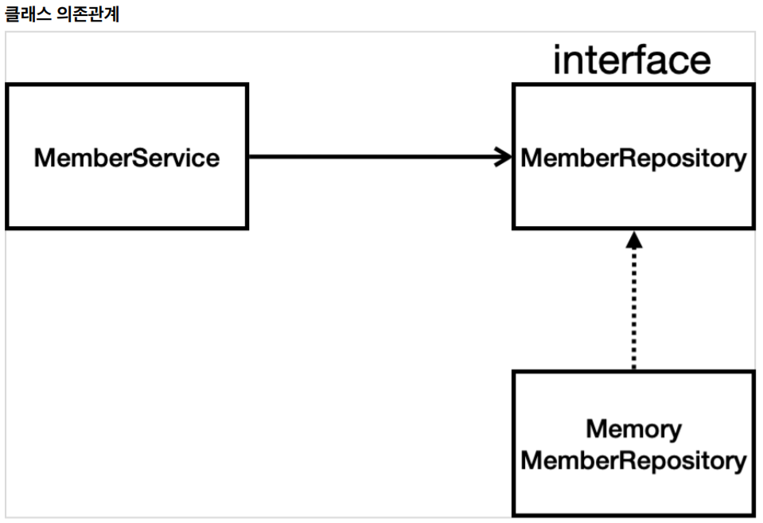
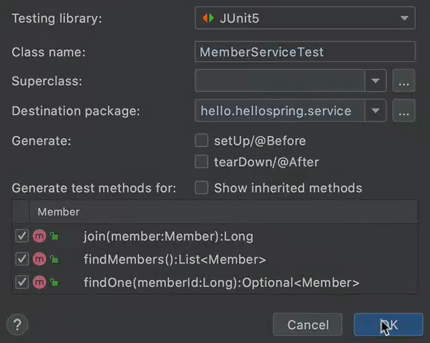

## 회원 관리 예제 

요구사항 

데이터: 회원ID, 이름

기능: 회원등록, 회원조회 

참고로 데이터 저장소는 미정이라고 가정함 



\- 아직 데이터 저장소가 미정이므로, 우선 인터페이스로 구현 클래스를 변경하는 것이 가능하도록 설계 

-----

### 회원도메인과 레포지터리 만들기 

**회원 객체**

\- domain패키지 생성 후 안에 Member클래스 생성

```java
package hello.hellospring.domain;

public class Member {

 	private Long id;
 	private String name;
    
    // getter & setter 생성 
 	public Long getId() {
 		return id;
 	}
 	public void setId(Long id) {
 		this.id = id;
 	}
 	public String getName() {
 		return name;
 	}
	 public void setName(String name) {
 		this.name = name;
	 }
}
```


**회원 레포지터리 인터페이스**

\- repository패키지 생성 후 그 안에 MemberRepository인터페이스 생성 

```java
package hello.hellospring.repository;

import hello.hellospring.domain.Member;
import java.util.List;
import java.util.Optional;

public interface MemberRepository {
 	Member save(Member member);
 	// 회원을 저장하고, 저장된 회원을 반환
 	Optional<Member> findById(Long id);
    // ID로 회원 찾아서 반환 
    // Optional은 자바8에서 추가된 기능으로서, findBy로 가져올 때, NULL일 수 있으므로, Optional로 감싸주면, Null일 때도 반환이 이뤄짐 
 	Optional<Member> findByName(String name);
    // Name으로 회원찾아서 반환 
	List<Member> findAll();
    // 지금까지 저장된 모든 회원리스트 반환 
}
```


**회원 레포지터리 메모리 구현체**

\- repository패키지 안에 MemoryMemberRepository클래스 생성 

```java
package hello.hellospring.repository;

import hello.hellospring.domain.Member;
import java.util.*;

public class MemoryMemberRepository implements MemberRepository {
    // implements MemberRepository 를 하면 밑에 생기는 밑줄에 마우스를 대고 implement methods를 누르고 전체 선택 후 OK를 해준다. 		
    
 private static Map<Long, Member> store = new HashMap<>();
    // HashMap을 쓰면, 실무에서는 동시성 문제가 발생가능하기 때문에 ConcurrentHashMap을 고려해야 한다. 
 private static long sequence = 0L;
    // 시퀀스도 실무에서는 long보다는 동시성 문제를 생각해서 AtomicLong 사용 할 것을 고려해야 한다. 
    
 @Override
 public Member save(Member member) {
 	member.setId(++sequence);
     // store에 넣기 전에 setId할 때 시퀀스값을 하나 올려주고, 
	 store.put(member.getId(), member);
     // store에 put으로 저장된다. (이 때 이름은 고객이 회원가입할 때 적는 것이고, id는 시스템이 시퀀스로 정해주는 것으로 설정)
	 return member;
 }
    
 @Override
 public Optional<Member> findById(Long id) {
 	return Optional.ofNullable(store.get(id));
     // null이 뜰 가능성이 있을 때, Optional.ofNullable로 감싸서 Null이 나오더라도 감쌀 수 있게 된다. 
 }
    
 @Override
 public List<Member> findAll() {
 	return new ArrayList<>(store.values());
     // store에 있는 values (여기서는 Members)를 반환한다. 
 }
    
 @Override
 public Optional<Member> findByName(String name) {
 	return store.values().stream()
       
 		.filter(member -> member.getName().equals(name))
 // member에서 member.getName이 파라미터로 넘어온 Name과 같은지 확인해서 같은 경우에만 필터링이 되고, 그 중에서 찾으면 반환이 된다.  
 		.findAny();
     // findAny는 하나로 찾는 것 루프를 다 돌면서 Map을 돌면서 하나 찾으면 반환 없으면 Optional로 Null을 반환 
 }
    
 public void clearStore() {
 	store.clear();
 	}
}
```


---------

### 회원 레포지터리 테스트 케이스 작성

개발한 기능을 실행해서 테스트 할 때 자바의 main 메서드를 통해서 실행하거나, 웹 애플리케이션의 컨트롤러를 통해서 해당 기능을 실행한다. 이러한 방법은 준비하고 실행하는데 오래 걸리고, 반복 실행하기 어렵고 여러 테스트를 한번에 실행하기 어렵다는 단점이 있다. 자바는 JUnit이라는 프레임워크로 테스트를 실행해서 이러한 문제를 해결한다.


**회원 레포지터리 메모리 구현체 테스트**

\- src/test/java 하위 폴더에 MemoryMemberRepositoryTest클래스를 생성한다.

```java
package hello.hellospring.repository;

import hello.hellospring.domain.Member;
import org.junit.jupiter.api.AfterEach;
import org.junit.jupiter.api.Test;
import java.util.List;
import java.util.Optional;
import static org.assertj.core.api.Assertions.*;

class MemoryMemberRepositoryTest {
 
 	MemoryMemberRepository repository = new MemoryMemberRepository();
 
 @AfterEach	// 하나의 테스트가 끝날 때마다 데이터를 클리어해주는 애너테이션
 public void afterEach() {
 	repository.clearStore();
 }
 
 @Test // org.junit.jupiter.api의 Test 애너테이션
 public void save() {
 
 	//given
 	Member member = new Member();
 	member.setName("spring"); // 이름을 spring으로 셋팅 
 	
 	//when
	 repository.save(member); // 레포지터리에 member를 저장
 
	 //then
 	Member result = repository.findById(member.getId()).get();
     // 바로 위에서 save로 저장한 것을 findBy로 잘 저장되었는지 확인 
     // 반환타입이 Optional이므로, 이럴 때는 get()으로 꺼내야한다. 
     // 참고로 get()으로 꺼내는 것이 좋은 방법은 아니나, 테스트코드에서는 그냥 해도 괜찮다.
    
 	assertThat(member).isEqualTo(result);
   // Assertions.assertThat(member).isEqualTo(result); => 이렇게 타이핑 후에 Assertions에 커서를 대고, Add on-demand static import for 'org.assertj.core.api.Assertions'를 클릭하면 assertThat(result).isEqualTo(member); 형태로 바꿀 수 있다. (위에 보면, import static가 되어있다. 한번 해두면 계속 asserThat으로 쓸 수 있다.)
     
 }
 
    
 @Test
 public void findByName() {
 
 	//given		 
 	Member member1 = new Member();
 	member1.setName("spring1");	
	repository.save(member1);
 	
    Member member2 = new Member();	// shift + f6으로 rename을 손쉽게 다 바꿀 수 있다.
	member2.setName("spring2");
	repository.save(member2);
	
    // spring1, spring2로 member1, member2 설정 => 맞게 뜨는 것과 잘못뜨는 것을 확인하기 위해  
     
 	//when
	 Member result = repository.findByName("spring1").get();
	 	
	 //then
	 assertThat(result).isEqualTo(member1); // 이러면 초록색으로 통과됐다고 뜸 
     assertThat(result).isEqualTo(member2); // 이러면 빨간색으로 에러뜸 
 }
 
 @Test
 public void findAll() {
 
 	//given
 	Member member1 = new Member();
 	member1.setName("spring1");
	repository.save(member1);
     
 	Member member2 = new Member();
 	member2.setName("spring2");
 	repository.save(member2);
 	
	 //when
	 List<Member> result = repository.findAll();
	 
	 //then
	 assertThat(result.size()).isEqualTo(2);
     
     assertThat(result.size()).isEqualTo(3);
     // 총 3개가 아니므로 에러가 뜸 
	 }
}


/*
메소드 개별로 테스트 했을 때는 에러가 안뜨다가 클래스 테스트를 돌리면 에러가 뜰 수 있다. 이 예시로 설명을 하면, findAll() 테스트가 먼저 진행되면 spring1과 spring2 네임을 설정했기 때문에, findByName()에서 추가로 spring1과 spring2를 설정하면 중복설정이 되므로 에러가 나는 것이다. 따라서 테스트가 하나 끝나고 나면, 데이터를 클리어 해줘야 한다. 

*/
```

\- @AfterEach : 한번에 여러 테스트를 실행하면 메모리 DB에 직전 테스트의 결과가 남을 수 있다. 이렇게 되면 다음 이전 테스트 때문에 다음 테스트가 실패할 가능성이 있다. @AfterEach 를 사용하면 각 테스트가 종료될 때 마다 이 기능을 실행한다. 여기서는 메모리 DB에 저장된 데이터를 삭제한다. 

\- 테스트는 각각 독립적으로 실행되어야 한다. 테스트 순서에 의존관계가 있는 것은 좋은 테스트가 아니다.


- #### TDD

  테스트클래스를 만들고 난 후 레포지터리를 작성할 수 있는데, 이는 쉽게 말해 내가 만들려고 하는 것의 테스트코드를 먼저 작성해서 하트 모양의 틀을 만들고 만든 결과물이 이 하트모양 틀에 맞는지 확인하는 것과 유사하다고 볼 수 있다. 

  위에서 테스트코드를 작성한 것은 내용물을 먼저 만들고 틀을 만들어 확인하는 것이라고 볼 수 있다.


-----

### 회원서비스 개발

\- service패키지에 MemberService클래스 생성 

```java
package hello.hellospring.service;

import hello.hellospring.domain.Member;
import hello.hellospring.repository.MemberRepository;
import java.util.List;
import java.util.Optional;

public class MemberService {
 	private final MemberRepository memberRepository = new MemoryMemberRepository();
    
 /**
 * 회원가입
 */
 	public Long join(Member member) {
	 	validateDuplicateMember(member); //중복 회원 검증 후 통과하면 save로 저장 
		memberRepository.save(member);
 		return member.getId();	// 회원가입을 하면, ID를 반환하도록 임의로 설정
	 }
    
 	private void validateDuplicateMember(Member member) {
        // 같은 이름이 있는 중복 회원을 허용하지 않음 
		memberRepository.findByName(member.getName())
 			.ifPresent(m -> {
 				throw new IllegalStateException("이미 존재하는 회원입니다.");
 			});
 }
    
    /*
    	// 원래 join메소드 안에 아래의 로직이 있었는데 메소드로 뽑은 것이 위의 validateDuplicateMember 메소드이다. 방법은 로직을 전체 드래그 한 상태에서 Ctrl + t를 누르면, 리팩토링과 관련된 기능들이 나오는데, 여기서 Extract Method를 하면, 로직을 하나의 메소드로 만들 수 있다. 
    	
        // 같은 이름이 있는 중복 회원을 허용하지 않음 
		memberRepository.findByName(member.getName())
 			.ifPresent(m -> {
 				throw new IllegalStateException("이미 존재하는 회원입니다.");
 			});
 			
 	*/
    
    
 /**
 * 전체 회원 조회
 */
 	public List<Member> findMembers() {
 		return memberRepository.findAll();
        // memberRepository에서 findAll()의 리턴은 List<Member>
 	}
    
 	public Optional<Member> findOne(Long memberId) {
 		return memberRepository.findById(memberId);
 	}
}
```


----

### 회원 서비스 테스트

클래스에서 cmd + shift + t 를 하면 Create New Test 기능이 옵션으로 뜬다. 여기서 이걸 누르면,  



여기서 이렇게 Test 클래스 이름을 설정해주고, 테스트 메소드를 선택하고 OK를 눌러주면, 테스트코드의 틀을 자동으로 생성할 수 있다. 


**회원 서비스 테스트**

```java
package hello.hellospring.service;

import hello.hellospring.domain.Member;
import hello.hellospring.repository.MemoryMemberRepository;
import org.junit.jupiter.api.BeforeEach;
import org.junit.jupiter.api.Test;
import static org.assertj.core.api.Assertions.*;
import static org.junit.jupiter.api.Assertions.*;

class MemberServiceTest {
	
    MemberService memberService;
    
	MemoryMemberRepository memberRepository;
    // MemoryMemberRepository를 클리어해주기 위함(@BeforeEach에서 같은 인스턴스를 쓰기 위한 과정의 연장선)
    
 @BeforeEach
 public void beforeEach() {
 	memberRepository = new MemoryMemberRepository();
     // MemberServiceTest와 MemberService에서 MemoryMemberRepository라는 같은 인스턴스를 쓰기 위함
 	memberService = new MemberService(memberRepository);
 }
    // 이렇게 하면 테스트를 실행할 때마다 각각 생성을 해준다. 
    /*
    매번 테스트를 실행할 때, @BeforeEach에서 MemoryMemberRepository를 생성해서 memberRepository를 BeforeEach 위에 있는 MemoryMemberRepository에 넣어준다. 그리고 memberRepository를 MemberService클래스에서 생성자 부분에서 public MemberService(MemberRepository memberRepository) 여기에 파라미터로 들어간다. 그러면 같은 MemoryMemberRepository가 사용되게 된다. (MemberServiceTest와 MemberService에서!)
    */
    
 @AfterEach // 클리어하기 위한 코드 
 public void afterEach() {
 	memberRepository.clearStore();
 }
    
 @Test
 public void 회원가입() throws Exception {
     // 회원가입()이런 식으로 한글 메소드로 테스트를 작성해도 무방하다. 
     
 	//Given 무언가 주어지고 
 	Member member = new Member();
 	member.setName("hello");
     
	//When 이걸 실행했을 때, 무얼 검증할건지 
 	Long saveId = memberService.join(member);
     // memberService의 join을 검증하는 건데 여기서 member객체를 넣고 이 때 리턴은 saveId(저장한 Id)로 잡음 
     
 	//Then 결과가 이렇게 나와야 한다. 
 	Member findMember = memberRepository.findById(saveId).get();
 	assertEquals(member.getName(), findMember.getName());
    // Assertions.assertThat(member.getName()).isEqualTo(findMember.getName()); 이 때 Assertions는 org.assertj.core.api꺼를 사용.
    // 여기에서 Assertions에 커서를 대고 static import를 해주면 위의 형태(assertEquals)로 변경된다. 
 } 
    
 @Test
 public void 중복_회원_예외() throws Exception {
     
 	//Given
 	Member member1 = new Member();
 	member1.setName("spring");
 
 	Member member2 = new Member();
 	member2.setName("spring"); // 둘 다 이름을 spring으로 설정해봤다.  
     
 	//When
 	memberService.join(member1);
 	IllegalStateException e = assertThrows(IllegalStateException.class, () -> memberService.join(member2));
     // memberService.join(member2)라는 로직을 실행하면, IllegalStateException라는 예외가 발생해야 한다. 
 	assertThat(e.getMessage()).isEqualTo("이미 존재하는 회원입니다.");
     // IllegalStateException에서 e로 메시지를 받아 메시지를 검증하는 방법 
 	}
}
```


-----

#### DI (Dependency Injection) 

\- MemberService와 MemberServiceTest를 비교해서 볼 것

(MemberService클래스) **기존에는 회원 서비스가 메모리 회원 레포지터리를 직접 생성하게 했다.** 

```java
public class MemberService {
 	private final MemberRepository memberRepository = new MemoryMemberRepository();
}
```


테스트코드에서 생성된 MemoryMemberRepository라는 인스턴스를 MemberServiceTest와 MemberService에서 같이 사용하기 위해 아래처럼 생성자를 넣어 외부에서  memberRepository를 받도록 설정한다. 

(MemberService클래스) 회원 레포지터리의 코드가 회원 서비스 코드를 DI (Dependency Injection) 가능하게 변경한다.

```java
public class MemberService {
 	private final MemberRepository memberRepository;
    // 여기서 생성자(Constructor)를 눌러서 아래 코드 생성 
    
 	public MemberService(MemberRepository memberRepository) {
 		this.memberRepository = memberRepository;
        // memberRepository를 직접 new로 생성하는게 아니라, 외부에서 memberRepository 넣어주도록 바꿈(DI라고 함)
 	}
 	...
}
```

