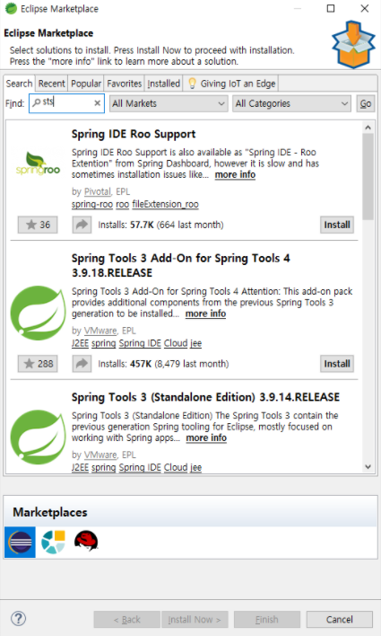

## Spring 0

#### 스프링 설치 및 개발환경 설정

#### 1. STS4 다운로드 및 설치 

https://spring.io/tools

해당 사이트에서 Projects > Spring Tools 4로 들어가서 Spring Tools 4 for Eclipse에서 각 운영체제에 맞는 파일을 다운로드 받으면 된다. 

#### 2. Spring Tools 설치

\-  Help > Eclipse Marketplace에서 legacy를 검색해서 Spring tools를 설치한다. 

이 후 다음과 같이 모두 체크해주고 Confirm을 누르고 진행한다. 

#### 3. Spring LegacyProject를 생성

File > New > Project > Spring MVC Project 

Next를 누르고 아래처럼 패키지명 설정하고 Finish

#### 4. Available Software 설치해서 Open perspective 항목 추가 

\- Help > Install New Software로 들어와서 아래처럼 설정을 해준다. 

기본적인 설치는 끝났다. 

#### 5. Preferences 설정 

\- Window > Preferences 에서 인코딩 관련 설정을 해줘야 한글이 깨지지 않는다. 

Web부분에서 HTML, CSS, JSP Files에서 모두 UTF-8로 설정한다. 

#### 6. 톰캣 설정

​	

이러면 개발을 하기 위한 준비는 끝! 

+ #### 혹시 톰캣에 문제가 있으면, 다음과 같은 방법을 사용해볼 것 

Project Explorer > 우클릭 Build Path > Configure Build Path > Libraries > Add Library

 

Server Runtime > Next > Apache Tomcat v9.0 을 눌러주면 된다. 

