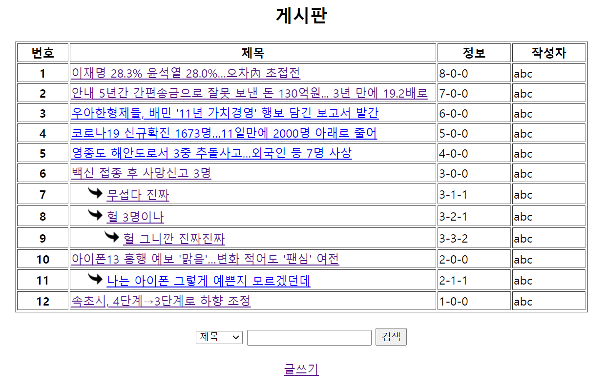
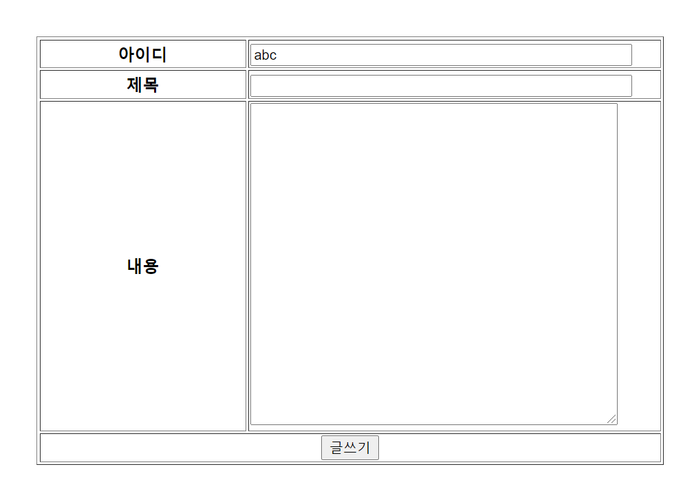

## 게시판(답글 가능 형태)

#### 게시판 목록창, 글쓰기 기능구현

이미지처럼 답변을 남기고 볼 수 있는 형태의 게시판을 구현해보자! 나름 다양한 기능들이 있는데, 차근차근 살펴보자

### 0. 구조

#### 자바 클래스

Dao - BbsDao

Dto - BbsDto

#### 데이터베이스

bbs.sql

#### JSP파일 (html 코드)

bbslist.jsp

bbswrite.jsp

bbswriteAf.jsp

### 1. 게시판 목록창 만들기 

- **bbslist.jsp (게시글 전체목록을 보여주는 페이지) 작성**

  \- 목록에서 볼 수 있는 내용들로는 번호, 제목, 정보, 작성자 정도가 있다. 정보는 후에 안보이게 처리할 예정이다. 

  \- 각 정보를 따로 하나하나 받아오는게 아니라, BbsDao에서부터 리스트 형태로 받아서 보여준다.

  \- 기본적으로 getInstance로 dao객체를 받아주고, 필수는 아니지만, 로그인 한 경우에 리스트를 볼 수 있도록 설정도 해주었다. 

  

- **BbsDto.java 작성**

  \- seq(시퀀스), id(작성자), 

  ref(그룹번호), step(행번호), depth(깊이), 

  title(제목), content(내용), wdate(작성날짜)

  del(삭제여부), readcount(조회수) 를 멤버변수로 받아준다

  \-  모든 변수를 받는 생성자 하나, 아이디, 제목, 내용만을 받는 생성자 하나를 따로 만들어준다. 

  \- getter와 setter, toString까지 작성한다. 

  

- **BbsDao.java(백엔드, 함수) 작성**

  \- 어디서든 객체를 받아올 수 있도록 BbsDao를 getInstance()로 받는다

  \- getBbsList()라는 함수를 작성하는데, JDBC(SELECT)부분에서 다수의 데이터를 받아올 때 학습한 수순을 밟으면 된다. 

  

### 2. 글쓰기 기능 구현 

- **bbslist.jsp에 글쓰기 버튼 생성** 

  \- 글쓰기를 누르면, bbswrite.jsp(글을 작성하는 페이지)로 이동한다.

  

- **bbswrite.jsp(글을 작성하는 페이지) 작성**

\- form태그로 `<form action="bbswriteAf.jsp" method="post">` 이렇게 코딩하였다.

\- 제목, 내용을 작성 받아서 글쓰기 버튼을 누르면 bbswriteAf.jsp(글쓰기의 후속처리 역할) 로 보낸다.

\- 아이디는 MemberDto에서 id를 받아 readonly 즉, 수정할 수 없게 설정하였다. 

 

- **BbsDao 작성** 

  \- writeBbs(BbsDto dto)라는 함수를 작성한다. 

  \- 이 때, 쿼리문에서는 INSERT를 활용하면 되는데,  시퀀스를 +1해주는 부분을 주의해서 작성하자

 

- **bbswriteAf.jsp 작성**

  \- BbsDao 객체를 getInstance() 받아온다

  \- writeBbs에서 매개변수를 받아서 함수를 작성하는데, 이 때, BbsDto에서 id, title, content만으로 만든 생성자를 매개변수로 받아주고, 글쓰기가 성공하면 bbslist.jsp(글 전체 목록페이지)로 이동하고, 실패할 경우엔 bbswrite.jsp에 있도록 하고 다시 입력하도록 알림을 띄운다. 

