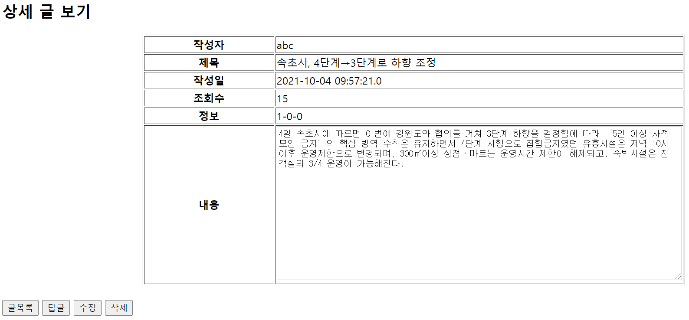
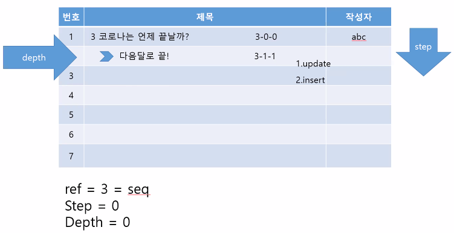

## 게시판(답글 가능 형태)

#### 게시글 상세페이지, 답글 기능 구현 

### 0. 구조

#### 자바 클래스

Dao - BbsDao

Dto - BbsDto

#### 데이터베이스

bbs.sql

#### JSP파일 (html 코드)

bbslist.jsp

bbsdetail.jsp

bbsanswer.jsp

bbsanswerAf.jsp

### 1. 게시글 상세 페이지 작성

- **bbslist.jsp에서 상세페이지로 이동하도록 링크 걸기**

  \- 시퀀스(seq)를 가지고 해당 개별 게시물의 상세페이지를 오픈하는 것이다.

  \- 제목을 클릭했을 때 bbsdetail.jsp로 이동하도록 a태그를 걸어준다.

- **BbsDao.java에 getBbs(int seq) 함수 작성**

  \- SEQ가 같다를 조건으로 SELECT로 데이터들을 가져온다. 

  \- return dto; 

- **BbsDao.java에 readcount(int seq) 함수 작성**

  \- 조회수를 보여주기 위한 함수이다. 

  \- SEQ가 같을 때, READCOUNT에 1을 더해서 UPDATE하는 원리이다. 

  

-  **bbsdetail.jsp(게시글 상세 페이지) 작성**

  \- 기본적으로 시퀀스 변수 선언을 하고, BbsDao 객체를 getInstance()로 받는다. 

  \- getBbs함수에 seq를 매개변수로 받고 BbsDto dto에 넣어준다. 

  \- 시퀀스(seq)로 개별 게시물을 받아오고 dto.getter로 각 데이터를 불러온다. 

  \- 여기서는 당장 수정은 불가능하기 때문에, input을 사용하지 않고, readonly를 사용해 데이터를 가져온다. 

  \- 글목록, 답글, 수정, 삭제 버튼을 넣어준다. 글목록을 제외하고 세 버튼은 클릭 시에 페이지가 이동하는데, 이동할 때 시퀀스를 가지고 이동하도록 코딩을 해준다. 

### 2. 답글 기능 구현 

먼저 답글이 달리는 **원리를 설명**해야 한다. 

예를 들어, 위 이미지에서 3-0-0은 ref - step - depth이다. 

ref는 그룹의 번호가 되는데, 시퀀스라고 보면 된다. step은 한줄 내려갈 때마다 1씩 증가하는 숫자이다. depth를 설명하기 위해 답글의 원글을 부모글이라고 하면, 부모글 아래에 달리는 답글은 들여쓰기가 이뤄진다. 이처럼 들여쓰기가 한번 이뤄지면 1이 증가한다. 만약 부모글 아래 답글에 다시 또 답글이 달리면 부모글 - 답글 - 답글의 답글이 되는데, 이러한 경우 답글의 답글은 depth가 2가 되는 것이다. 

그리고 게시글 목록은 최신 글일수록 위에 나타나고, 오래된 글일수록 아래로 내려가게 되어 기존 글들의 step이 계속 하나씩 증가하게 되는 것이다. 또한 앞서 말한 것처럼 답글은 depth도 늘어나게 된다.  답글 기능 구현 과정에서  쿼리문에서는 새로운 글이 들어올 자리를 만드는 개념으로 step+1이 되는 UPDATE를 위한 쿼리, 답글이 들어가게 되는 경우에 step과 depth에 각각 +1이 일어나는 INSERT를 위한 쿼리 즉, 2개의 쿼리를 작성해야 한다. 따라서 지금까지보다 다소 복잡한 함수를 작성해야 한다.  

-  **bbsdetail.jsp(게시글 상세 페이지)에 버튼 생성** 

  \- 버튼을 누르면 dto.getSeq()를 가지고 bbsanswer.jsp(부모글이 보이고, 답글을 남길 수 있는 페이지)로 이동하도록 작성한다 

  

- **bbsanswer.jsp(부모글이 보이고, 답글을 남길 수 있는 페이지) 작성**

  \- 먼저 부모글을 보여주는 table을 만들어준다. 

  \-  답글은 `<form action="bbsanswerAf.jsp" method="post">` 이렇게 form을 작성해준다. 

  \- 답글이 달릴 때는 부모글의 시퀀스와 같은 시퀀스를 갖도록 하는데, 이 부분은 사용자에게는 보이지 않도록 hidden처리를 해준다. 

- **bbsanswerAf.jsp(답글을 작성한 후에 후속처리를 하는 페이지) 작성** 

  \- 여기서 dao에서 작성한 함수 dao.answer(seq, new Bbs(id, title, content))를 사용한다

  \- 에러없이 성공적으로 답글이 달릴 경우, bbslist.jsp 페이지로 이동해서 리스트에 답글이 뜨게 한다.

- **BbsDao.java에서 answer(int seq, BbsDto bbs) 함수 작성** 

  \- 위의 원리 설명에서 언급한 바와 같이 UPDATE를 위한 쿼리 sql1과 INSERT를 위한 쿼리 sql2를 작성해야 한다. 

  \- UPDATE 쿼리를 설명하자면, 부모글의 시퀀스(SEQ)와 같은 시퀀스(REF)를 가지고, 부모글의 스텝(3.0)보다 크다면(3.1 3.2 3.3) 스텝을 하나 늘려라를 구현한 것이다. 

  \- INSERT 쿼리를 설명하자면, dto 각 데이터에 값을 삽입하는 것인데, 시퀀스는 값을 1 증가시키고, 아이디는 psmt로 받아오고, 시퀀스가 같다는 조건을 붙여서 REF는 그대로 유지, STEP, DEPTH는 +1을 시킨 값을 삽입하는 것이다. 그리고 답글의 wdate는 SYSDATE로 답글 작성시간으로 준다.  

  \- try - catch문이 다소 복잡하니 주의해서 코드를 작성한다. 

  \- 이 함수는 bbsanswerAf.jsp에서 호출되어 결과적으로 bbslist.jsp에서 답글을 확인이 가능하다.

- **bbslist.jsp에서 함수 arrow(int depth) 작성**

  \- 해당 함수로, 답글의 깊이와 함께 답글 표시 이미지를 넣을 수 있다. 즉, 들여쓰기와 화살 이미지로 답글임을 알려주는 함수이다. 

  

