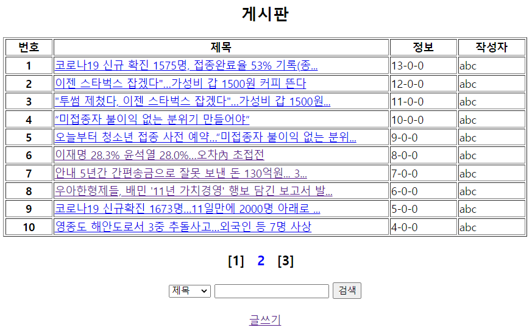

## 게시판(답글 가능 형태)

#### 게시물 검색 기능(제목, 내용, 작성자) 구현, 페이징 기능 구현, 게시글 삭제 기능 구현 

### 0. 구조

#### 자바 클래스

Dao - BbsDao

Dto - BbsDto

#### 데이터베이스

bbs.sql

#### JSP파일 (html 코드)

bbslist.jsp

bbsdetail.jsp

bbsdelete.jsp


### 1. 게시물 검색 기능(제목, 내용, 작성자) 구현

- **bbslist.jsp에서 프론트 구현** 

  \- 제목, 내용, 작성자를 고르도록 select태그를 사용하고 id로 choice를 주었다

  \- 검색어를 입력하는 input태그에는 id로 search를 주었다. 

  \- 검색 버튼을 누르면 searchBbs()가 실행되도록 JS로 구현하였다. 

  \- searchBbs()는 choice와 search를 가지고 bbslist.jsp로 가는 역할을 한다. 

  \- 상단에 choice와 search를 변수로 받아주고, 조건문을 걸어주었다. 

  

- **BbsDao.java에서 getBbsSearchList(String choice, String search) 함수 작성**

  \- 기존에 getBbsList()를 복붙해서 추가 및 수정하였다. 

  \- sql로 쿼리문을 통해 데이터들을 받고, 추가로 조건문으로 검색이 잘 작동할 경우, 그에 맞는 리스트들을 출력하도록 하였다. 


### 2. 페이징 기능 구현



페이징 기능에 있어서 몇가지 생각해봐야 할 것들이 있다. 일단 원리는 총 게시물들의 수를 세서, 몇개의 게시글마다 페이지를 나눌지 정하고, (총 게시물 / 나눌 게시물의 수) 로 페이지의 개수가 정해진다. 그리고 기본적으로 전체 글들의 페이지를 나누기도 해야하지만, 검색한 게시물들도 페이지가 나눠져야 한다. 이런 것들을 고려해서 기능 구현을 해보자

- **BbsDao에서 getBbsPagingList(String choice, String search, int pageNumber) 함수 작성** 

  \- 처음에 회원가입한 정보를 받아올 때는 getBbsList(), 검색기능을 구현할 때는 getBbsSearchList(String choice, String search)  함수를 사용했다. getBbsPagingList(String choice, String search, int pageNumber)는 pageNumber를 추가로 받아서 기존의 리스트 함수를 수정, 추가해서 만든다. 

  \- 기본적으로 쿼리문은 아래의 형태를 Dao에서 구현할 것이다. 자세한 코딩은 따로 올린 코드 파일을 참고하자. 

  ```sql
  SELECT SEQ, ID, REF, STEP, DEPTH, TITLE, CONTENT, WDATE, DEL, READCOUNT
  FROM 
  	(SELECT ROW_NUMBER()OVER(ORDER BY REF DESC, STEP ASC) AS RNUM, 
  			SEQ, ID, REF, STEP, DEPTH, TITLE, CONTENT, WDATE, DEL, READCOUNT
  	 FROM BBS 
  	 -- 조건자리
  	 ORDER BY REF DESC, STEP ASC)
  WHERE RNUM >= 1 AND RNUM <= 10;
  ```


- **BbsDao에서 getAllBbs(String choice, String search) 함수 작성**

  \- 페이징을 위해 글의 총 개수를 구하는 함수이다.

  \- 이 함수에서는 검색 결과에도 페이징이 필요하기 때문에 검색 코드 일부(제목,내용,작성자별 검색 조건문)가 들어온다. 

  \- return len으로 글의 총수를 구한다. 


- **bbslist.jsp에서 paging 구현** 

  \- 글의 총수, 페이지 수, 현재 위치한 페이지 출력을 위한 함수를 문서 상단 스크립트릿에 작성한다. 

  \- 기존에 있던 `List<BbsDto> list = dao.getBbsSearchList(choice, search);`를 주석처리 하고, `List<BbsDto> list = dao.getBbsPagingList(choice, search,pageNumber);`를 넣어준다. 

  \- 게시글 리스트 부분과 검색부분 사이에 프론트를 구현하는데, 반복문과 조건문을 활용한다. 

  1  [2]  [3] -> 이러한 형태를 만들어주는 것이다. 참고로 for문의 int i는 0부터 시작하지만, 페이지번호는 1부터 시작하기 때문에 보이는 페이지번호에는 +1을 해줘야 한다. 즉, 보이는 페이지 번호에는 i +1을 넣어주되 실제로 이동하는 페이지에는 i 를 넣어주면 된다. 

  \- 해당 페이지 번호에는 onclick으로 goPage()함수가 들어간다. 

  \- 스크립트태그 내에서 goPage(pageNum) 함수를 작성해야 한다. 여기서도 페이징은 검색기능과 같이 가야되기 때문에 choice와 search를 받아온다. 

  

  ✨ 여기까지하면 페이징 기능은 거의 정상작동을 한다. 그러나 만약에 내용을 검색하고 2 페이지로 넘어가면, 전체글의 2페이지로 넘어가게 된다. 즉, 검색 중인 상태가 지속되어야 하는데 페이지를 넘기면 검색창이 공백이 되어서 문제가 발생한다. 

  \- head태그 내에 검색어가 유지되도록 JQuery로 코드를 작성한다. 

  \- 검색을 위한 input태그에 search를 JSP 표현식으로 값을 받아서 value에 넣어준다. 

  \- 추가로 search, choice가 null값이거나 search에 공백이 들어갈 때, 검색창에 빈문자열을 출력하고 bbslist.jsp를 출력하도록 상단에 JSP로 조건문을 작성해준다.
