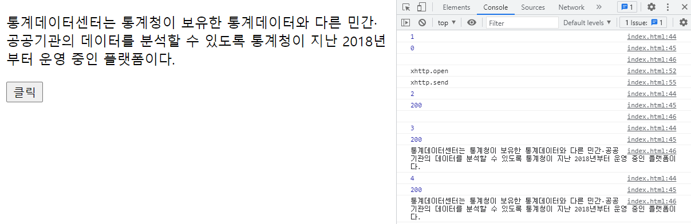

## XML 1

#### XML, txt파일로 테스트, 문자열을 XML로 받아서 원하는 데이터 출력하기, XML파일에서 원하는 데이터 출력하기 

### 1. XML


​	XML eXtensible Markup Language
​		확장		   표시 	  언어 

:사용자 지정 태그 
목적 : Data(공공)를 공유하기 위한 목적 
	  Setup을 하기 위한 목적 
예) 교통정보 -> 버스번호, 정류장, 노선 -> DB

tag data
번호 740
출발 강남역
도착 한남동

```html
<버스들> root tag 
	<버스>
		<번호>740</번호>
		<출발>강남역</출발>
		<도착>한남동</도착>
		<배차간격>5분</배차간격>
			   :
	</버스>
</버스들>

XML ->Json
```


### 2. txt파일로 테스트

```html
<body>
    
<p id ="demo"> p tag </p>
<button type="button" onclick="loadXmlDoc()">클릭</button>

<script type="text/javascript">
// xml하기 전 txt파일로 테스트
let xhttp = new XMLHttpRequest();	// xml 파일 읽기   Request:요청

function loadXmlDoc() {
	xhttp.onreadystatechange = function () {
		console.log(this.readyState);
		console.log(this.status);
		console.log(this.responseText);
		
		document.getElementById("demo").innerHTML = this.responseText;
	}
	
	xhttp.open("GET", "text.txt", true);	// 
	console.log("xhttp.open");	
	
	xhttp.send();
	console.log("xhttp.send");
}

/*  
	readyState : 진행상태
	0 -> open 메소드를 수행하기 전 상태 
	1 -> loading 중 .. 
	2 -> loading 완료 
	3 -> web server에서 처리중 ..
	4 -> server에서 처리 완료 
	

	status
	200 -> success
	403 -> 접근 금지
	404 -> 없음, 찾을 수 없음 
	500 -> 문법 상 에러 
 
*/
</script>
</body>
```




### 3. 문자열을 XML로 받아서 원하는 데이터 출력하기 

```html
<body>
<p id ="demo"> p tag </p>

<script type="text/javascript">
let xmltest = "<bookstore>" +			/* root 태그 */
			  "<book>" +				/* node */
			  		"<title>탈무드</title>" +
					"<author>저자1</author>" +
					"<year>2001</year>"+
			  "</book>"	+
			  "<book>" +				/* node */
			  		"<title>이솝우화</title>" +
					"<author>저자2</author>" +
					"<year>2004</year>"+
			  "</book>" +
			  "</bookstore>";
// 여기까지는 문자열이다. 		
//alert(xmltest);			  

let parser, xmlDoc;

parser = new DOMParser();
xmlDoc = parser.parseFromString(xmltest, "text/html");
// 문자열을 xml로 바꿔주는 것이다.
// alert(xmlDoc);
// 바꿔주면 object로 출력이 된다.

document.getElementById("demo").innerHTML
	//= xmlDoc.getElementsByTagName("book")[0].childNodes[0].nodeName;
	//= xmlDoc.getElementsByTagName("book")[0].childNodes[1].nodeName;
	
	//= xmlDoc.getElementsByTagName("book")[0].childNodes[0].childNodes[0].nodeValue;	// 탈무드
	//= xmlDoc.getElementsByTagName("book").length; // 2 
	//= xmlDoc.getElementsByTagName("book")[0].childNodes.length; //3
	
	// 0번지는 탈무드가 포함된 book태그이고, childeNodes는 제목, 저자, 년을 의미한다. 
	// childeNodes의 0번지는 탈무드이고, .nodeName은 그 태그명을 보여주는 것이다. 
	// childeNodes의 0번지의 childeNodes의 0번의 값(value)를 해야 탈무드를 출력할 수 있다.
</script>
</body>
```


### 4. XML파일에서 원하는 데이터 출력하기 

- **member.xml 파일**

  ```xml
  <?xml version="1.0" encoding="UTF-8"?>
  <고객들>
  	<고객>
  		<번호>1</번호>
  		<이름>홍길동</이름>
  		<주소>서울시</주소>
  		<방문>2020/03/23</방문>
  	</고객>
  	<고객>
  		<번호>2</번호>
  		<이름>성춘향</이름>
  		<주소>남원시</주소>
  		<방문>2021/01/31</방문>
  	</고객>
  	<고객>
  		<번호>3</번호>
  		<이름>일지매</이름>
  		<주소>부산시</주소>
  		<방문>2019/07/11</방문>
  	</고객>
  </고객들>
  ```

  

```html
<body>
<p id ="demo"> p tag </p>	

<script type="text/javascript">

let xhttp = new XMLHttpRequest();

xhttp.onreadystatechange = function (){
	
	if(this.readyState == 4 && this.status == 200){	// 작업처리가 끝나고 성공했을 때를 의미
		nodeValFunc(this);
		//nodeNameFunc(this);
		//childNodeFunc(this); 
	}
}

xhttp.open("GET","member.xml",true);
xhttp.send();

function nodeValFunc(xhttp){
	
	let num, name;
	let txt, numtxt, xmlDoc;
	
	txt = numtxt= "";
	
	xmlDoc = xhttp.responseXML; // 여기선 responsetext가 아니라 responseXML
	console.log(xmlDoc);
	
	num = xmlDoc.getElementsByTagName("번호");		// num은 배열
	console.log(num.length);			// 3 
	
	console.log(num[0].childNodes[0].nodeValue);
	
	// 홍길동
	
	name = xmlDoc.getElementsByTagName("이름");
	console.log(name[0].childNodes[0].nodeValue);
	
	for (i = 0; i < num.length; i++) {
		txt += num[i].childNodes[0].nodeValue + "<br>";
		numtxt += name[i].childNodes[0].nodeValue + "<br>";
	}
	document.getElementById("demo").innerHTML = txt + "<br>" + numtxt;
}


function nodeNameFunc(xhttp) {
	let arr, xmlDoc, txt;
	
	txt = "";
	
	xmlDoc = xhttp.responseXML;
	arr = xmlDoc.documentElement.childNodes;
	//alert(arr);
	
	for (i = 0; i < arr.length; i++) {
		console.log(arr[i].nodeType);
		console.log(arr[i].nodeName);
		
		if(arr[i].nodeType == 1 ){
			txt += arr[i].nodeName + "<br>";	// +를 해줘야 글이 계속 추가가 된다. 
		}
	}
	document.getElementById("demo").innerHTML = txt;
	
}

function childNodeFunc(xhttp) {
	let arr, xmlDoc, txt;
	txt = "";
	
	xmlDoc = xhttp.responseXML;
	
	arr = xmlDoc.getElementsByTagName("고객")[0];
	let len = arr.childNodes.length;
	//alert(len);	// 9 => <고객> 우측 텍스트 공간부터 1 그리고 밑으로 태그들 세서 </방문>까지해서 9이다. 
	
	let fchild = arr.firstChild;
	
	for (i = 0; i < len; i++) {
		// console.log(fchild.nodeName);
		
		if(fchild.nodeType==1){
			txt += i + " " + fchild. nodeName + "<br>";
		}
		
		fchild = fchild.nextSibling;
	}
	document.getElementById("demo").innerHTML = txt;
}
</script>	
</body>
```


